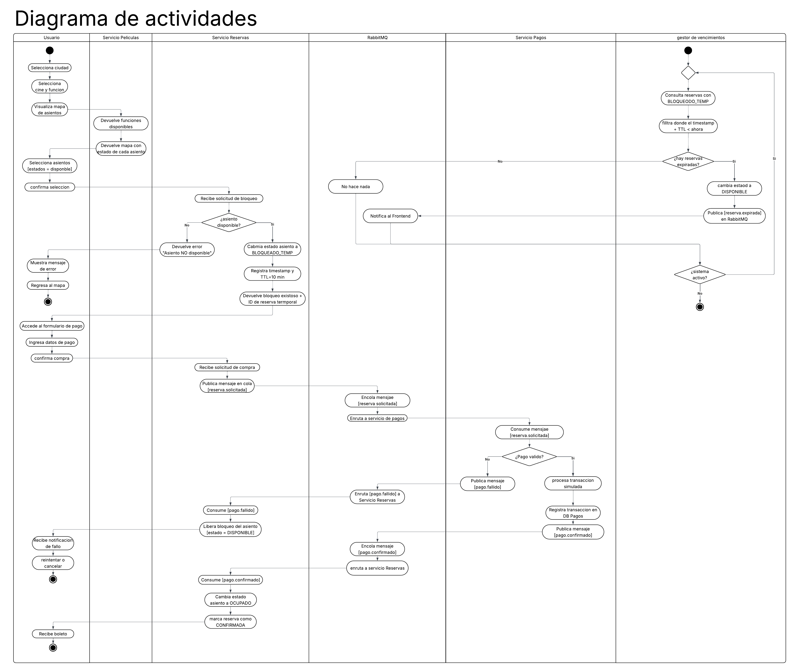

# Diagrama de Actividades – Flujo de Compra de Boletos

# Justificación del enfoque utilizado

Para representar correctamente el flujo de negocio se utilizaron swimlanes (carriles de responsabilidad), donde cada carril corresponde a un actor o componente arquitectónico participante.

Esta decisión permite identificar claramente qué parte del sistema es responsable de cada acción y evita ambigüedades durante el análisis o la implementación.

Los carriles definidos son:

* Usuario
* Servicio de Películas
* Servicio de Reservas
* RabbitMQ
* Servicio de Pagos

Esta distribución refleja directamente la arquitectura SOA planteada para el proyecto, donde cada servicio mantiene una responsabilidad específica y bien delimitada.

# Descripción general del flujo

El proceso inicia cuando el usuario navega por la plataforma y selecciona una ciudad, un cine y una función disponible. A partir de esta información, el sistema consulta el Servicio de Películas, encargado de administrar la cartelera y la disponibilidad de funciones.

Una vez obtenida la información, el usuario visualiza el mapa de asientos y selecciona aquellos que desea adquirir.

A partir de este punto comienza el flujo crítico de reserva y pago, donde se aplican mecanismos de control de concurrencia para evitar que múltiples usuarios compren simultáneamente el mismo asiento.

%2018.07.33.png)

# Gestión del bloqueo temporal de asientos

Una de las decisiones arquitectónicas más importantes del sistema consiste en bloquear temporalmente los asientos antes de iniciar el proceso de pago.

Cuando el usuario confirma la selección de uno o varios asientos, el Servicio de Reservas verifica si dichos asientos continúan disponibles.

Si la validación es exitosa, el sistema cambia el estado de los asientos a **BLOQUEADO_TEMP**, registra la fecha y hora del bloqueo y asigna un tiempo de vida (TTL) de diez minutos.

Esta estrategia permite reservar provisionalmente los asientos mientras el usuario completa el proceso de pago.

La razón de esta decisión es evitar condiciones de carrera (*race conditions*) donde dos usuarios intentan adquirir simultáneamente el mismo asiento. Sin este mecanismo, ambos podrían visualizar el asiento como disponible y completar la compra, generando inconsistencias en la operación.

Por el contrario, si el asiento ya fue reservado o bloqueado previamente por otro usuario, el sistema rechaza la solicitud y notifica inmediatamente la situación al usuario.

%2018.07.51.png)

# Inicio del proceso de pago

Una vez que el bloqueo temporal ha sido realizado exitosamente, el usuario accede al formulario de pago e ingresa la información necesaria para completar la transacción.

Cuando confirma la compra, el Servicio de Reservas no procesa directamente el pago. En lugar de ello, publica un evento denominado **reserva.solicitada** dentro de RabbitMQ.

Esta decisión arquitectónica permite desacoplar completamente la gestión de reservas del procesamiento de pagos.

De esta manera, el Servicio de Reservas no necesita conocer detalles internos sobre cómo se procesa una transacción financiera ni esperar una respuesta inmediata para continuar operando.

%2018.09.45.png)

# Participación de RabbitMQ

RabbitMQ actúa como el bróker de mensajería responsable de gestionar la comunicación asíncrona entre servicios.

Cuando el Servicio de Reservas publica el evento **reserva.solicitada**, RabbitMQ almacena el mensaje en una cola y posteriormente lo entrega al Servicio de Pagos.

La principal ventaja de este enfoque es que la operación no depende de que el Servicio de Pagos se encuentre disponible en ese instante.

Si el servicio de pagos experimenta una caída temporal, el mensaje permanecerá almacenado hasta que pueda ser procesado, garantizando así la confiabilidad de la operación.

Esta característica constituye una de las principales razones por las cuales la arquitectura utiliza RabbitMQ para los procesos críticos del negocio.
%2018.10.49.png)

# Procesamiento de pagos

El Servicio de Pagos consume el mensaje recibido desde RabbitMQ y ejecuta las validaciones necesarias para determinar si la transacción es válida.

Entre las verificaciones realizadas se encuentran:

* Validación de los datos de pago.
* Verificación de consistencia de la solicitud.
* Simulación del procesamiento financiero.
* Registro de la transacción en la base de datos correspondiente.

Dependiendo del resultado obtenido, el sistema puede seguir dos caminos distintos.

# Escenario de pago exitoso

Si el pago es aceptado, el Servicio de Pagos registra la transacción y publica un nuevo evento denominado **pago.confirmado**.

RabbitMQ recibe este mensaje y lo distribuye al Servicio de Reservas.

Al consumir el evento, el Servicio de Reservas actualiza definitivamente el estado del asiento a **OCUPADO**, genera el boleto correspondiente, registra la reserva como confirmada y finaliza exitosamente el proceso.

Finalmente, el usuario recibe la confirmación de compra y puede visualizar o descargar su boleto.

Este flujo garantiza que un asiento únicamente se marque como vendido cuando exista una confirmación efectiva del pago.

# Escenario de pago fallido

Si durante la validación se detecta algún problema, el Servicio de Pagos publica un evento denominado **pago.fallido**.

RabbitMQ distribuye este evento hacia el Servicio de Reservas, que actúa como consumidor del mensaje.

Al recibir la notificación, el sistema libera inmediatamente el bloqueo temporal de los asientos involucrados y los devuelve al estado **DISPONIBLE**.

Posteriormente se informa al usuario que la transacción no pudo completarse, permitiéndole reintentar el proceso o cancelar la operación.

Este mecanismo constituye una acción compensatoria que mantiene la consistencia del sistema y evita que los asientos permanezcan bloqueados innecesariamente.

# Gestión de concurrencia y consistencia

El flujo propuesto garantiza que un asiento pueda encontrarse únicamente en uno de los siguientes estados:

* Disponible.
* Bloqueado temporalmente.
* Ocupado.

La transición entre estados es controlada exclusivamente por el Servicio de Reservas, evitando modificaciones concurrentes provenientes de otros componentes.

Esta decisión centraliza las reglas de negocio relacionadas con la disponibilidad de asientos y reduce significativamente el riesgo de inconsistencias.

# Flujo paralelo de expiración automática

Además del flujo principal de compra, el sistema incorpora un proceso paralelo encargado de gestionar las reservas temporales que nunca llegan a completarse.

Para ello se implementa un componente denominado **Expiry Scheduler**, ubicado dentro del Servicio de Reservas.

Este componente se ejecuta periódicamente mediante una tarea programada (cron job) que se activa cada minuto.

Durante cada ejecución, el scheduler consulta todas las reservas que permanecen en estado **BLOQUEADO_TEMP** y verifica si el tiempo máximo permitido ha expirado.

%2018.11.18.png)

# Justificación del Expiry Scheduler

La existencia de este componente responde a un problema frecuente en plataformas de venta de boletos.

Es común que un usuario seleccione asientos y posteriormente abandone el proceso sin completar el pago. Si no existiera un mecanismo de limpieza automática, dichos asientos permanecerían bloqueados indefinidamente y dejarían de estar disponibles para otros usuarios.

El scheduler evita este problema al identificar reservas vencidas y liberar automáticamente los recursos asociados.

Gracias a este proceso, la disponibilidad mostrada al resto de usuarios siempre refleja el estado real del sistema.

# Relación entre el Scheduler y RabbitMQ

Cuando el scheduler detecta una reserva vencida, actualiza el estado del asiento a **DISPONIBLE** y publica un evento denominado **reserva.expirada**.

La publicación de este evento permite que otros componentes del sistema puedan reaccionar ante la expiración de una reserva sin necesidad de acoplarse directamente al scheduler.

Por ejemplo, en futuras versiones podrían incorporarse mecanismos de notificación en tiempo real mediante WebSockets, auditoría de eventos o sistemas de monitoreo que reaccionen automáticamente a este tipo de mensajes.

Esta solución sigue el principio de arquitectura orientada a eventos y favorece la extensibilidad del sistema.
