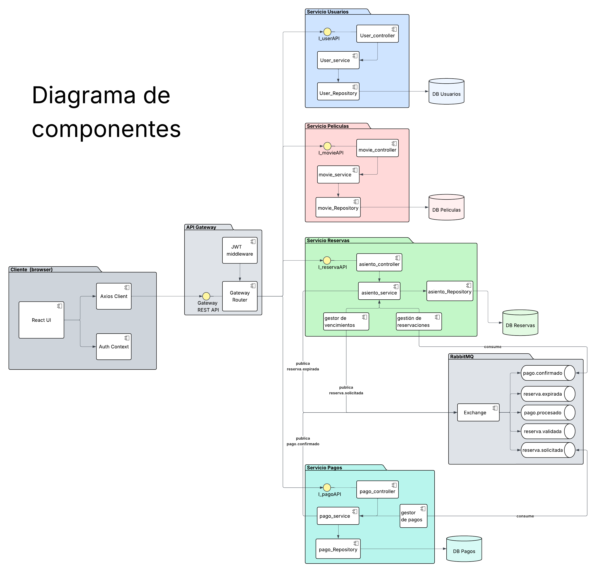
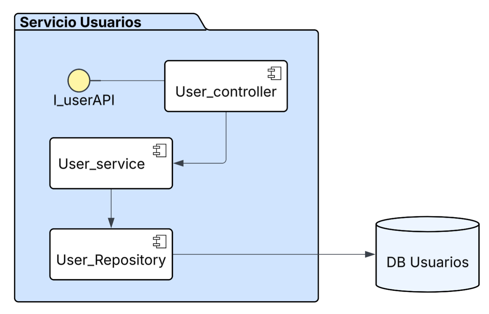
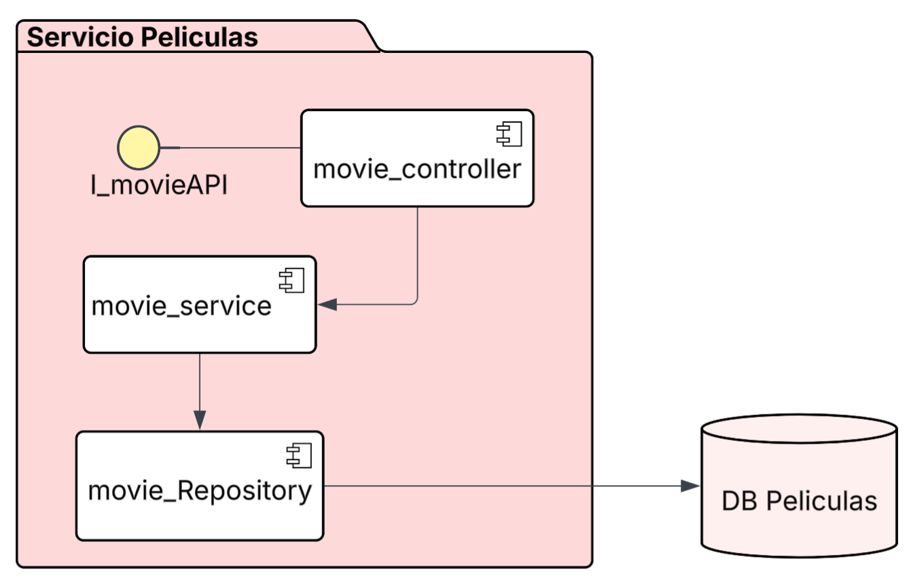
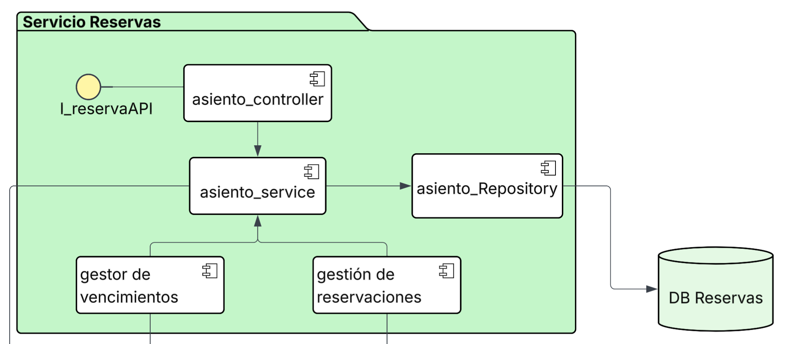
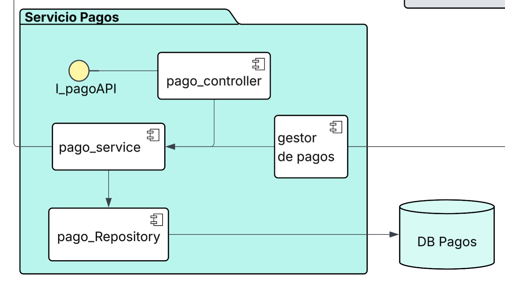
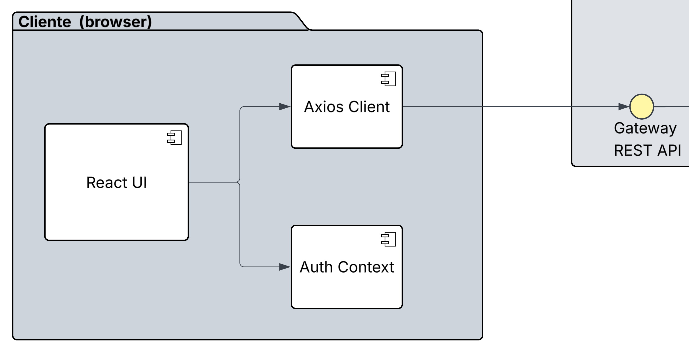
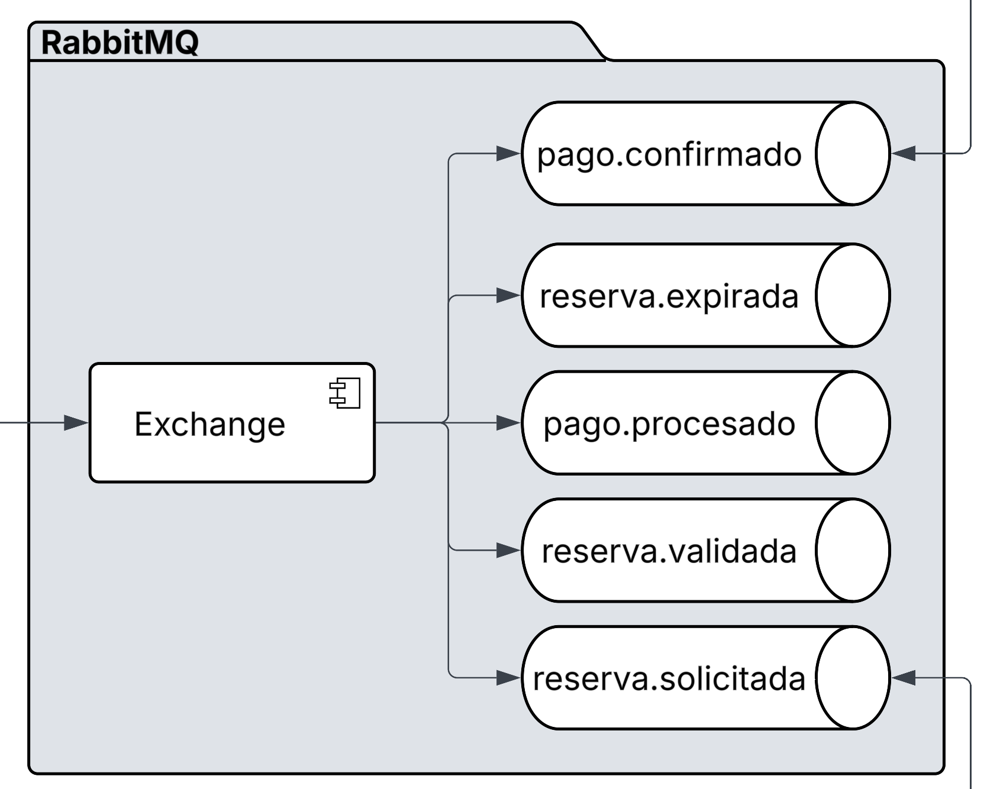

# Diagrama de Componentes

## Justificación Arquitectónica

La solución adopta una Arquitectura Orientada a Servicios (SOA) debido a que el enunciado establece explícitamente que cada dominio conceptual debe modelarse como un servicio independiente con autonomía funcional y lógica propia. Esta decisión permite desacoplar las diferentes áreas de negocio, reducir dependencias directas entre módulos y facilitar el crecimiento futuro de la plataforma.

Bajo este enfoque, cada servicio encapsula su propia lógica de negocio, controla su acceso a datos y expone interfaces bien definidas para interactuar con el resto del ecosistema. Esto favorece la mantenibilidad del sistema y permite que cada componente evolucione de manera independiente sin afectar a los demás dominios.

Adicionalmente, los procesos críticos relacionados con reservas y pagos se desacoplan mediante RabbitMQ, permitiendo que las operaciones de negocio continúen ejecutándose incluso ante fallos temporales de algún servicio participante.

|  |  |  |  |
|:-:|:-:|:-:|:-:|

# Organización de los Servicios SOA

La arquitectura se encuentra dividida en cuatro servicios principales que representan los dominios de negocio identificados durante el análisis de requerimientos.

El Servicio de Usuarios es responsable de la gestión de usuarios, autenticación y control de acceso. Su función principal consiste en administrar la identidad de los clientes que utilizan la plataforma.

El Servicio de Películas concentra toda la información relacionada con la cartelera, funciones, ciudades, cines y clasificación de películas. Este servicio permite desacoplar completamente la gestión de contenido cinematográfico del resto de funcionalidades del sistema.

El Servicio de Reservas administra el mapa de asientos, la disponibilidad en tiempo real, el bloqueo temporal de localidades y la confirmación de reservas. Debido a que maneja recursos altamente concurrentes, constituye uno de los dominios más críticos de la plataforma.

El Servicio de Pagos es responsable de procesar las transacciones financieras, registrar pagos y generar las confirmaciones correspondientes. Su separación permite aislar la lógica financiera del resto de procesos operativos.

Cada uno de estos servicios mantiene responsabilidades claramente definidas y se comunica mediante interfaces formales, reduciendo el acoplamiento entre dominios.

---

# Frontend

La capa de presentación se implementa utilizando React y Vite. Dentro de esta capa se identifican varios componentes especializados que colaboran para construir la experiencia de usuario.

El componente React UI representa la interfaz principal de la aplicación y actúa como punto de interacción entre el usuario y los servicios del sistema.

El componente Auth Context centraliza la información relacionada con autenticación, sesiones activas y tokens JWT. Esta decisión evita duplicar lógica de autenticación en múltiples pantallas y facilita la administración global del estado del usuario.

Finalmente, Axios Client actúa como la capa de comunicación HTTP encargada de consumir los servicios expuestos por el backend. Su utilización permite centralizar interceptores, encabezados de autenticación y manejo uniforme de errores.

# API Gateway

El API Gateway constituye el punto único de entrada para todas las solicitudes provenientes del frontend. Su incorporación responde a la necesidad de ocultar la complejidad interna de la arquitectura y evitar que el cliente conozca directamente la ubicación o estructura de los servicios internos.

El componente Gateway Router se encarga de enrutar las solicitudes hacia el servicio correspondiente según el dominio funcional requerido. De esta forma, el frontend interactúa con una única API independientemente del número de servicios existentes.

El componente JWT Middleware centraliza la validación de tokens de autenticación, garantizando que únicamente usuarios autorizados puedan acceder a los recursos protegidos del sistema.

La interfaz Gateway REST API representa el contrato expuesto al cliente y formaliza los puntos de acceso disponibles para la aplicación web.

Esta estrategia simplifica el consumo de servicios, mejora la seguridad y facilita la incorporación futura de mecanismos como monitoreo, balanceo de carga o limitación de solicitudes.

# Estructura Interna de los Servicios

Todos los servicios implementan una arquitectura en capas compuesta por Controller, Service y Repository.

La capa Controller es responsable de recibir las solicitudes HTTP, validar los datos de entrada y delegar el procesamiento a la lógica de negocio correspondiente. Esta capa no contiene reglas de negocio, actuando únicamente como punto de acceso al servicio.

La capa Service concentra las reglas de negocio y representa el núcleo funcional de cada dominio. En esta capa se ejecutan las validaciones, cálculos y decisiones que definen el comportamiento del sistema.

La capa Repository abstrae completamente el acceso a PostgreSQL, permitiendo que la lógica de negocio permanezca independiente de la tecnología de persistencia utilizada. Esta separación mejora la mantenibilidad y facilita futuras modificaciones en la estrategia de almacenamiento.

La adopción de esta estructura promueve una clara separación de responsabilidades, reduce el acoplamiento interno y favorece la reutilización de componentes.

# Interfaces de Servicio

Cada servicio expone una interfaz formal que representa su contrato público dentro de la arquitectura.

Las interfaces IUserAPI, IMovieAPI, IReservationAPI e IPaymentAPI definen los servicios disponibles para otros componentes del sistema sin exponer detalles internos de implementación.

La utilización de interfaces permite que los consumidores dependan de contratos estables en lugar de implementaciones concretas, reduciendo el acoplamiento y facilitando la evolución futura de cada servicio.

Desde una perspectiva arquitectónica, estas interfaces representan los límites funcionales de cada dominio y documentan explícitamente los puntos de integración permitidos.

# Persistencia de Datos

Cada servicio posee acceso exclusivo a su propio repositorio de datos, siguiendo el principio de autonomía de información promovido por SOA.

La base de datos de Usuarios almacena la información relacionada con autenticación y perfiles de usuario.

La base de datos de Películas almacena información sobre cartelera, funciones, ciudades y salas de cine.

La base de datos de Reservas mantiene el estado de los asientos, bloqueos temporales y reservas confirmadas.

La base de datos de Pagos registra las transacciones financieras y el historial de operaciones realizadas.

La separación de persistencia evita dependencias directas entre dominios y permite que cada servicio evolucione su modelo de datos de manera independiente.

# Integración Mediante RabbitMQ

RabbitMQ actúa como el componente central de comunicación asíncrona dentro de la arquitectura.

Su función consiste en desacoplar los procesos críticos relacionados con reservas y pagos mediante el intercambio de eventos. En lugar de depender de llamadas directas entre servicios, los mensajes son publicados en el broker y procesados posteriormente por consumidores especializados.

El componente Exchange representa el punto de entrada de los mensajes dentro de RabbitMQ. Su responsabilidad consiste en recibir eventos publicados por los servicios productores y distribuirlos hacia las colas correspondientes según las reglas de enrutamiento configuradas.

Las colas reserva.solicitada, reserva.validada, pago.procesado, pago.confirmado y reserva.expirada representan canales especializados donde los mensajes permanecen almacenados hasta ser procesados por sus respectivos consumidores.

Esta estrategia garantiza tolerancia a fallos, resiliencia operativa y procesamiento desacoplado de eventos.

# Consumers de Mensajería

Dentro de los servicios de Reservas y Pagos se identifican componentes consumidores especializados encargados de procesar eventos provenientes de RabbitMQ.

El componente Payment Consumer consume solicitudes de reserva y ejecuta el procesamiento financiero correspondiente. Una vez completado el pago, genera nuevos eventos que continúan el flujo de negocio.

El componente Reservation Consumer consume eventos relacionados con pagos confirmados y actualiza el estado definitivo de las reservas dentro del sistema.

La separación de estos consumidores respecto a los controladores HTTP constituye una decisión arquitectónica importante, ya que permite que el procesamiento de eventos se ejecute independientemente de las solicitudes web recibidas por el sistema.

Esto mejora la escalabilidad y evita bloquear recursos destinados a la atención de usuarios.

# Scheduler de Expiración

El componente Expiry Scheduler forma parte del Servicio de Reservas y tiene la responsabilidad de gestionar el vencimiento automático de bloqueos temporales sobre asientos.

Cuando un usuario selecciona asientos pero abandona el proceso de compra antes de completar el pago, dichos asientos no pueden permanecer bloqueados indefinidamente, ya que afectarían la disponibilidad real mostrada al resto de clientes.

El Scheduler ejecuta verificaciones periódicas sobre las reservas pendientes y publica eventos de expiración cuando detecta bloqueos vencidos. Posteriormente, estos eventos son procesados para liberar nuevamente los asientos afectados.

Esta decisión garantiza la correcta utilización de los recursos disponibles y evita inconsistencias en el proceso de selección de localidades.

# Comunicación Entre Componentes

La arquitectura combina dos mecanismos de comunicación complementarios.

La comunicación síncrona se implementa mediante interfaces REST y es utilizada para operaciones que requieren respuesta inmediata, como autenticación, consulta de cartelera o disponibilidad de asientos.

La comunicación asíncrona se implementa mediante RabbitMQ y se utiliza para procesos críticos donde la concurrencia y la tolerancia a fallos son factores determinantes, como la confirmación de reservas y el procesamiento de pagos.

La combinación de ambos enfoques permite equilibrar simplicidad operativa y robustez arquitectónica, satisfaciendo los requisitos funcionales y no funcionales establecidos para la plataforma.

# Conclusión

El Diagrama de Componentes refleja una arquitectura SOA desacoplada, organizada por dominios de negocio y preparada para operar en entornos de alta concurrencia. La incorporación de un API Gateway, interfaces de servicio, persistencia independiente y comunicación basada en eventos permite construir una solución escalable, mantenible y alineada con los requisitos del proyecto.

La estructura propuesta favorece la separación de responsabilidades, la evolución independiente de cada servicio y la resiliencia del sistema frente a fallos, constituyendo una base sólida para la implementación de la plataforma de venta de boletos en línea.
