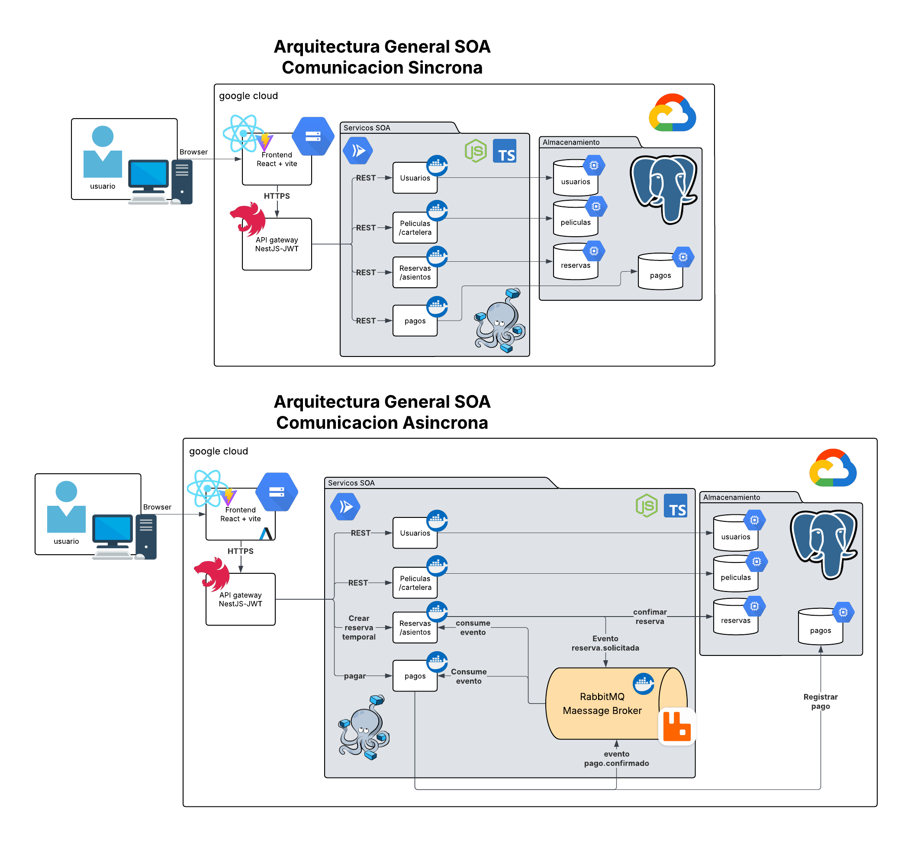
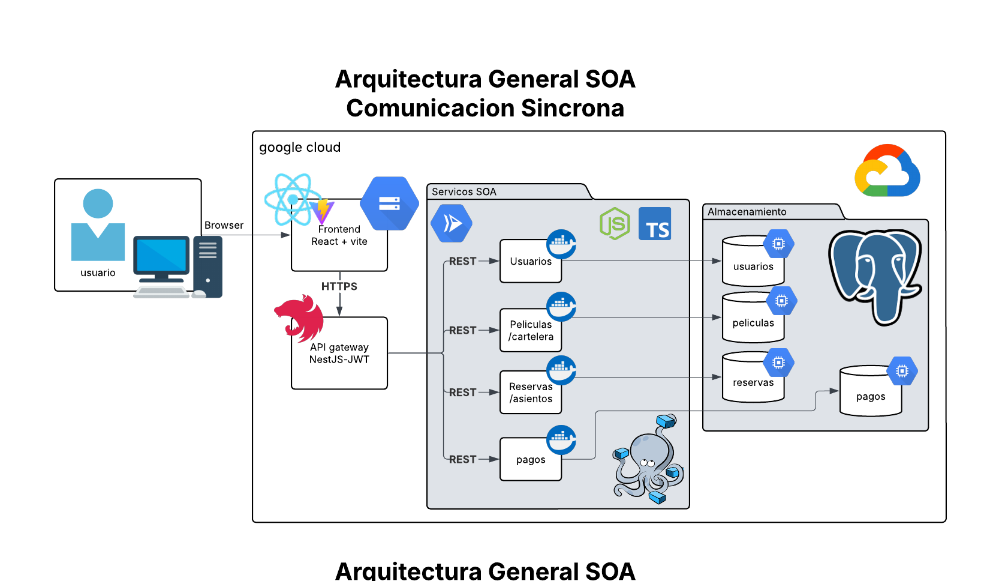
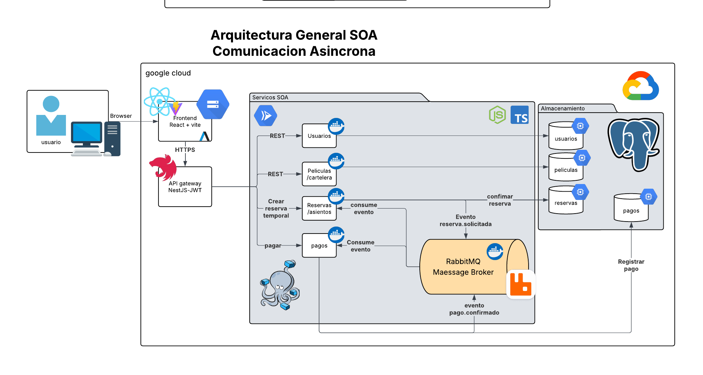

# Diagrama de Arquitectura General

El Diagrama de Arquitectura General tiene como propósito representar la visión conceptual de alto nivel del sistema, 
mostrando la topología SOA seleccionada, la ubicación de los servicios de negocio, el mecanismo de comunicación utilizado 
y la interacción entre los componentes principales.

Este diagrama no describe detalles de implementación interna, clases, puertos o configuraciones específicas de infraestructura.
Su finalidad es proporcionar una visión global que permita comprender cómo se organiza el sistema y cómo se distribuyen las 
responsabilidades entre los diferentes dominios de negocio.

Para satisfacer los requisitos planteados en el proyecto, se presentan dos vistas complementarias de la arquitectura:

* Arquitectura con comunicación síncrona.
* Arquitectura con comunicación asíncrona.

Ambas representan la misma solución SOA, diferenciándose únicamente en la forma en que los servicios intercambian información.

# Arquitectura SOA Adoptada

La solución se basa en una Arquitectura Orientada a Servicios (SOA), donde cada dominio de negocio es implementado como un servicio independiente.

Los servicios definidos para el sistema son:

* Servicio de Usuarios
* Servicio de Películas y Cartelera
* Servicio de Reservas y Asientos
* Servicio de Pagos

Este enfoque reduce el acoplamiento entre módulos y facilita la evolución futura del sistema.

# Infraestructura General

La arquitectura propuesta contempla la siguiente distribución lógica:

## Frontend

La aplicación cliente se desarrolla utilizando React y Vite.

Sus responsabilidades son:

* Presentar la interfaz gráfica al usuario.
* Consumir las APIs REST mediante Axios.
* Gestionar el estado visual de la aplicación.
* Enviar solicitudes autenticadas utilizando JWT.

El frontend se despliega como aplicación estática en Google Cloud Storage.

## API Gateway

El API Gateway constituye el punto único de entrada al sistema.

Sus responsabilidades incluyen:

* Validación de tokens JWT.
* Centralización de acceso a servicios.
* Enrutamiento de solicitudes.
* Aplicación de políticas de seguridad.
* Desacoplamiento entre clientes y servicios internos.

La utilización de un Gateway evita exponer directamente los servicios de negocio al exterior.

## Servicios SOA

Cada servicio se ejecuta dentro de su propio contenedor Docker.

### Servicio de Usuarios

Responsable de:

* Registro de usuarios.
* Autenticación.
* Gestión de perfiles.

### Servicio de Películas y Cartelera

Responsable de:

* Consulta de ciudades.
* Consulta de cines.
* Consulta de funciones.
* Consulta de películas.
* Gestión de estrenos, preventas y reestrenos.

### Servicio de Reservas y Asientos

Responsable de:

* Disponibilidad de asientos.
* Bloqueo temporal.
* Liberación automática.
* Confirmación de reservas.

### Servicio de Pagos

Responsable de:

* Procesamiento de pagos.
* Registro de transacciones.
* Confirmación de compras.

## RabbitMQ

RabbitMQ actúa como Message Broker central de la solución.

Su función principal es desacoplar los servicios involucrados en procesos críticos mediante comunicación basada en eventos.

Permite:

* Procesamiento asíncrono.
* Tolerancia a fallos.
* Reintentos automáticos.
* Persistencia temporal de mensajes.
* Eliminación de dependencias temporales entre servicios.

RabbitMQ también se ejecuta dentro de un contenedor Docker independiente.

## Persistencia

La información del sistema se almacena en PostgreSQL.

Para simplificar la administración de infraestructura, las bases de datos se alojan en una máquina virtual dedicada dentro de Google Cloud.

Cada servicio mantiene su propio esquema o conjunto de tablas, preservando la separación lógica de responsabilidades.

# Vista 1: Arquitectura con Comunicación Síncrona

## Descripción

La comunicación síncrona se utiliza para operaciones donde el usuario requiere una respuesta inmediata.

En este modelo:

1. El cliente envía una solicitud.
2. El servicio procesa la operación.
3. El servicio devuelve una respuesta.
4. El cliente permanece esperando durante todo el proceso.

## Justificación Arquitectónica

La elección de comunicación síncrona para operaciones de lectura responde a la necesidad de ofrecer al usuario una experiencia inmediata y confiable. Al tratarse de consultas ligeras, con tiempos de respuesta cortos y sin riesgos significativos de concurrencia, este enfoque garantiza que el sistema pueda devolver resultados de manera rápida y directa. De esta forma, se simplifica la implementación y se asegura que las interacciones más frecuentes sean ágiles y transparentes para el usuario.

## Beneficios

Entre los beneficios más relevantes se encuentran la simplicidad de la arquitectura, la facilidad para trazar solicitudes y la reducción de complejidad operativa. Al no requerir mecanismos adicionales de coordinación, las respuestas se entregan en tiempo real, lo que mejora la percepción de eficiencia y refuerza la confianza del usuario en el sistema. Este modelo es especialmente útil en escenarios donde la inmediatez es un atributo crítico de calidad.

## Limitaciones

Sin embargo, este enfoque también presenta limitaciones que deben considerarse. La dependencia directa entre servicios reduce la tolerancia a fallos y puede generar bloqueos en situaciones de alta demanda. Asimismo, la escalabilidad se ve restringida cuando los procesos se vuelven más complejos, lo que obliga a evaluar cuidadosamente su aplicación. En consecuencia, la comunicación síncrona resulta adecuada para operaciones simples y frecuentes, pero debe complementarse con estrategias asíncronas en procesos críticos o de mayor carga.

# Vista 2: Arquitectura con Comunicación Asíncrona

## Descripción

La comunicación asíncrona se utiliza para procesos críticos relacionados con reservas y pagos.

En este modelo:

1. Un servicio publica un evento.
2. RabbitMQ almacena el mensaje.
3. Un consumidor procesa la operación posteriormente.
4. El productor no necesita esperar la finalización del proceso.

## Justificación Arquitectónica

La selección de comunicación asíncrona mediante un middleware de mensajería responde directamente a los requisitos de calidad establecidos en el proyecto. Este enfoque permite desacoplar los procesos críticos, garantizando que las operaciones sensibles como la reserva de asientos y las transacciones financieras se gestionen de manera confiable. Al introducir una cola como mecanismo de amortiguación, se evita la pérdida de solicitudes en caso de fallos y se asegura que los mensajes se procesen en orden, reduciendo riesgos de concurrencia y mejorando la tolerancia a picos de demanda.

## Beneficios
Entre los beneficios más destacados se encuentran la escalabilidad y la resiliencia del sistema. La comunicación desacoplada facilita que los servicios puedan operar de manera independiente, lo que incrementa la tolerancia a fallos y permite manejar cargas elevadas sin comprometer la estabilidad. Asimismo, el uso de colas mejora la gestión de concurrencia y asegura que las solicitudes críticas se mantengan disponibles hasta ser procesadas, fortaleciendo la confiabilidad general de la plataforma.

## Limitaciones
No obstante, este enfoque también introduce ciertas limitaciones que deben considerarse en la planificación arquitectónica. La incorporación de un middleware de mensajería incrementa la complejidad del sistema, exige un mayor esfuerzo de monitoreo y puede derivar en escenarios de consistencia eventual. Además, la depuración de errores se vuelve más desafiante debido a la naturaleza distribuida de los procesos. Por ello, aunque la comunicación asíncrona aporta ventajas significativas en términos de resiliencia y escalabilidad, requiere una estrategia sólida de supervisión y gobernanza para garantizar su efectividad.

# Conclusión

La arquitectura propuesta combina comunicación síncrona y asíncrona para aprovechar las fortalezas de ambos modelos.

La comunicación síncrona permite ofrecer respuestas rápidas para consultas de cartelera y disponibilidad, mientras que la comunicación asíncrona garantiza que los procesos críticos de reservas y pagos puedan ejecutarse de manera segura, tolerante a fallos y escalable.

Esta estrategia híbrida permite satisfacer los requisitos funcionales y no funcionales establecidos para la plataforma de venta de boletos, manteniendo una arquitectura SOA desacoplada, escalable y preparada para futuras ampliaciones.
