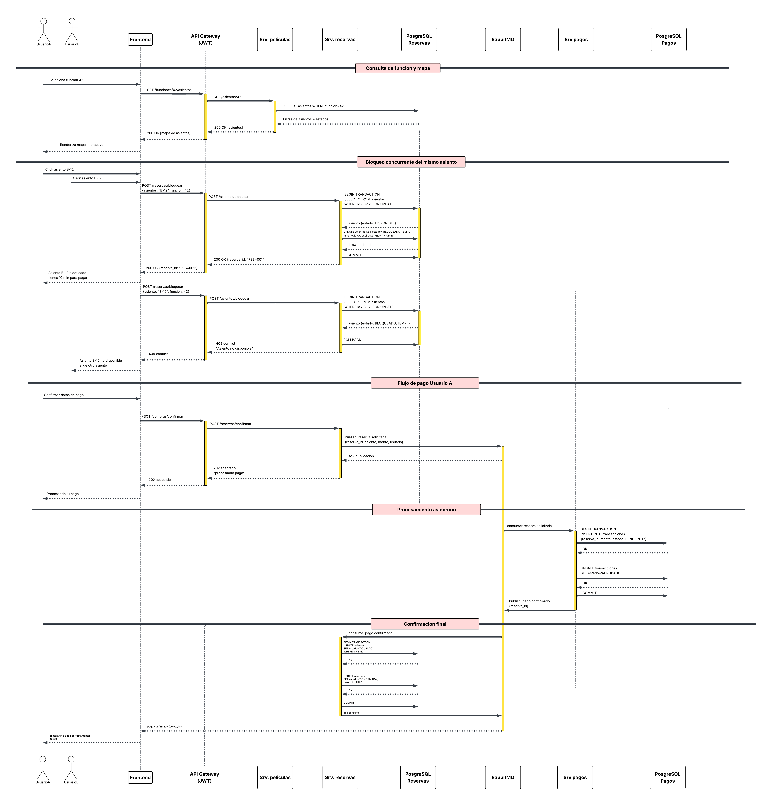
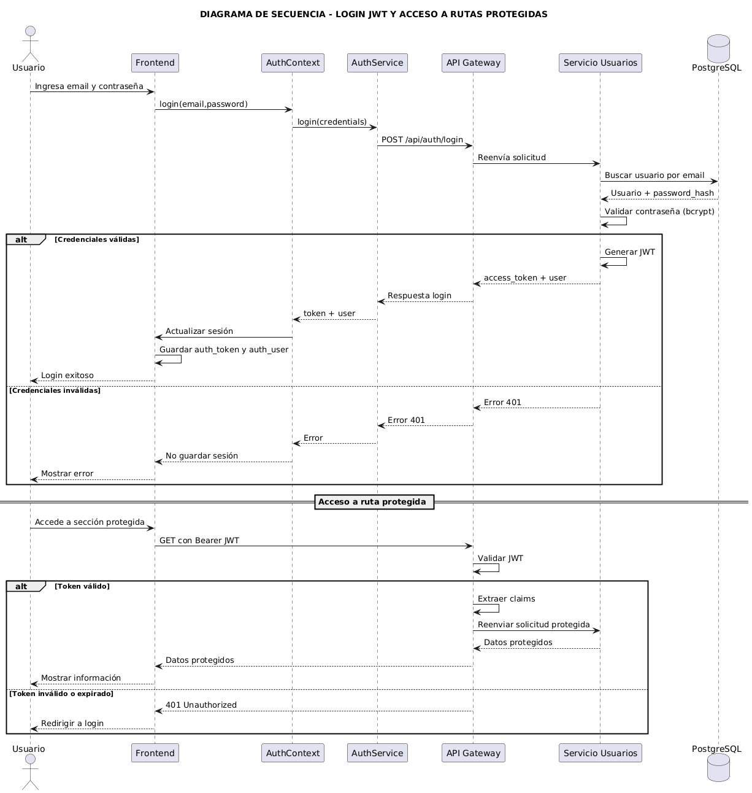

# Diagrama de Secuencia - Compra Concurrente Exitosa

## Justificación del escenario seleccionado

Se eligió modelar una compra concurrente exitosa debido a que representa el riesgo operacional más importante dentro de una plataforma de venta de boletos.

En sistemas de reservas, el principal problema consiste en evitar que dos usuarios compren simultáneamente el mismo recurso. Si la arquitectura no implementa mecanismos adecuados de sincronización, podrían generarse ventas duplicadas, inconsistencias en la disponibilidad de asientos y conflictos en la información almacenada.

Por esta razón, el diagrama muestra explícitamente cómo el Servicio de Reservas utiliza mecanismos transaccionales de PostgreSQL para serializar el acceso a los registros y garantizar que únicamente una solicitud pueda modificar el estado del asiento en un momento determinado.

# Consulta inicial de disponibilidad

El proceso comienza cuando uno de los usuarios selecciona una función de cine y solicita visualizar los asientos disponibles.

La petición es enviada desde el Frontend hacia el API Gateway, que actúa como punto único de entrada para todas las solicitudes externas.

Posteriormente el Gateway redirige la consulta al Servicio de Películas, encargado de administrar la cartelera y la información asociada a funciones y disponibilidad.

El servicio consulta la base de datos correspondiente y devuelve el estado actual de los asientos, permitiendo que el Frontend renderice el mapa interactivo que será utilizado por los usuarios para realizar la selección.

Esta etapa corresponde a una comunicación síncrona basada en HTTP debido a que el usuario requiere una respuesta inmediata para continuar navegando dentro de la plataforma.

# Intento concurrente de bloqueo del asiento

El punto central del diagrama ocurre cuando dos usuarios intentan seleccionar simultáneamente el mismo asiento.

Ambos usuarios visualizan inicialmente el asiento como disponible y realizan la selección con pocos milisegundos de diferencia.

Las solicitudes llegan al Servicio de Reservas a través del API Gateway.

Para evitar condiciones de carrera, el Servicio de Reservas inicia una transacción en PostgreSQL y ejecuta una consulta utilizando el mecanismo SELECT FOR UPDATE sobre el registro correspondiente al asiento.

Esta instrucción provoca que PostgreSQL adquiera un bloqueo exclusivo sobre la fila seleccionada, impidiendo que otras transacciones puedan modificarla mientras la operación actual no haya finalizado.

Gracias a este mecanismo, el Usuario A obtiene el bloqueo primero y puede continuar con el proceso.

# Bloqueo exitoso para el primer usuario

Una vez adquirido el bloqueo, el Servicio de Reservas verifica que el asiento continúe disponible.

Al confirmar dicha condición, actualiza el estado del asiento a BLOQUEADO_TEMP, registra el usuario propietario del bloqueo y establece una fecha de expiración correspondiente a diez minutos.

Posteriormente la transacción es confirmada mediante COMMIT y el sistema devuelve una respuesta exitosa al Usuario A junto con el identificador de la reserva temporal.

A partir de este momento el asiento deja de estar disponible para cualquier otro usuario y queda reservado exclusivamente para quien obtuvo el bloqueo.

Este mecanismo constituye la primera barrera de protección contra compras concurrentes.

# Rechazo de la segunda solicitud

Cuando la solicitud del Usuario B intenta acceder al mismo asiento, PostgreSQL permite leer el registro únicamente después de que la transacción anterior haya finalizado.

Al consultar el estado actualizado, el sistema detecta que el asiento ya se encuentra bloqueado temporalmente.

Debido a ello, la transacción es cancelada mediante un ROLLBACK y el Servicio de Reservas devuelve una respuesta HTTP 409 Conflict indicando que el asiento ya no se encuentra disponible.

Es importante destacar que en este escenario no se genera ningún mensaje dentro de RabbitMQ.

La razón es que el conflicto se detecta antes de que la reserva sea considerada válida. Como consecuencia, el flujo termina inmediatamente para el segundo usuario, evitando trabajo innecesario sobre los servicios posteriores.

# Inicio del proceso de pago

Una vez que el Usuario A posee un bloqueo válido sobre el asiento, puede proceder a completar la compra.

Al confirmar los datos de pago, el Frontend envía la solicitud al API Gateway, que la redirige al Servicio de Reservas.

En lugar de procesar directamente la transacción financiera, el Servicio de Reservas publica un evento denominado reserva.solicitada en RabbitMQ.

Esta decisión responde a una estrategia de desacoplamiento entre los dominios de Reservas y Pagos.

La reserva únicamente genera una solicitud de procesamiento, mientras que el Servicio de Pagos se encarga posteriormente de validar y completar la operación financiera.

# Procesamiento asíncrono del pago

Una vez recibido el mensaje, el Servicio de Pagos inicia el procesamiento de la transacción.

En primer lugar registra una transacción pendiente dentro de su propia base de datos y posteriormente ejecuta la lógica correspondiente a la validación y autorización del pago.

Tras completar exitosamente el proceso, actualiza el estado de la transacción a APROBADO y publica un nuevo evento denominado pago.confirmado.

Finalmente envía una confirmación de consumo a RabbitMQ, indicando que el mensaje fue procesado correctamente y puede ser eliminado de la cola.

Este mecanismo garantiza que cada solicitud sea procesada una única vez y evita duplicidad de operaciones.

# Confirmación definitiva de la reserva

RabbitMQ distribuye el evento pago.confirmado hacia el Servicio de Reservas.

Al recibir la notificación, el servicio inicia una nueva transacción y actualiza el estado del asiento desde BLOQUEADO_TEMP hacia OCUPADO.

Posteriormente registra la reserva como confirmada, genera el identificador único del boleto y almacena la información correspondiente dentro de la base de datos.

Una vez completadas todas las operaciones, la transacción es confirmada y se envía la confirmación de consumo al bróker.

En este punto la compra puede considerarse finalizada exitosamente.

# archivo crudo:
[Pizarrón en LucidChart](https://lucid.app/lucidchart/0341407f-3b08-4f73-8287-b3ce5f045f7b/edit?viewport_loc=8234%2C-212%2C3634%2C1790%2C0_0&invitationId=inv_e0d154ab-d1a0-4b92-9dc3-a4259897cd75)

# Diagrama de Secuencia - Login JWT Y Acceso a Rutas Protegidas

## Justificación del escenario seleccionado

Se eligió modelar el inicio de sesión con JWT porque representa el mecanismo principal de autenticación y autorización utilizado por la aplicación FilmStars.

Este flujo permite mostrar cómo el sistema valida la identidad del usuario, genera un token firmado y utiliza dicho token para permitir o rechazar el acceso a rutas protegidas. Además, refleja la separación de responsabilidades entre el Frontend, el API Gateway y el Servicio de Usuarios.

En la arquitectura actual, el Frontend no valida directamente las credenciales ni genera tokens. Su responsabilidad consiste en capturar los datos del usuario, enviar la solicitud de login y almacenar la sesión cuando la autenticación es exitosa. La validación de credenciales y la generación del JWT se realizan dentro del Servicio de Usuarios.

# Inicio de sesión

El proceso comienza cuando el usuario ingresa su correo electrónico y contraseña desde la interfaz web.

El Frontend invoca la función `login` del `AuthContext`, que a su vez utiliza el `authService.ts` para enviar una petición `POST /api/auth/login` hacia el API Gateway.

El API Gateway actúa como punto único de entrada y reenvía esta solicitud al Servicio de Usuarios. Esta ruta no requiere un token previo, ya que precisamente corresponde al proceso de autenticación inicial.

El Servicio de Usuarios consulta PostgreSQL para buscar el usuario asociado al correo recibido. La base de datos devuelve la información del usuario junto con el `password_hash` almacenado.

# Validación de credenciales y generación del JWT

Una vez obtenido el registro del usuario, el Servicio de Usuarios compara la contraseña ingresada contra el hash almacenado utilizando `bcrypt`.

Si las credenciales son correctas, el servicio genera un JWT firmado con la llave configurada en `JWT_SECRET`. El token incluye claims básicos del usuario, como `sub`, `email`, `nombre` y `rol`.

Posteriormente el Servicio de Usuarios devuelve una respuesta con `access_token`, `token_type`, `expires_in` y la información pública del usuario.

El `authService.ts` transforma esta respuesta al formato utilizado por el Frontend y el `AuthContext` actualiza el estado de sesión. Finalmente, el token se guarda en `localStorage` como `auth_token` y los datos del usuario como `auth_user`, permitiendo conservar la sesión después de recargar la página.

Si las credenciales son inválidas, el Servicio de Usuarios responde con un error `401`. En ese caso no se guarda información de sesión y el Frontend muestra el error correspondiente al usuario.

# Acceso a rutas protegidas

Después de iniciar sesión, el usuario puede acceder a secciones protegidas del sistema.

Para estas solicitudes, el Frontend debe enviar el JWT en la cabecera `Authorization` usando el formato `Bearer <token>`.

El API Gateway intercepta las rutas protegidas, como `/api/clientes` y `/api/users`, y valida el token antes de reenviar la solicitud al servicio correspondiente.

Si el token es válido, el Gateway extrae los claims del JWT y agrega la información del usuario autenticado en cabeceras internas como `X-User-Id`, `X-User-Email`, `X-User-Nombre` y `X-User-Rol`.

Con esta información, los servicios internos pueden conocer la identidad del usuario sin tener que volver a validar el token. Esto centraliza la seguridad en el API Gateway y mantiene a los servicios enfocados en su lógica de negocio.

Si el token no existe, es inválido o ya expiró, el API Gateway responde con `401 Unauthorized`. Como consecuencia, el Frontend debe impedir el acceso a la sección protegida y redirigir al usuario hacia el login.
