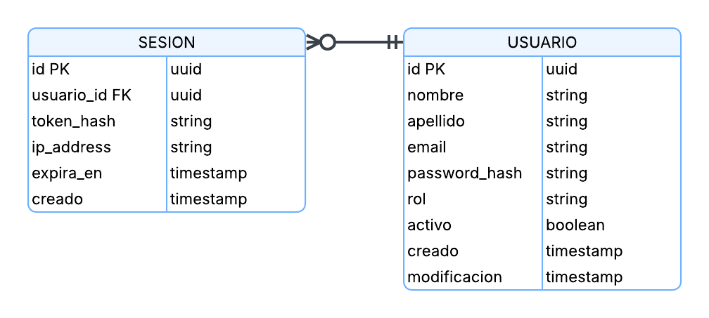
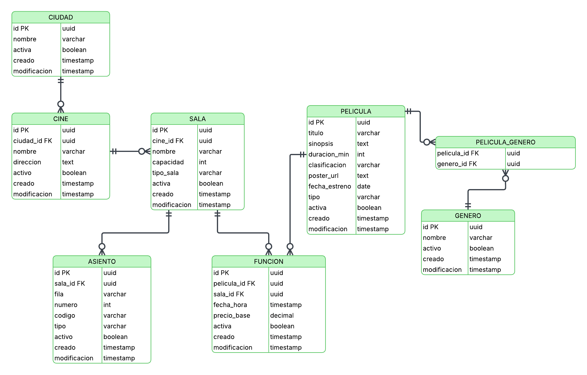
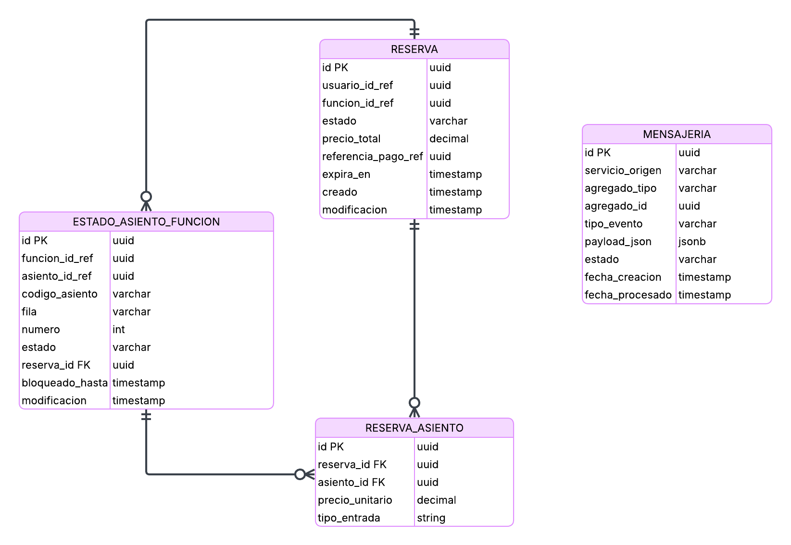
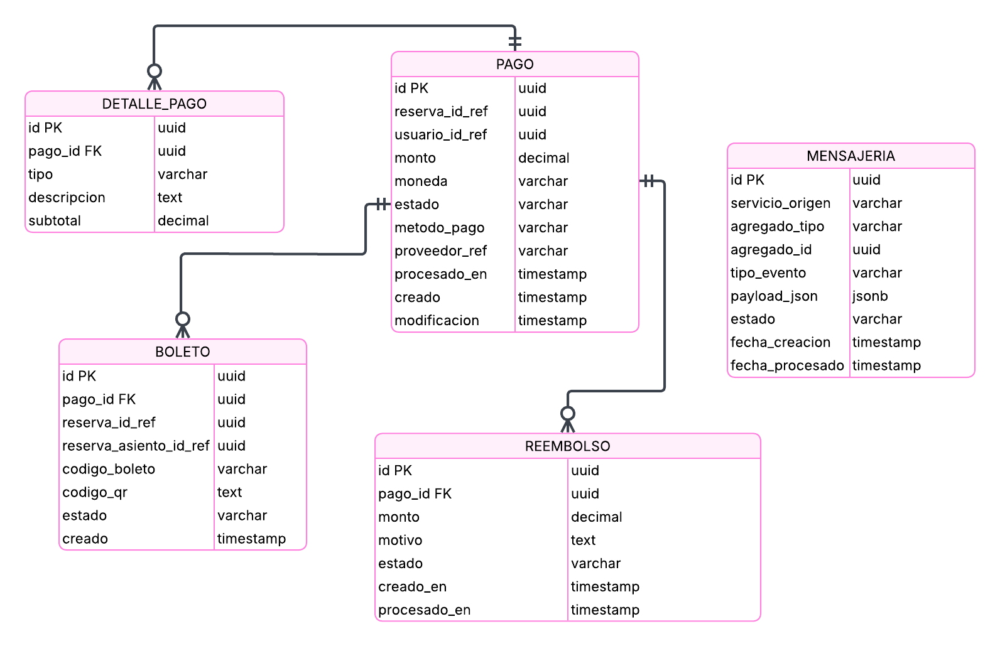

# Diagrama Entidad-Relación

Debido a que el proyecto FilmStars utiliza una arquitectura orientada a servicios (SOA), se decidió separar la persistencia de datos por dominio funcional.  
Esto significa que cada servicio posee su propia base de datos independiente, evitando acoplamiento fuerte entre módulos y facilitando el despliegue, mantenimiento y escalabilidad del sistema.

Las bases de datos definidas para el proyecto son:

- **DB Usuarios**
- **DB Películas / Cartelera**
- **DB Reservas / Asientos**
- **DB Pagos**

---

## Vista general de la separación por servicio

| Servicio | Base de datos | Propósito principal |
|---|---|---|
| Usuarios | `filmstars_users` | Gestión de usuarios, autenticación y sesiones |
| Películas / Cartelera | `filmstars_movies` | Gestión de ciudades, cines, salas, asientos, películas y funciones |
| Reservas / Asientos | `filmstars_reservations` | Gestión de reservas y estado de asientos por función |
| Pagos | `filmstars_payments` | Gestión de pagos, detalle de pagos, boletos y reembolsos |

---

## DB Usuario

#### Descripción

La base de datos de usuarios concentra la información de los usuarios registrados y de sus sesiones activas o históricas.

#### Tablas

| Tabla | Descripción |
|---|---|
| `usuario` | Almacena la información principal del usuario |
| `sesion` | Almacena información de tokens, IP y expiración de sesiones |

## DB Películas

#### Descripción

La base de datos de películas/cartelera contiene toda la información relacionada con la exhibición de películas: ciudades, cines, salas, asientos, géneros, películas y funciones.

#### Tablas

| Tabla | Descripción |
|---|---|
| `ciudad` | Catálogo de ciudades disponibles |
| `cine` | Cines disponibles por ciudad |
| `sala` | Salas pertenecientes a un cine |
| `asiento` | Asientos físicos de cada sala |
| `genero` | Géneros de películas |
| `pelicula` | Información general de las películas |
| `pelicula_genero` | Relación entre películas y géneros |
| `funcion` | Funciones programadas de una película |

## DB Reservas

#### Descripción

La base de datos de reservas gestiona la información de reservas y el estado de los asientos para una función específica.

#### Tablas

| Tabla | Descripción |
|---|---|
| `reserva` | Almacena las reservas realizadas |
| `estado_asiento_funcion` | Almacena el estado de cada asiento según la función |
| `reserva_asiento` | Relaciona la reserva con los asientos seleccionados |
| `mensajeria` | Registra eventos para comunicación asíncrona |

## DB Pagos

#### Descripción

La base de datos de pagos concentra la información de pagos simulados, boletos emitidos, detalles de pago, reembolsos y eventos de mensajería.

#### Tablas

| Tabla | Descripción |
|---|---|
| `pago` | Almacena el pago realizado |
| `detalle_pago` | Almacena el detalle del pago |
| `boleto` | Almacena el boleto emitido luego de una compra exitosa |
| `reembolso` | Almacena posibles reembolsos |
| `mensajeria` | Registra eventos relacionados con pagos |

