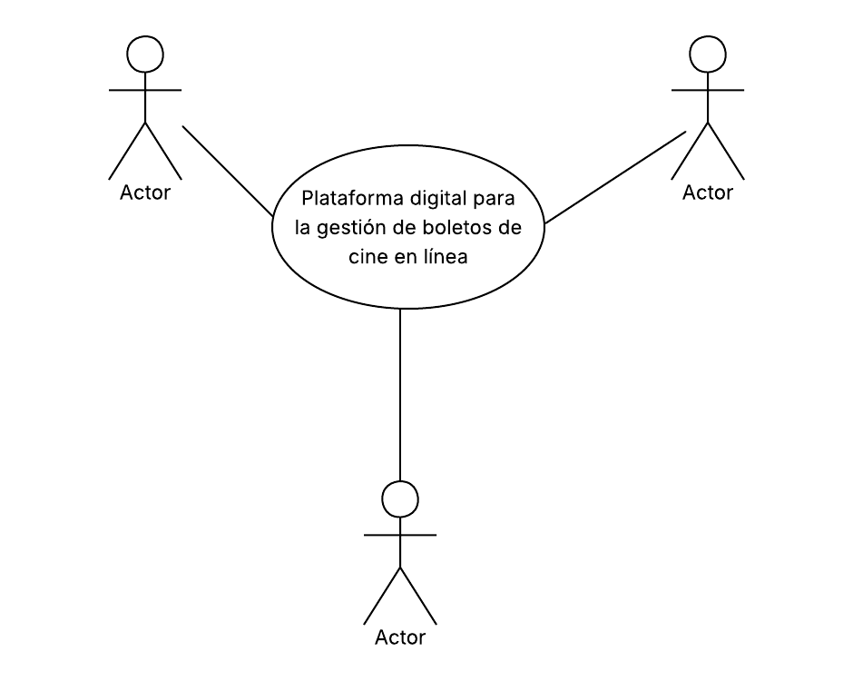
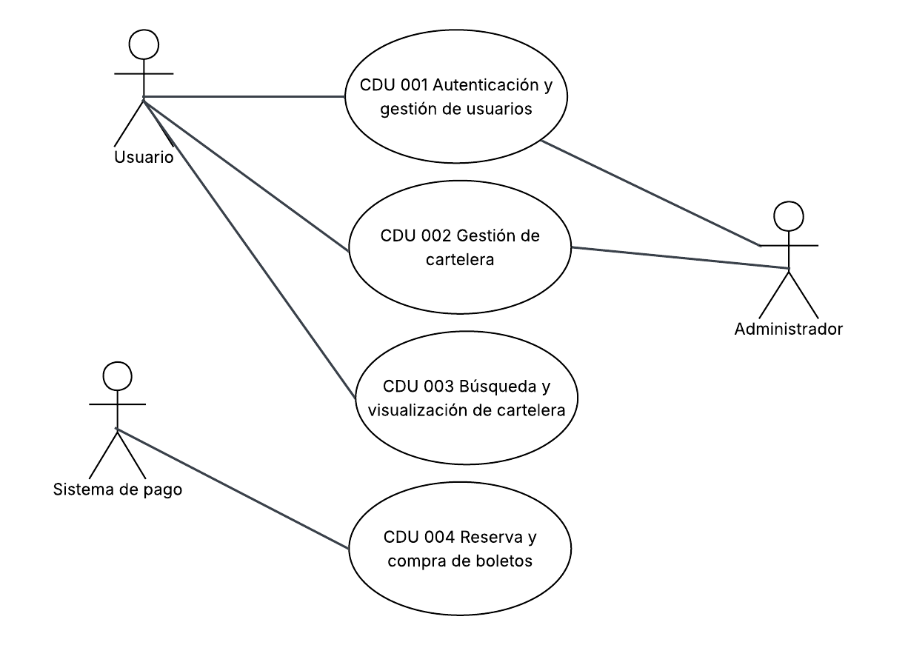
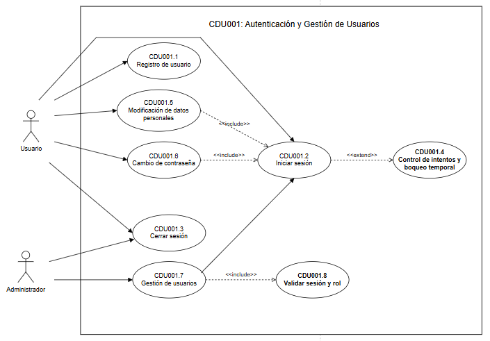
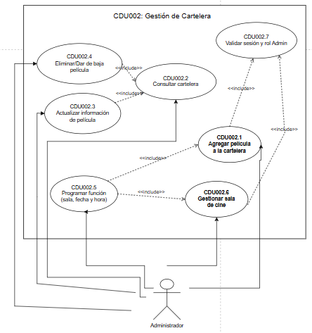
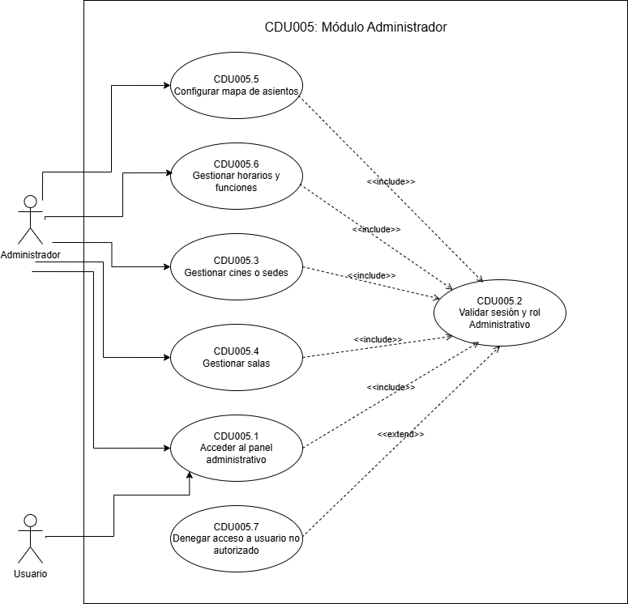

# Casos de uso
## Diagrama de casos de uso de alto nivel

## Primera descomposición

---
## Casos de Uso Expandidos

## CDU001: Autenticación y Gestión de Usuarios

Sus expandidos serían:

- CDU001.1: Registro de usuario
- CDU001.2: Iniciar sesión
- CDU001.3: Cerrar sesión
- CDU001.4: Control de intentos y bloqueo temporal
- CDU001.5: Modificación de datos personales
- CDU001.6: Cambio de contraseña
- CDU001.7: Gestión de usuarios (Administrador)
- CDU001.8: Validación de sesión y rol

---

| Campo             | Detalle                                                                                                                                                                                                                                                                                                                                                                                                                                                                                                                                               |
| ----------------- | ----------------------------------------------------------------------------------------------------------------------------------------------------------------------------------------------------------------------------------------------------------------------------------------------------------------------------------------------------------------------------------------------------------------------------------------------------------------------------------------------------------------------------------------------------- |
| Nombre            | Registro de usuario                                                                                                                                                                                                                                                                                                                                                                                                                                                                                                                                   |
| Código            | CDU001.1                                                                                                                                                                                                                                                                                                                                                                                                                                                                                                                                              |
| Actores           | Usuario                                                                                                                                                                                                                                                                                                                                                                                                                                                                                                                                               |
| Descripción       | Permite que un nuevo usuario cree una cuenta en la plataforma FilmStars ingresando sus datos personales y credenciales para acceder a la compra de boletos.                                                                                                                                                                                                                                                                                                                                                                                           |
| Precondiciones    | N/A                                                                                                                                                                                                                                                                                                                                                                                                                                                                                                                                                   |
| Post Condiciones  | - Usuario creado exitosamente. - El usuario no es creado si ocurre un error en los datos ingresados.                                                                                                                                                                                                                                                                                                                                                                                                                                               |
| Flujo principal   | 1. El usuario selecciona la opción "Registrarse". 2. El sistema muestra el formulario de registro. 3. El usuario ingresa su nombre completo. 4. El usuario ingresa su correo electrónico. 5. El usuario ingresa su contraseña. 6. El usuario confirma su contraseña. 7. El usuario presiona "Crear cuenta". 8. El sistema valida que todos los campos sean correctos. 9. El sistema verifica que el correo electrónico sea único. 10. El sistema cifra la contraseña. 11. El sistema guarda el usuario. 12. El sistema muestra confirmación de registro exitoso y redirige al inicio de sesión. |
| Flujos alternos   | **FA1: Datos incompletos** FA1.1 El sistema resalta los campos vacíos. FA1.2 Notifica "Todos los campos son obligatorios". FA1.3 El usuario completa los datos faltantes. FA1.4 Continúa flujo principal en el paso 8.  **FA2: Correo electrónico ya registrado** FA2.1 El sistema detecta el correo duplicado. FA2.2 Notifica "Este correo ya está en uso". FA2.3 El usuario ingresa un correo diferente. FA2.4 Continúa flujo principal en el paso 9.  **FA3: Contraseñas no coinciden** FA3.1 El sistema detecta que la confirmación no coincide. FA3.2 Notifica "Las contraseñas no coinciden". FA3.3 El usuario corrige la confirmación. FA3.4 Continúa flujo principal en el paso 8.  **FA4: Error al guardar** FA4.1 El sistema notifica que el registro no pudo completarse. FA4.2 Sugiere reintentar más tarde. |
| Reglas de negocio | - El correo electrónico debe ser único en el sistema. - La contraseña debe cumplir los requisitos mínimos de seguridad (mínimo 8 caracteres, al menos una mayúscula y un número). - Las credenciales deben almacenarse de forma segura mediante cifrado. |
| Flujo de excepción | **FE1: Error del servidor al procesar el registro** FE1.1 El sistema detecta un error interno (caída de servicio, timeout de base de datos, etc.). FE1.2 El sistema notifica al usuario: "No se pudo completar el registro. Inténtelo de nuevo más tarde". FE1.3 El sistema registra el error en los logs para análisis del equipo técnico. FE1.4 Los datos ingresados por el usuario se mantienen en el formulario para evitar reingreso.  **FE2: Fallo en el servicio de correo de confirmación** FE2.1 El usuario se registra exitosamente pero el servicio de correo falla. FE2.2 El sistema notifica al usuario que su cuenta fue creada pero el correo de confirmación no pudo enviarse. FE2.3 El sistema permite reenviar el correo de confirmación desde el perfil del usuario. |
| Reglas de calidad | - La contraseña debe cifrarse antes de almacenarse. - El registro no debe exceder 3 segundos. - El indicador de fuerza de contraseña debe mostrarse en tiempo real. |

---

| Campo             | Detalle                                                                                                                                                                                                                                                                    |
| ----------------- | -------------------------------------------------------------------------------------------------------------------------------------------------------------------------------------------------------------------------------------------------------------------------- |
| Nombre            | Iniciar sesión                                                                                                                                                                                                                                                             |
| Código            | CDU001.2                                                                                                                                                                                                                                                                   |
| Actores           | Usuario  Administrador                                                                                                                                                                                                                                    |
| Descripción       | Permite que un usuario registrado acceda a la plataforma mediante autenticación con sus credenciales, obteniendo acceso según su rol asignado.                                                                                                                             |
| Precondiciones    | - El usuario debe existir en el sistema (CDU001.1).                                                                                                                                                                                                                        |
| Post Condiciones  | - Sesión iniciada correctamente y usuario redirigido según su rol. - Sesión no iniciada si las credenciales son inválidas.                                                                                                                                              |
| Flujo principal   | 1. El usuario ingresa su correo electrónico. 2. El usuario ingresa su contraseña. 3. El usuario presiona "Iniciar sesión". 4. El sistema valida las credenciales ingresadas. 5. El sistema genera un JWT con los claims esenciales del usuario: id, nombre, correo y rol. 6. El sistema retorna el token al frontend. 7. El frontend almacena temporalmente el token y lo envía en rutas protegidas mediante Authorization: Bearer <token>. 8. El sistema redirige al usuario según su rol (usuario general al catálogo, administrador al panel de gestión). |
| Flujos alternos   | **FA1: Credenciales inválidas** FA1.1 El sistema notifica "Correo o contraseña incorrectos". FA1.2 El sistema incrementa el contador de intentos fallidos. FA1.3 El usuario puede reintentar.  **FA2: Usuario bloqueado temporalmente** FA2.1 El sistema detecta que el usuario superó el límite de intentos. FA2.2 El sistema notifica el bloqueo y el tiempo restante de espera. FA2.3 El sistema deniega el acceso. |
| Reglas de negocio | - Si las credenciales no son válidas, el acceso es denegado. - El sistema no debe revelar si el error es de correo o de contraseña para proteger la seguridad. |
| Flujo de excepción | **FE1: Error del sistema de autenticación** FE1.1 El sistema de autenticación (base de datos o servicio externo) no responde. FE1.2 El sistema notifica: "Error del sistema. Inténtelo de nuevo más tarde". FE1.3 El sistema registra el error y alerta al equipo de infraestructura.  **FE2: Token de sesión no se genera** FE2.1 Tras validar credenciales correctas, el sistema no puede generar el token de sesión. FE2.2 El sistema notifica al usuario que ocurrió un error y solicita reintentar. FE2.3 El contador de intentos fallidos no se incrementa. |
| Reglas de calidad | - La validación debe procesarse de forma segura. - No se debe revelar información sensible en los mensajes de error. - El inicio de sesión no debe exceder 2 segundos. |

---

| Campo             | Detalle                                                                                                                                                                       |
| ----------------- | ----------------------------------------------------------------------------------------------------------------------------------------------------------------------------- |
| Nombre            | Cerrar sesión                                                                                                                                                                 |
| Código            | CDU001.3                                                                                                                                                                      |
| Actores           | Usuario, Administrador                                                                                                                                                        |
| Descripción       | Permite finalizar la sesión activa del usuario para cerrar el acceso a la plataforma de manera segura.                                                                       |
| Precondiciones    | El usuario tiene una sesión activa.                                                                                                                                           |
| Post Condiciones  | La sesión es cerrada correctamente y el usuario es redirigido a la pantalla de inicio.                                                                                       |
| Flujo principal   | 1. El usuario selecciona la opción "Cerrar sesión". 2. El sistema invalida el token/sesión activa. 3. El sistema elimina los datos de sesión almacenados localmente. 4. El sistema redirige al usuario a la pantalla de inicio de sesión. |
| Flujos alternos   | **FA1: Sesión expirada previamente** FA1.1 El sistema detecta que la sesión ya no es válida. FA1.2 El sistema redirige a la pantalla de autenticación mostrando aviso de sesión expirada. |
| Reglas de negocio | - Al cerrar sesión se invalida el token de acceso actual de forma inmediata. - El usuario no puede acceder a funciones protegidas tras cerrar sesión. |
| Flujo de excepción | **FE1: Error del servidor al invalidar la sesión** FE1.1 El sistema intenta invalidar el token/sesión pero el servicio de autenticación no responde. FE1.2 El sistema notifica al usuario: "Error al cerrar sesión. Se cerrará de forma local". FE1.3 El sistema elimina los datos locales de sesión del navegador/dispositivo del usuario. FE1.4 El sistema registra el error para revisión técnica.  **FE2: Token ya expirado o inválido al cerrar sesión** FE2.1 El token ya no es válido en el servidor al intentar invalidarlo. FE2.2 El sistema procede a limpiar los datos locales y redirige al inicio de sesión sin mostrar error. |
| Reglas de calidad | - La invalidación de la sesión debe ser inmediata. - El cierre de sesión no debe presentar errores visibles al usuario. |

---

| Campo             | Detalle                                                                                                                                                                                                                                                                                |
| ----------------- | -------------------------------------------------------------------------------------------------------------------------------------------------------------------------------------------------------------------------------------------------------------------------------------- |
| Nombre            | Control de intentos y bloqueo temporal                                                                                                                                                                                                                                                 |
| Código            | CDU001.4                                                                                                                                                                                                                                                                               |
| Actores           | Usuario, Administrador                                                                                                                                                                                                                                                                 |
| Descripción       | Controla los intentos fallidos de inicio de sesión y aplica un bloqueo temporal cuando se supera el límite permitido, protegiendo la plataforma de accesos no autorizados.                                                                                                            |
| Precondiciones    | Se ha realizado al menos un intento de inicio de sesión fallido.                                                                                                                                                                                                                       |
| Post Condiciones  | - Intento registrado en el sistema. - Usuario bloqueado temporalmente si excede el límite de intentos. - Acceso permitido si las credenciales son válidas antes de alcanzar el límite.                                                                                          |
| Flujo principal   | 1. El usuario intenta iniciar sesión con credenciales incorrectas. 2. El sistema registra el intento fallido. 3. El sistema evalúa el número de intentos acumulados. 4. Si no supera el límite, el sistema permite un nuevo intento e informa los intentos restantes. 5. Si supera el límite, el sistema aplica un bloqueo temporal. 6. El sistema notifica al usuario el bloqueo y el tiempo de espera. |
| Flujos alternos   | **FA1: Límite de intentos alcanzado** FA1.1 El sistema activa el bloqueo temporal. FA1.2 El sistema deniega el acceso mostrando el tiempo restante de bloqueo.  **FA2: Error al registrar el intento** FA2.1 El sistema deniega el acceso como medida de seguridad. FA2.2 El sistema muestra un mensaje de error genérico. |
| Reglas de negocio | - El límite de intentos fallidos es de 5 intentos consecutivos. - Al exceder el límite se bloquea el acceso por un tiempo definido (mínimo 15 minutos). - El contador se reinicia tras un inicio de sesión exitoso. |
| Flujo de excepción | **FE1: Fallo en el registro de intentos fallidos** FE1.1 El sistema intenta registrar un intento fallido pero la base de datos no responde. FE1.2 El sistema deniega el acceso como medida de seguridad preventiva. FE1.3 El sistema muestra mensaje genérico de error y solicita reintentar. FE1.4 El error se registra en los logs del sistema.  **FE2: Inconsistencia en el contador de intentos** FE2.1 El sistema detecta que el contador de intentos del usuario está corrupto o inconsistente. FE2.2 El sistema reinicia el contador y notifica al usuario que debe reintentar. FE2.3 El administrador del sistema recibe una alerta de seguridad para revisión manual. |
| Reglas de calidad | - El registro de intentos debe ser confiable y persistente. - El bloqueo debe aplicarse de forma inmediata al cumplirse la condición. - El mensaje de bloqueo debe indicar el tiempo de espera restante. |

---

| Campo             | Detalle                                                                                                                                                                                                                                                                                                                                                                                                                                                                                                                        |
| ----------------- | ------------------------------------------------------------------------------------------------------------------------------------------------------------------------------------------------------------------------------------------------------------------------------------------------------------------------------------------------------------------------------------------------------------------------------------------------------------------------------------------------------------------------------ |
| Nombre            | Modificación de datos personales                                                                                                                                                                                                                                                                                                                                                                                                                                                                                               |
| Código            | CDU001.5                                                                                                                                                                                                                                                                                                                                                                                                                                                                                                                       |
| Actores           | Usuario, Administrador                                                                                                                                                                                                                                                                                                                                                                                                                                                                                                         |
| Descripción       | Permite que el usuario autenticado acceda a su perfil y actualice sus datos personales como nombre, correo electrónico y foto de perfil para mantener su cuenta actualizada.                                                                                                                                                                                                                                                                                                                                                   |
| Precondiciones    | El usuario debe estar autenticado y tener una sesión activa (CDU001.2).                                                                                                                                                                                                                                                                                                                                                                                                                                                        |
| Post Condiciones  | Datos del usuario actualizados exitosamente, o cambios descartados si el usuario cancela.                                                                                                                                                                                                                                                                                                                                                                                                                                      |
| Flujo principal   | 1. El usuario accede a la sección "Mi Perfil". 2. El sistema carga y muestra los datos actuales del usuario. 3. El usuario presiona el botón "Editar". 4. El formulario se habilita para edición. 5. El usuario modifica su nombre. 6. El usuario modifica su correo electrónico. 7. El usuario selecciona nueva foto de perfil (opcional). 8. El usuario presiona "Guardar Cambios". 9. El sistema valida los datos modificados. 10. El sistema actualiza la información en la base de datos. 11. El sistema muestra notificación de éxito. 12. El formulario regresa a modo solo lectura. |
| Flujos alternos   | **FA1: Nuevo correo ya registrado** FA1.1 El sistema detecta que el correo ya existe en el sistema. FA1.2 Notifica "Este correo ya está en uso por otra cuenta". FA1.3 El usuario ingresa un correo diferente. FA1.4 Continúa flujo principal en el paso 9.  **FA2: Formato de correo inválido** FA2.1 El sistema detecta formato incorrecto. FA2.2 Notifica "Ingrese un correo electrónico válido". FA2.3 El usuario corrige el correo. FA2.4 Continúa flujo principal en el paso 9.  **FA3: Foto de perfil inválida** FA3.1 El sistema detecta formato no permitido o tamaño excedido. FA3.2 Notifica "Solo se permiten imágenes JPG/PNG de hasta 5MB". FA3.3 El usuario selecciona una imagen válida. FA3.4 Continúa flujo principal en el paso 8.  **FA4: El usuario cancela la edición** FA4.1 El usuario presiona "Cancelar". FA4.2 El sistema descarta todos los cambios. FA4.3 El formulario vuelve a modo de solo lectura. |
| Reglas de negocio | - El usuario solo puede editar su propio perfil. - No puede existir más de un usuario con el mismo correo electrónico. - El administrador puede editar datos de cualquier usuario. |
| Flujo de excepción | **FE1: Fallo en la conexión a la base de datos durante la actualización** FE1.1 El sistema procesa la actualización pero la base de datos no responde. FE1.2 El sistema notifica: "Error al actualizar sus datos. Inténtelo de nuevo más tarde". FE1.3 Los cambios no se aplican y el formulario mantiene los datos originales. FE1.4 El sistema registra el error para revisión técnica.  **FE2: Error de integridad referencial** FE2.1 Al modificar el correo, el sistema detecta una violación de integridad referencial en tablas relacionadas. FE2.2 El sistema cancela la operación y notifica al usuario que debe contactar a soporte. FE2.3 Se genera un ticket automático para el equipo de soporte técnico. |
| Reglas de calidad | - El botón "Guardar Cambios" debe deshabilitarse si no se realizaron modificaciones. - La actualización no debe exceder 2 segundos. - La edición debe contar con botones claramente visibles. |

---

| Campo             | Detalle                                                                                                                                                                                                                                                                                                                                                                                                                                                                                                                      |
| ----------------- | ---------------------------------------------------------------------------------------------------------------------------------------------------------------------------------------------------------------------------------------------------------------------------------------------------------------------------------------------------------------------------------------------------------------------------------------------------------------------------------------------------------------------------- |
| Nombre            | Cambio de contraseña                                                                                                                                                                                                                                                                                                                                                                                                                                                                                                         |
| Código            | CDU001.6                                                                                                                                                                                                                                                                                                                                                                                                                                                                                                                     |
| Actores           | Usuario, Administrador                                                                                                                                                                                                                                                                                                                                                                                                                                                                                                       |
| Descripción       | Permite que el usuario autenticado cambie su contraseña desde su perfil, validando la contraseña actual y asegurando que la nueva cumpla los requisitos de seguridad de la plataforma.                                                                                                                                                                                                                                                                                                                                       |
| Precondiciones    | El usuario debe estar autenticado y ubicado en su página de perfil (CDU001.2).                                                                                                                                                                                                                                                                                                                                                                                                                                               |
| Post Condiciones  | Contraseña cambiada exitosamente, o cambio rechazado si la validación falla.                                                                                                                                                                                                                                                                                                                                                                                                                                                 |
| Flujo principal   | 1. El usuario accede a la sección "Mi Perfil". 2. El sistema muestra el formulario de cambio de contraseña. 3. El usuario ingresa su contraseña actual. 4. El usuario ingresa la nueva contraseña. 5. El usuario confirma la nueva contraseña. 6. El sistema valida que la contraseña actual sea correcta. 7. El sistema valida los requisitos de seguridad de la nueva contraseña. 8. El sistema verifica que la confirmación coincida. 9. El usuario presiona "Cambiar Contraseña". 10. El sistema actualiza la contraseña en la base de datos. 11. El sistema muestra notificación de éxito. |
| Flujos alternos   | **FA1: Contraseña actual incorrecta** FA1.1 El sistema detecta que la contraseña actual no es válida. FA1.2 Notifica "La contraseña actual es incorrecta". FA1.3 El usuario la reingresa. FA1.4 Continúa flujo principal en el paso 6.  **FA2: Nueva contraseña débil** FA2.1 El sistema detecta que no cumple los requisitos mínimos. FA2.2 Notifica los requisitos de seguridad incumplidos. FA2.3 El usuario corrige la contraseña. FA2.4 Continúa flujo principal en el paso 7.  **FA3: Confirmación no coincide** FA3.1 El sistema detecta que la confirmación es diferente. FA3.2 Notifica "Las contraseñas no coinciden". FA3.3 El usuario corrige la confirmación. FA3.4 Continúa flujo principal en el paso 8.  **FA4: Error del sistema al actualizar** FA4.1 El sistema notifica el fallo al usuario. FA4.2 La contraseña no es modificada. FA4.3 El sistema sugiere reintentar más tarde. |
| Reglas de negocio | - La contraseña actual debe ser válida para autorizar el cambio. - La nueva contraseña no puede ser igual a la anterior. - Debe cumplir requisitos mínimos: al menos 8 caracteres, una mayúscula y un número. |
| Flujo de excepción | **FE1: Error del sistema al verificar la contraseña actual** FE1.1 El servicio de validación de contraseñas no responde. FE1.2 El sistema notifica: "Error del sistema. No se pudo verificar la contraseña actual". FE1.3 El sistema sugiere reintentar más tarde.  **FE2: Fallo en el cifrado de la nueva contraseña** FE2.1 Tras validar todos los requisitos, el sistema no puede cifrar la nueva contraseña. FE2.2 El sistema notifica el error y no aplica el cambio. FE2.3 La contraseña actual permanece activa. FE2.4 Se registra el error crítico en los logs del sistema. |
| Reglas de calidad | - Mostrar el indicador de fuerza de contraseña en tiempo real. - Los mensajes de error deben ser claros y específicos. - El proceso de cambio no debe exceder 2 segundos. |

---

| Campo             | Detalle                                                                                                                                                                                                                                                                                                                        |
| ----------------- | ------------------------------------------------------------------------------------------------------------------------------------------------------------------------------------------------------------------------------------------------------------------------------------------------------------------------------ |
| Nombre            | Gestión de usuarios                                                                                                                                                                                                                                                                                                            |
| Código            | CDU001.7                                                                                                                                                                                                                                                                                                                       |
| Actores           | Administrador                                                                                                                                                                                                                                                                                                                  |
| Descripción       | Permite al administrador consultar, activar, desactivar y eliminar cuentas de usuario dentro de la plataforma para garantizar el control y la integridad de la base de usuarios.                                                                                                                                               |
| Precondiciones    | - El administrador debe estar autenticado. - Debe tener privilegios de administración. -El administrador debe estar autenticado. - El JWT debe ser válido. - El JWT debe contener rol Admin.                                                                                                                                                                                                                                     |
| Post Condiciones  | - El cambio de estado del usuario se refleja inmediatamente en el sistema. - El usuario afectado pierde o recupera acceso según la acción realizada.                                                                                                                                                                        |
| Flujo principal   | 1. El administrador accede al panel de gestión de usuarios. 2. El sistema muestra el listado de usuarios registrados con su estado. 3. El administrador selecciona un usuario. 4. El administrador elige la acción a realizar (activar, desactivar o eliminar). 5. El sistema solicita confirmación de la acción. 6. El administrador confirma. 7. El sistema ejecuta la acción y actualiza el estado del usuario. 8. El administrador elige la acción: activar, desactivar o eliminar. 9. El sistema solicita confirmación. 10.  El administrador confirma. 11. El sistema ejecuta la acción y actualiza el estado del usuario. |
| Flujos alternos   | **FA1: Error al cargar listado** FA1.1 El sistema notifica el error. FA1.2 El administrador recarga la página. FA1.3 El sistema vuelve a solicitar los datos.  **FA2: El administrador cancela la acción** FA2.1 El sistema descarta la operación. FA2.2 El estado del usuario no cambia. FA3.3 El sistema redirige al usuario a la pantalla principal. |
| Reglas de negocio | - Solo el administrador puede realizar esta acción. - Un administrador no puede eliminar su propia cuenta desde este módulo. - Las eliminaciones deben ser lógicas (soft delete) para conservar el historial de transacciones. |
| Flujo de excepción | **FE1: Error al eliminar/desactivar un usuario con transacciones activas** FE1.1 El sistema detecta que el usuario tiene boletos comprados o transacciones pendientes. FE1.2 El sistema impide la desactivación y notifica al administrador. FE1.3 El sistema muestra el detalle de las transacciones pendientes para que el administrador gestione manualmente.  **FE2: Fallo en la propagación del cambio de estado** FE2.1 Después de confirmar la acción, el sistema no puede aplicar el cambio de estado en la base de datos. FE2.2 El sistema notifica al administrador que la operación falló. FE2.3 El estado del usuario permanece sin cambios. FE2.4 Se genera un registro de error para revisión técnica. |
| Reglas de calidad | - El listado debe presentarse de forma clara con estado visible. - Las acciones irreversibles deben requerir confirmación explícita. - La interfaz debe ser consistente con el resto del sistema. |

---

| Campo             | Detalle |
| ----------------- | ------- |
| Nombre            | Validar sesión y rol |
| Código            | CDU001.8 |
| Actores           | Usuario, Administrador |
| Descripción       | Permite validar que el usuario tenga una sesión activa mediante JWT y que posea el rol requerido para acceder a funcionalidades protegidas. |
| Precondiciones    | El usuario debe haber iniciado sesión correctamente. |
| Post Condiciones  | El acceso es permitido si el JWT es válido y el rol cumple con los permisos requeridos; de lo contrario, el acceso es denegado. |
| Flujo principal   | 1. El usuario intenta acceder a una ruta protegida. 2. El frontend verifica si existe un token almacenado. 3. El frontend envía el token en la cabecera `Authorization: Bearer <token>`. 4. El API Gateway o backend valida la firma y expiración del JWT. 5. El sistema verifica los claims del usuario, incluyendo su rol. 6. Si el rol es válido para la operación solicitada, el sistema permite el acceso. |
| Flujos alternos   | **FA1: Token no enviado** FA1.1 El sistema detecta que no existe token. FA1.2 El acceso es rechazado. FA1.3 El usuario es redirigido al login.  **FA2: Token expirado o inválido** FA2.1 El sistema detecta que el token no es válido. FA2.2 El sistema rechaza la petición. FA2.3 El usuario debe iniciar sesión nuevamente.  **FA3: Rol insuficiente** FA3.1 El sistema detecta que el usuario no posee el rol requerido. FA3.2 El backend responde con acceso denegado. FA3.3 El frontend redirige al usuario a una vista permitida. |
| Reglas de negocio | - Toda ruta protegida debe validar JWT. - Toda ruta administrativa debe validar rol Admin. - La validación de permisos debe realizarse en backend aunque el frontend oculte las vistas. |
| Flujo de excepción | **FE1: Error al validar token** FE1.1 El servicio de autenticación no responde. FE1.2 El sistema rechaza temporalmente el acceso como medida de seguridad. FE1.3 El error se registra en logs. |
| Reglas de calidad | - La validación debe ejecutarse en menos de 1 segundo. - Los mensajes de acceso denegado no deben revelar información sensible. - La validación debe ser consistente en frontend y backend. |

---

## CDU002: Gestión de Cartelera

Sus expandidos serían:

- CDU002.1: Agregar película a la cartelera
- CDU002.2: Consultar cartelera
- CDU002.3: Actualizar información de película
- CDU002.4: Eliminar/Dar de baja película
- CDU002.5: Programar función (sala, fecha y hora)
- CDU002.6: Gestionar sala de cine

---

| Campo             | Detalle                                                                                                                                                                                                                                                                                                                                                                                                                      |
| ----------------- | ---------------------------------------------------------------------------------------------------------------------------------------------------------------------------------------------------------------------------------------------------------------------------------------------------------------------------------------------------------------------------------------------------------------------------- |
| Nombre            | Agregar película a la cartelera                                                                                                                                                                                                                                                                                                                                                                                               |
| Código            | CDU002.1                                                                                                                                                                                                                                                                                                                                                                                                                     |
| Actores           | Administrador                                                                                                                                                                                                                                                                                                                                                                                                                |
| Descripción       | Permite al administrador registrar una nueva película en la cartelera de FilmStars, especificando su categoría de proyección (Estreno, Pre-venta o Re-estreno) e información relevante para el usuario.                                                                                                                                                                                                                      |
| Precondiciones    | - El administrador debe estar autenticado. - Debe tener permisos de gestión de cartelera.                                                                                                                                                                                                                                                                                                                                 |
| Post Condiciones  | - La película queda registrada en el sistema y disponible para ser programada. - El registro falla si los datos obligatorios están incompletos o son inválidos.                                                                                                                                                                                                                                                           |
| Flujo principal   | 1. El administrador accede al módulo "Gestión de Cartelera". 2. Selecciona la opción "Agregar película". 3. El sistema muestra el formulario de registro. 4. El administrador ingresa el título de la película. 5. Ingresa la sinopsis o descripción. 6. Ingresa el género y clasificación (A, B, C, D). 7. Selecciona la categoría de cartelera: Estreno, Pre-venta o Re-estreno. 8. Carga el póster/imagen de la película. 9. Ingresa la duración en minutos. 10. Presiona "Guardar". 11. El sistema valida los datos y registra la película. 12. El sistema confirma el registro exitoso. |
| Flujos alternos   | **FA1: Título vacío** FA1.1 El sistema resalta el campo obligatorio. FA1.2 Notifica "El título es obligatorio". FA1.3 El administrador ingresa el título. FA1.4 Continúa flujo principal en el paso 11.  **FA2: Formato de imagen inválido** FA2.1 El sistema detecta formato no permitido. FA2.2 Notifica "Solo se permiten imágenes JPG/PNG de hasta 10MB". FA2.3 El administrador carga una imagen válida. FA2.4 Continúa flujo principal en el paso 10.  **FA3: Categoría no seleccionada** FA3.1 El sistema notifica que la categoría es obligatoria. FA3.2 El administrador selecciona una categoría. FA3.3 Continúa flujo principal en el paso 11. |
| Reglas de negocio | - Toda película debe pertenecer a una categoría: Estreno, Pre-venta o Re-estreno. - El título debe ser único en la cartelera activa. - La clasificación de edad es obligatoria. |
| Flujo de excepción | **FE1: Error del servidor al guardar la película** FE1.1 El sistema valida los datos correctamente pero falla al guardar en la base de datos. FE1.2 El sistema notifica: "Error al guardar la película. Inténtelo de nuevo". FE1.3 El sistema mantiene el formulario con los datos ingresados para evitar reingreso. FE1.4 Se registra el error en los logs del sistema.  **FE2: Fallo en el servicio de almacenamiento de imágenes** FE2.1 El sistema valida los datos pero el servicio de almacenamiento de pósters no responde. FE2.2 El sistema notifica que la película se guardó sin póster. FE2.3 El administrador puede subir el póster posteriormente desde la edición de la película. |
| Reglas de calidad | - El sistema debe confirmar el registro en menos de 3 segundos. - El póster debe tener buena resolución para una visualización correcta en la cartelera. |

---

| Campo             | Detalle                                                                                                                                                                                              |
| ----------------- | ---------------------------------------------------------------------------------------------------------------------------------------------------------------------------------------------------- |
| Nombre            | Consultar cartelera                                                                                                                                                                                  |
| Código            | CDU002.2                                                                                                                                                                                             |
| Actores           | Administrador                                                                                                                                                                                        |
| Descripción       | Permite al administrador visualizar la lista completa de películas registradas en la cartelera, con su estado y detalles relevantes, para su administración.                                        |
| Precondiciones    | - El administrador debe estar autenticado.                                                                                                                                                           |
| Post Condiciones  | Las películas registradas se visualizan correctamente con su información y estado.                                                                                                                   |
| Flujo principal   | 1. El administrador accede al módulo "Gestión de Cartelera". 2. El sistema muestra el listado de todas las películas con su categoría, estado y fecha de vigencia.                               |
| Flujos alternos   | **FA1: Error al cargar el listado** FA1.1 El sistema notifica el error de carga. FA1.2 El administrador recarga la página. FA1.3 El sistema vuelve a solicitar los datos. FA1.4 El listado se muestra correctamente. |
| Reglas de negocio | - El administrador tiene acceso a todas las películas independientemente de su estado. - Las películas deben ordenarse por categoría y fecha de agregación. |
| Flujo de excepción | **FE1: Error de conexión con la base de datos de películas** FE1.1 El sistema intenta cargar el listado pero la base de datos no responde. FE1.2 El sistema muestra mensaje: "Error al cargar la cartelera. Inténtelo más tarde". FE1.3 El sistema ofrece un botón de "Reintentar" que vuelve a solicitar los datos.  **FE2: Timeout en la respuesta del servicio** FE2.1 La consulta a la base de datos excede el tiempo máximo de espera (3 segundos). FE2.2 El sistema cancela la operación y muestra mensaje de error de timeout. FE2.3 Se registra el error de rendimiento para optimización del sistema. |
| Reglas de calidad | - El listado debe presentarse de forma clara, con póster visible y datos legibles. - La carga del listado no debe exceder 3 segundos. |

---

| Campo             | Detalle                                                                                                                                                                                                                                                                                                                                                                                        |
| ----------------- | ---------------------------------------------------------------------------------------------------------------------------------------------------------------------------------------------------------------------------------------------------------------------------------------------------------------------------------------------------------------------------------------------- |
| Nombre            | Actualizar información de película                                                                                                                                                                                                                                                                                                                                                             |
| Código            | CDU002.3                                                                                                                                                                                                                                                                                                                                                                                       |
| Actores           | Administrador                                                                                                                                                                                                                                                                                                                                                                                  |
| Descripción       | Permite al administrador modificar los datos de una película ya registrada (título, sinopsis, categoría, póster, duración) para mantener la cartelera actualizada.                                                                                                                                                                                                                             |
| Precondiciones    | - El administrador debe estar autenticado. - Debe existir al menos una película registrada en el sistema.                                                                                                                                                                                                                                                                                   |
| Post Condiciones  | - La información de la película se actualiza correctamente. - Los cambios se reflejan de inmediato en la cartelera visible para los usuarios.                                                                                                                                                                                                                                              |
| Flujo principal   | 1. El administrador selecciona una película del listado. 2. Presiona el botón "Editar". 3. El sistema carga el formulario con los datos actuales. 4. El administrador modifica los campos necesarios. 5. Presiona "Guardar cambios". 6. El sistema valida los datos modificados. 7. El sistema actualiza la información en la base de datos. 8. El sistema confirma la actualización exitosa. |
| Flujos alternos   | **FA1: Campos obligatorios vacíos** FA1.1 El sistema resalta los campos faltantes. FA1.2 El administrador completa la información. FA1.3 Continúa flujo principal en el paso 6.  **FA2: El administrador cancela la edición** FA2.1 El sistema descarta todos los cambios realizados. FA2.2 Los datos de la película se mantienen sin modificar. |
| Reglas de negocio | - Solo el administrador puede modificar información de la cartelera. - Los cambios en la categoría de una película afectan su visualización en el catálogo de usuarios. |
| Flujo de excepción | **FE1: Conflicto de concurrencia al editar** FE1.1 Otro administrador modificó la película mientras esta se editaba. FE1.2 El sistema detecta el conflicto y notifica: "La información de la película cambió. Recargue y vuelva a intentarlo". FE1.3 El sistema descarta los cambios locales y recarga los datos actualizados.  **FE2: Error de integridad referencial al cambiar la categoría** FE2.1 El sistema detecta que la película tiene funciones programadas y no puede cambiar su categoría. FE2.2 El sistema notifica al administrador que primero debe cancelar las funciones existentes. FE2.3 La operación se cancela y los datos originales se mantienen. |
| Reglas de calidad | - La actualización debe reflejarse en la cartelera en menos de 3 segundos. - El formulario debe precargar los datos existentes para facilitar la edición. |

---

| Campo             | Detalle                                                                                                                                                                                                            |
| ----------------- | ------------------------------------------------------------------------------------------------------------------------------------------------------------------------------------------------------------------ |
| Nombre            | Eliminar / Dar de baja película                                                                                                                                                                                    |
| Código            | CDU002.4                                                                                                                                                                                                           |
| Actores           | Administrador                                                                                                                                                                                                      |
| Descripción       | Permite al administrador retirar una película de la cartelera activa cuando ya no esté en proyección o por decisión administrativa.                                                                                |
| Precondiciones    | - El administrador debe estar autenticado. - Debe existir la película en el sistema.                                                                                                                            |
| Post Condiciones  | - La película queda inactiva y ya no se muestra en el catálogo de usuarios. - Las funciones programadas asociadas son canceladas o marcadas como finalizadas.                                                   |
| Flujo principal   | 1. El administrador selecciona la película del listado. 2. Presiona el botón "Dar de baja". 3. El sistema solicita confirmación de la acción. 4. El administrador confirma. 5. El sistema desactiva la película y la retira de la cartelera activa. |
| Flujos alternos   | **FA1: La película tiene funciones vigentes con boletos vendidos** FA1.1 El sistema advierte sobre las funciones con boletos activos. FA1.2 El administrador decide si procede con la baja. FA1.3 Si confirma, el sistema cancela las funciones y notifica a los usuarios afectados.  **FA2: El administrador cancela la baja** FA2.1 El sistema descarta la operación. FA2.2 La película permanece activa en la cartelera. |
| Reglas de negocio | - Solo el administrador puede dar de baja una película. - La eliminación debe ser lógica (inactivación) para conservar el historial de ventas. - Se debe notificar a usuarios con boletos comprados si la función es cancelada. |
| Flujo de excepción | **FE1: Error del sistema al procesar la baja** FE1.1 El administrador confirma la baja pero el sistema no puede actualizar el estado de la película. FE1.2 El sistema notifica: "Error al procesar la baja. Inténtelo de nuevo". FE1.3 La película permanece activa en el sistema.  **FE2: Fallo en la notificación a usuarios afectados** FE2.1 El sistema da de baja la película pero falla al enviar notificaciones a usuarios con boletos comprados. FE2.2 El sistema registra la falla de notificación. FE2.3 El equipo de soporte recibe alerta para contactar manualmente a los usuarios afectados. |
| Reglas de calidad | - El botón debe ser visible e intuitivo con un ícono de eliminación/desactivación. - La acción debe requerir confirmación explícita antes de ejecutarse. |

---

| Campo             | Detalle                                                                                                                                                                                                                                                                                                                                                                              |
| ----------------- | ------------------------------------------------------------------------------------------------------------------------------------------------------------------------------------------------------------------------------------------------------------------------------------------------------------------------------------------------------------------------------------ |
| Nombre            | Programar función (sala, fecha y hora)                                                                                                                                                                                                                                                                                                                                               |
| Código            | CDU002.5                                                                                                                                                                                                                                                                                                                                                                             |
| Actores           | Administrador                                                                                                                                                                                                                                                                                                                                                                        |
| Descripción       | Permite al administrador asignar una función para una película activa, definiendo la sala, la fecha y la hora de proyección, generando así el mapa de asientos disponibles para la venta.                                                                                                                                                                                            |
| Precondiciones    | - El administrador debe estar autenticado. - Debe existir al menos una película activa (CDU002.1). - Debe existir al menos una sala disponible (CDU002.6).                                                                                                                                                                                                                    |
| Post Condiciones  | - La función queda programada y disponible para la venta de boletos. - El mapa de asientos de la sala se genera automáticamente para esa función.                                                                                                                                                                                                                                 |
| Flujo principal   | 1. El administrador selecciona la película para la que desea programar una función. 2. Selecciona la opción "Programar función". 3. El sistema muestra el formulario de programación. 4. El administrador selecciona la sala. 5. El administrador define la fecha de la función. 6. El administrador define la hora de inicio. 7. El administrador presiona "Confirmar función". 8. El sistema verifica la disponibilidad de la sala en ese horario. 9. El sistema registra la función y genera el mapa de asientos. |
| Flujos alternos   | **FA1: La sala no está disponible en el horario seleccionado** FA1.1 El sistema notifica el conflicto de horario. FA1.2 El administrador selecciona una sala o un horario diferente. FA1.3 Continúa flujo principal en el paso 8.  **FA2: Fecha en el pasado** FA2.1 El sistema rechaza la fecha y notifica. FA2.2 El administrador selecciona una fecha futura válida. FA2.3 Continúa flujo principal en el paso 9. |
| Reglas de negocio | - No se pueden programar dos funciones en la misma sala con horarios solapados. - La función debe programarse con al menos 24 horas de anticipación. - El mapa de asientos se genera automáticamente según la capacidad de la sala seleccionada. |
| Flujo de excepción | **FE1: Error del sistema al registrar la función** FE1.1 El sistema valida los datos pero la base de datos falla al registrar la función. FE1.2 El sistema notifica: "Error al programar la función. Inténtelo de nuevo". FE1.3 El sistema mantiene el formulario con los datos ingresados.  **FE2: Inconsistencia en la disponibilidad de la sala** FE2.1 Al confirmar, el sistema detecta que otra función fue programada en el mismo horario mientras se completaba el formulario. FE2.2 El sistema notifica el conflicto de concurrencia y solicita seleccionar otro horario. FE2.3 El sistema actualiza la lista de horarios disponibles en tiempo real. |
| Reglas de calidad | - El sistema debe validar y confirmar la programación en menos de 3 segundos. - El formulario debe mostrar los horarios ocupados de cada sala para facilitar la selección. |

---

| Campo             | Detalle                                                                                                                                                                                                                                                          |
| ----------------- | ---------------------------------------------------------------------------------------------------------------------------------------------------------------------------------------------------------------------------------------------------------------- |
| Nombre            | Gestionar sala de cine                                                                                                                                                                                                                                           |
| Código            | CDU002.6                                                                                                                                                                                                                                                         |
| Actores           | Administrador                                                                                                                                                                                                                                                    |
| Descripción       | Permite al administrador registrar y administrar las salas del cine, definiendo nombre, capacidad total y distribución de asientos, para que puedan ser asignadas a funciones.                                                                                   |
| Precondiciones    | - El administrador debe estar autenticado.                                                                                                                                                                                                                       |
| Post Condiciones  | - La sala queda registrada y disponible para ser asignada a funciones. - O bien, los datos de una sala existente se actualizan correctamente.                                                                                                                 |
| Flujo principal   | 1. El administrador accede al módulo "Gestión de Salas". 2. Selecciona "Agregar sala" o selecciona una existente para editar. 3. El sistema muestra el formulario de sala. 4. El administrador ingresa el nombre de la sala. 5. Ingresa la capacidad total de asientos. 6. Presiona "Guardar". 7. El sistema valida y registra la sala. |
| Flujos alternos   | **FA1: Capacidad inválida (≤ 0)** FA1.1 El sistema rechaza el valor y notifica. FA1.2 El administrador corrige la capacidad. FA1.3 Continúa flujo principal en el paso 7.  **FA2: Nombre de sala duplicado** FA2.1 El sistema notifica que ya existe una sala con ese nombre. FA2.2 El administrador ingresa un nombre diferente. FA2.3 Continúa flujo principal en el paso 7. |
| Reglas de negocio | - El nombre de la sala debe ser único dentro del cine. - La capacidad debe ser un número entero positivo mayor a 0. |
| Flujo de excepción | **FE1: Error del sistema al registrar la sala** FE1.1 El sistema valida los datos pero falla al guardar la sala en la base de datos. FE1.2 El sistema notifica el error y mantiene el formulario con los datos ingresados. FE1.3 Se registra el error en los logs del sistema.  **FE2: Conflicto con sala existente en uso** FE2.1 Al modificar la capacidad de una sala, el sistema detecta que ya existen funciones programadas con más asientos vendidos que la nueva capacidad. FE2.2 El sistema impide la modificación y notifica al administrador de la inconsistencia. FE2.3 El administrador debe cancelar funciones futuras antes de reducir la capacidad. |
| Reglas de calidad | - El registro debe confirmarse en menos de 3 segundos. - La sala debe mostrarse disponible para asignación inmediatamente después del registro. |

---

## CDU003: Búsqueda y Visualización de Cartelera

Sus expandidos serían:

- CDU003.1: Seleccionar ciudad y cine
- CDU003.2: Visualizar cartelera por categoría
- CDU003.3: Consultar detalle de película
- CDU003.4: Consultar funciones disponibles

---

| Campo             | Detalle                                                                                                                                                                                                                                                                                                                                                              |
| ----------------- | -------------------------------------------------------------------------------------------------------------------------------------------------------------------------------------------------------------------------------------------------------------------------------------------------------------------------------------------------------------------- |
| Nombre            | Seleccionar ciudad y cine                                                                                                                                                                                                                                                                                                                                            |
| Código            | CDU003.1                                                                                                                                                                                                                                                                                                                                                             |
| Actores           | Usuario                                                                                                                                                                                                                                                                                                                                                              |
| Descripción       | Permite al usuario seleccionar su ciudad para que la plataforma muestre dinámicamente los cines disponibles en dicha localidad y las funciones vigentes en cada uno.                                                                                                                                                                                                 |
| Precondiciones    | N/A                                                                                                                                                                                                                                                                                                                                                                  |
| Post Condiciones  | - El sistema muestra los cines disponibles en la ciudad seleccionada. - La cartelera se filtra según el cine elegido.                                                                                                                                                                                                                                             |
| Flujo principal   | 1. El usuario accede a la pantalla principal de FilmStars. 2. El sistema presenta un selector de ciudad. 3. El usuario selecciona su ciudad. 4. El sistema carga y muestra los cines disponibles en esa ciudad. 5. El usuario selecciona un cine. 6. El sistema actualiza la cartelera mostrando las películas y funciones disponibles en ese cine. |
| Flujos alternos   | **FA1: No hay cines disponibles en la ciudad seleccionada** FA1.1 El sistema notifica "No hay cines disponibles en esta ciudad por el momento". FA1.2 El usuario selecciona otra ciudad.  **FA2: Error al cargar cines** FA2.1 El sistema muestra mensaje de error de conexión. FA2.2 El sistema sugiere reintentar. |
| Reglas de negocio | - Solo se muestran cines activos y con funciones vigentes. - El sistema debe recordar la última ciudad seleccionada para la sesión. |
| Flujo de excepción | **FE1: Error del servidor al cargar ciudades** FE1.1 El sistema intenta cargar la lista de ciudades pero el servicio no responde. FE1.2 El sistema muestra mensaje de error y sugiere reintentar más tarde. FE1.3 El sistema ofrece un botón de reintento para volver a cargar los datos.  **FE2: Inconsistencia en la geolocalización** FE2.1 El sistema detecta que la ubicación del usuario no coincide con ninguna ciudad disponible. FE2.2 El sistema muestra todas las ciudades sin filtrar por ubicación. FE2.3 El usuario puede seleccionar manualmente su ciudad de interés. |
| Reglas de calidad | - La carga de cines disponibles no debe exceder 2 segundos. - El selector debe ser visible y accesible desde la pantalla principal. |

---

| Campo             | Detalle                                                                                                                                                                                                                                                                                                                                                                                                             |
| ----------------- | ------------------------------------------------------------------------------------------------------------------------------------------------------------------------------------------------------------------------------------------------------------------------------------------------------------------------------------------------------------------------------------------------------------------- |
| Nombre            | Visualizar cartelera por categoría                                                                                                                                                                                                                                                                                                                                                                                  |
| Código            | CDU003.2                                                                                                                                                                                                                                                                                                                                                                                                            |
| Actores           | Usuario, Administrador                                                                                                                                                                                                                                                                                                                                                                                              |
| Descripción       | Permite al usuario visualizar las películas en cartelera clasificadas y segmentadas según su tipo de proyección: Estrenos, Pre-ventas y Re-Estrenos, para facilitar la búsqueda según su interés.                                                                                                                                                                                                                   |
| Precondiciones    | - Se ha seleccionado un cine (CDU003.1). - Existen películas activas con funciones programadas en ese cine.                                                                                                                                                                                                                                                                                                     |
| Post Condiciones  | - El sistema muestra las películas organizadas por su categoría de proyección. - Si no hay películas en alguna categoría, se muestra un mensaje informativo.                                                                                                                                                                                                                                                    |
| Flujo principal   | 1. El sistema carga la cartelera del cine seleccionado. 2. El sistema organiza las películas en secciones: "Estrenos", "Pre-ventas" y "Re-Estrenos". 3. El usuario navega entre las secciones de la cartelera. 4. El sistema muestra el póster, título, clasificación y horarios disponibles de cada película. |
| Flujos alternos   | **FA1: No hay películas en una categoría** FA1.1 El sistema oculta o muestra vacía la sección correspondiente con el mensaje "Sin películas disponibles en esta categoría".  **FA2: Error al cargar la cartelera** FA2.1 El sistema muestra mensaje de error. FA2.2 El sistema sugiere recargar la página. |
| Reglas de negocio | - Solo se muestran películas con funciones vigentes y activas. - La clasificación de las categorías es: Estreno (nuevos lanzamientos), Pre-venta (aún no estrenadas) y Re-Estreno (reposiciones). |
| Flujo de excepción | **FE1: Error al cargar imágenes de pósters** FE1.1 El sistema carga la cartelera pero el servicio de imágenes no responde. FE1.2 Los pósters no se muestran y se reemplazan por un placeholder por defecto. FE1.3 El sistema intenta recargar las imágenes en segundo plano.  **FE2: Fallo en el servicio de categorización** FE2.1 El sistema no puede determinar la categoría de una o más películas. FE2.2 Las películas afectadas se muestran en una sección especial "Sin categorizar". FE2.3 El sistema registra el error para revisión del administrador. |
| Reglas de calidad | - La visualización debe ser clara y organizada, con los pósters en buena resolución. - La carga de la cartelera no debe exceder 3 segundos. |

---

| Campo             | Detalle                                                                                                                                                                                                                                           |
| ----------------- | ------------------------------------------------------------------------------------------------------------------------------------------------------------------------------------------------------------------------------------------------- |
| Nombre            | Consultar detalle de película                                                                                                                                                                                                                     |
| Código            | CDU003.3                                                                                                                                                                                                                                          |
| Actores           | Usuario                                                                                                                                                                                                                                           |
| Descripción       | Permite al usuario visualizar la información completa de una película seleccionada desde la cartelera, incluyendo sinopsis, clasificación, duración y póster.                                                                                     |
| Precondiciones    | - Existe al menos una película activa en la cartelera (CDU003.2).                                                                                                                                                                                 |
| Post Condiciones  | - Se muestra el detalle completo de la película. - El usuario puede proceder a consultar funciones disponibles o regresar a la cartelera.                                                                                                      |
| Flujo principal   | 1. El usuario selecciona una película desde la cartelera. 2. El sistema valida la existencia y estado de la película. 3. El sistema obtiene la información completa. 4. El sistema muestra el detalle: título, sinopsis, clasificación, duración, género y póster. |
| Flujos alternos   | **FA1: Película no disponible o dada de baja** FA1.1 El sistema notifica que la película ya no está disponible. FA1.2 El sistema regresa al usuario a la cartelera.  **FA2: Error al cargar el detalle** FA2.1 El sistema muestra mensaje de error. FA2.2 El sistema permite reintentar la carga. |
| Reglas de negocio | - Solo se puede consultar el detalle de películas con estado activo. - La información mostrada debe ser la registrada por el administrador. |
| Flujo de excepción | **FE1: Error al cargar el detalle de la película** FE1.1 El sistema no puede acceder a la información detallada de la película. FE1.2 El sistema muestra mensaje de error y permite regresar a la cartelera. FE1.3 Se registra el error para revisión técnica.  **FE2: Inconsistencia en los datos de la película** FE2.1 El sistema detecta que los datos de la película están incompletos o corruptos. FE2.2 El sistema muestra los datos disponibles con un aviso de "Información incompleta". FE2.3 Se notifica automáticamente al administrador para revisión. |
| Reglas de calidad | - Las imágenes deben estar optimizadas y cargarse rápidamente. - La presentación debe ser clara y ordenada. - Debe permitir al usuario regresar sin perder su posición en la cartelera. |

---

| Campo             | Detalle                                                                                                                                                                                                                                                                                              |
| ----------------- | ---------------------------------------------------------------------------------------------------------------------------------------------------------------------------------------------------------------------------------------------------------------------------------------------------- |
| Nombre            | Consultar funciones disponibles                                                                                                                                                                                                                                                                      |
| Código            | CDU003.4                                                                                                                                                                                                                                                                                             |
| Actores           | Usuario                                                                                                                                                                                                                                                                                              |
| Descripción       | Permite al usuario visualizar las funciones programadas para una película específica, mostrando fechas, horarios disponibles y disponibilidad de asientos, para que pueda seleccionar la función de su preferencia.                                                                                  |
| Precondiciones    | - El usuario ha seleccionado una película (CDU003.3). - Existen funciones programadas para esa película.                                                                                                                                                                                         |
| Post Condiciones  | - El sistema muestra el listado de funciones con horarios y disponibilidad. - El usuario puede seleccionar una función para proceder con la compra.                                                                                                                                               |
| Flujo principal   | 1. Desde el detalle de la película, el usuario selecciona "Ver funciones". 2. El sistema obtiene las funciones programadas para esa película en el cine seleccionado. 3. El sistema muestra las funciones con fecha, hora, sala y porcentaje de disponibilidad de asientos. |
| Flujos alternos   | **FA1: No hay funciones disponibles para la película** FA1.1 El sistema muestra el mensaje "No hay funciones programadas para esta película". FA1.2 El usuario puede regresar al detalle o a la cartelera.  **FA2: Todas las funciones están agotadas** FA2.1 El sistema muestra las funciones como "Agotadas". FA2.2 El botón de compra se deshabilita para esas funciones. |
| Reglas de negocio | - Solo se muestran funciones vigentes (fecha y hora futura). - Las funciones con todos los asientos ocupados deben marcarse como "Agotadas". - Los horarios deben mostrarse en la zona horaria local del cine. |
| Flujo de excepción | **FE1: Error al obtener disponibilidad de asientos** FE1.1 El sistema carga las funciones pero no puede obtener el estado actual de los asientos. FE1.2 El sistema muestra las funciones pero sin el porcentaje de disponibilidad. FE1.3 El sistema permite avanzar a la selección de asientos con un aviso de que la disponibilidad se actualizará.  **FE2: Fallo en el servicio de funciones** FE2.1 El sistema no puede acceder a las funciones programadas para la película. FE2.2 El sistema muestra mensaje: "Error al cargar funciones. Inténtelo de nuevo más tarde". FE2.3 El usuario puede regresar a la cartelera o reintentar la carga. |
| Reglas de calidad | - La disponibilidad de asientos debe actualizarse en tiempo real. - La lista de funciones debe presentarse de forma ordenada cronológicamente. |

---

## CDU004: Reserva y Compra de Boletos

Sus expandidos serían:

- CDU004.1: Seleccionar función y asientos
- CDU004.2: Bloquear asientos temporalmente
- CDU004.3: Procesar pago
- CDU004.4: Confirmar compra y emitir boleto
- CDU004.5: Cancelar reserva

---

| Campo             | Detalle                                                                                                                                                                                                                                                                                                                                                                                                                                                                                                                                 |
| ----------------- | --------------------------------------------------------------------------------------------------------------------------------------------------------------------------------------------------------------------------------------------------------------------------------------------------------------------------------------------------------------------------------------------------------------------------------------------------------------------------------------------------------------------------------------- |
| Nombre            | Seleccionar función y asientos                                                                                                                                                                                                                                                                                                                                                                                                                                                                                                          |
| Código            | CDU004.1                                                                                                                                                                                                                                                                                                                                                                                                                                                                                                                                |
| Actores           | Usuario                                                                                                                                                                                                                                                                                                                                                                                                                                                                                                                                 |
| Descripción       | Permite al usuario seleccionar una función disponible y elegir sus asientos en el mapa interactivo de la sala, visualizando en tiempo real el estado de cada asiento (Disponible, Ocupado o Bloqueado temporalmente).                                                                                                                                                                                                                                                                                                                   |
| Precondiciones    | - El usuario debe estar autenticado. - Existe al menos una función disponible con asientos libres (CDU003.4).                                                                                                                                                                                                                                                                                                                                                                                                                        |
| Post Condiciones  | - Los asientos seleccionados quedan bloqueados temporalmente para el usuario. - El usuario puede proceder al pago.                                                                                                                                                                                                                                                                                                                                                                                                                   |
| Flujo principal   | 1. El usuario selecciona la función deseada desde el listado de funciones (CDU003.4). 2. El sistema muestra el mapa interactivo de la sala con el estado de cada asiento. 3. El usuario identifica los asientos disponibles (marcados en verde). 4. El usuario selecciona uno o más asientos disponibles. 5. El sistema valida que los asientos seleccionados sigan disponibles. 6. El sistema bloquea temporalmente los asientos seleccionados (CDU004.2). 7. El sistema muestra el resumen de la selección (asientos, película, función, precio total). 8. El usuario confirma la selección y procede al pago. |
| Flujos alternos   | **FA1: El asiento fue ocupado por otro usuario mientras se seleccionaba** FA1.1 El sistema detecta el conflicto en tiempo real. FA1.2 El sistema notifica "El asiento [X] ya no está disponible". FA1.3 El asiento se marca como ocupado en el mapa. FA1.4 El usuario selecciona otro asiento disponible.  **FA2: El usuario no selecciona ningún asiento** FA2.1 El sistema no habilita el botón de continuar. FA2.2 El usuario debe seleccionar al menos un asiento para continuar. |
| Reglas de negocio | - Un usuario no puede seleccionar más asientos de los permitidos por función (máximo definido por el sistema). - Los asientos seleccionados deben bloquearse de inmediato para evitar condiciones de carrera. - El estado del mapa de asientos debe actualizarse en tiempo real. |
| Flujo de excepción | **FE1: Error del servidor al cargar el mapa de asientos** FE1.1 El sistema intenta cargar el mapa de asientos pero el servicio no responde. FE1.2 El sistema muestra mensaje: "Error al cargar el mapa de asientos. Inténtelo de nuevo". FE1.3 El sistema ofrece un botón de reintento.  **FE2: Inconsistencia en tiempo real de la disponibilidad** FE2.1 El usuario selecciona asientos que aparecen disponibles pero al confirmar ya están ocupados por otro usuario. FE2.2 El sistema detecta la inconsistencia y notifica: "Los asientos seleccionados ya no están disponibles". FE2.3 El mapa se refresca con la disponibilidad actual. FE2.4 El usuario debe seleccionar otros asientos. |
| Reglas de calidad | - El mapa interactivo debe ser visualmente claro: verde (disponible), rojo (ocupado), amarillo (seleccionado/bloqueado temporalmente). - La respuesta del sistema al seleccionar un asiento no debe exceder 1 segundo. |

---

| Campo             | Detalle                                                                                                                                                                                                                                                                                                                                                                                         |
| ----------------- | ----------------------------------------------------------------------------------------------------------------------------------------------------------------------------------------------------------------------------------------------------------------------------------------------------------------------------------------------------------------------------------------------- |
| Nombre            | Bloquear asientos temporalmente                                                                                                                                                                                                                                                                                                                                                                 |
| Código            | CDU004.2                                                                                                                                                                                                                                                                                                                                                                                        |
| Actores           | Sistema                                                                                                                                                                                                                                                                                                                                                                                         |
| Descripción       | El sistema bloquea los asientos seleccionados por el usuario de forma temporal mientras este completa el proceso de pago, impidiendo que otros usuarios los seleccionen simultáneamente y evitando condiciones de carrera.                                                                                                                                                                       |
| Precondiciones    | - El usuario ha seleccionado al menos un asiento disponible (CDU004.1).                                                                                                                                                                                                                                                                                                                         |
| Post Condiciones  | - Los asientos quedan bloqueados temporalmente en el sistema, visibles como no disponibles para otros usuarios. - Si el pago no se completa en el tiempo límite, los asientos son liberados automáticamente.                                                                                                                                                                                 |
| Flujo principal   | 1. El usuario confirma la selección de asientos. 2. El sistema envía la solicitud de bloqueo a la cola de mensajería. 3. El consumidor del servicio de reservas procesa el bloqueo de forma asíncrona. 4. El sistema actualiza el estado de los asientos a "Bloqueado temporalmente". 5. El sistema inicia el temporizador de reserva temporal. 6. El sistema notifica al usuario el tiempo disponible para completar el pago. |
| Flujos alternos   | **FA1: El asiento ya fue bloqueado por otro usuario en el mismo instante** FA1.1 El servicio de reservas detecta el conflicto en la cola de mensajería. FA1.2 El sistema notifica al usuario que el asiento ya no está disponible. FA1.3 El mapa de asientos se actualiza en tiempo real. FA1.4 El usuario selecciona otro asiento.  **FA2: Tiempo de reserva expirado** FA2.1 El temporizador llega a cero sin completarse el pago. FA2.2 El sistema libera automáticamente los asientos bloqueados. FA2.3 El sistema notifica al usuario que su reserva ha expirado. FA2.4 El usuario puede reiniciar el proceso de selección. |
| Reglas de negocio | - El bloqueo temporal tiene una duración máxima de 10 minutos. - La gestión de bloqueos debe realizarse de forma asíncrona mediante la cola de mensajería para evitar condiciones de carrera. - Al expirar el tiempo, los asientos se liberan automáticamente sin intervención manual. |
| Flujo de excepción | **FE1: Error en la cola de mensajería al procesar el bloqueo** FE1.1 El sistema envía la solicitud a la cola pero el mensaje no se procesa. FE1.2 El sistema detecta la falla y notifica: "Error al reservar los asientos. Inténtelo de nuevo". FE1.3 Los asientos no se bloquean y siguen disponibles para el usuario.  **FE2: Fallo del temporizador de reserva** FE2.1 El sistema bloquea los asientos pero el temporizador no se inicializa correctamente. FE2.2 El sistema detecta el error tras 1 minuto y libera los asientos automáticamente. FE2.3 El usuario es notificado de que debe reiniciar el proceso. FE2.4 Se genera un registro de error para el equipo de desarrollo. |
| Reglas de calidad | - El temporizador debe ser visible para el usuario durante todo el proceso de pago. - La liberación automática de asientos debe ejecutarse sin afectar el rendimiento del sistema. - El sistema debe garantizar consistencia en el estado de los asientos entre múltiples sesiones concurrentes. |

---

| Campo             | Detalle                                                                                                                                                                                                                                                                                                                                                                                                                                                                          |
| ----------------- | -------------------------------------------------------------------------------------------------------------------------------------------------------------------------------------------------------------------------------------------------------------------------------------------------------------------------------------------------------------------------------------------------------------------------------------------------------------------------------- |
| Nombre            | Procesar pago                                                                                                                                                                                                                                                                                                                                                                                                                                                                    |
| Código            | CDU004.3                                                                                                                                                                                                                                                                                                                                                                                                                                                                         |
| Actores           | Usuario, Sistema de pago                                                                                                                                                                                                                                                                                                                                                                                                                                                         |
| Descripción       | Permite al usuario completar la transacción económica para confirmar la compra de sus boletos, procesando el pago a través del sistema de pago integrado y garantizando la integridad de la transacción ante posibles fallos del sistema.                                                                                                                                                                                                                                        |
| Precondiciones    | - El usuario tiene asientos bloqueados temporalmente (CDU004.2). - El tiempo de reserva temporal no ha expirado.                                                                                                                                                                                                                                                                                                                                                             |
| Post Condiciones  | - Pago procesado exitosamente y transacción registrada en el sistema. - O bien, pago rechazado y asientos aún bloqueados para reintento dentro del tiempo límite.                                                                                                                                                                                                                                                                                                            |
| Flujo principal   | 1. El sistema muestra el resumen de la compra (película, función, asientos, precio total). 2. El usuario selecciona el método de pago. 3. El usuario ingresa los datos de pago requeridos. 4. El usuario confirma el pago presionando "Pagar". 5. El sistema envía la transacción a la cola de mensajería para su procesamiento asíncrono. 6. El sistema de pago procesa la transacción. 7. El sistema recibe confirmación del pago exitoso. 8. El sistema registra la transacción y procede a confirmar la compra (CDU004.4). |
| Flujos alternos   | **FA1: Datos de pago incompletos o inválidos** FA1.1 El sistema notifica los campos incorrectos. FA1.2 El usuario corrige los datos. FA1.3 Continúa flujo principal en el paso 5.  **FA2: Pago rechazado por el sistema de pago** FA2.1 El sistema notifica "El pago fue rechazado". FA2.2 El sistema permite al usuario intentar con otro método de pago. FA2.3 Los asientos permanecen bloqueados si el tiempo no ha expirado.  **FA3: Fallo del sistema durante el pago** FA3.1 La transacción queda pendiente en la cola de mensajería. FA3.2 El sistema reintenta el procesamiento automáticamente. FA3.3 Si el reintento falla, el sistema notifica al usuario y libera los asientos. FA3.4 La transacción no se pierde gracias al mecanismo de cola persistente. |
| Reglas de negocio | - El pago debe procesarse de forma asíncrona mediante la cola de mensajería para garantizar la integridad ante caídas del sistema. - No se puede confirmar una compra sin un pago exitoso. - Los asientos permanecen bloqueados durante el proceso de pago hasta el tiempo límite. |
| Flujo de excepción | **FE1: Error del sistema de pago externo** FE1.1 El sistema envía la transacción al servicio de pago pero este no responde o devuelve un error no controlado. FE1.2 El sistema marca la transacción como "Pendiente de verificación". FE1.3 El sistema notifica al usuario: "Su pago está en proceso de verificación. Recibirá una notificación por correo". FE1.4 El sistema programa un reintento automático de verificación cada 5 minutos por 30 minutos.  **FE2: Fallo de la base de datos durante el registro del pago** FE2.1 El pago es procesado exitosamente por el servicio externo pero falla el registro en la base de datos local. FE2.2 El sistema detecta la inconsistencia al intentar confirmar la compra. FE2.3 El sistema marca la transacción como "Requiere verificación manual". FE2.4 El usuario recibe acceso provisional a los boletos mientras se resuelve el conflicto. FE2.5 El equipo de soporte recibe una alerta de alta prioridad. |
| Reglas de calidad | - El tiempo de espera visible para el usuario durante el procesamiento no debe exceder 5 segundos. - Las transacciones fallidas deben poder reintentarse sin pérdida de datos. - Los datos de pago deben transmitirse y almacenarse de forma segura y cifrada. |

---

| Campo             | Detalle                                                                                                                                                                                                                                                                                                                                                                                   |
| ----------------- | ----------------------------------------------------------------------------------------------------------------------------------------------------------------------------------------------------------------------------------------------------------------------------------------------------------------------------------------------------------------------------------------- |
| Nombre            | Confirmar compra y emitir boleto                                                                                                                                                                                                                                                                                                                                                          |
| Código            | CDU004.4                                                                                                                                                                                                                                                                                                                                                                                  |
| Actores           | Usuario                                                                                                                                                                                                                                                                                                                                                                                   |
| Descripción       | Tras la confirmación del pago exitoso, el sistema confirma la compra de forma definitiva, convierte el bloqueo temporal en una reserva permanente, genera el boleto digital y lo entrega al usuario.                                                                                                                                                                                     |
| Precondiciones    | - El pago ha sido procesado exitosamente (CDU004.3). - Los asientos aún se encuentran bloqueados para el usuario.                                                                                                                                                                                                                                                                      |
| Post Condiciones  | - Los asientos quedan marcados como "Ocupados" de forma permanente. - El boleto digital es generado y entregado al usuario. - La transacción queda registrada en el historial del usuario.                                                                                                                                                                                          |
| Flujo principal   | 1. El sistema recibe confirmación del pago exitoso desde la cola de mensajería. 2. El sistema actualiza el estado de los asientos de "Bloqueado temporalmente" a "Ocupado". 3. El sistema genera el boleto digital con la información de la función, asientos. 4. El sistema muestra el boleto al usuario en pantalla. 5. El sistema envía el boleto al correo electrónico del usuario. 6. El sistema registra la compra en el historial del usuario. |
| Flujos alternos   | **FA1: Error al generar el boleto** FA1.1 El sistema registra el error sin liberar los asientos (el pago ya fue procesado). FA1.2 El sistema notifica al usuario e indica que el boleto será enviado por correo en breve. FA1.3 El sistema reintenta la generación del boleto de forma automática.  **FA2: Error al enviar el correo** FA2.1 El boleto se mantiene disponible en la sección "Mis boletos" del perfil del usuario. FA2.2 El sistema notifica que el correo no pudo enviarse y sugiere descargarlo manualmente. |
| Reglas de negocio | - El boleto solo puede generarse tras un pago confirmado exitosamente. - Cada boleto debe contener un código único e irrepetible para su validación en taquilla. - Los asientos confirmados no pueden ser liberados ni reasignados. |
| Flujo de excepción | **FE1: Error al registrar la compra en la base de datos** FE1.1 El pago fue procesado pero el sistema no puede registrar la compra definitiva. FE1.2 El sistema marca la transacción como "Compra pendiente de confirmación". FE1.3 El sistema notifica al usuario que sus boletos están en proceso de generación. FE1.4 El sistema reintenta automáticamente la confirmación cada 2 minutos. FE1.5 Si persiste el fallo, se notifica al equipo de soporte para intervención manual.  **FE2: Fallo crítico en la generación del boleto digital** FE2.1 Tras múltiples intentos, el sistema no puede generar el boleto digital. FE2.2 El sistema notifica al usuario que sus asientos están confirmados pero el boleto tardará en generarse. FE2.3 El sistema genera un código de confirmación temporal que el usuario puede usar en taquilla. FE2.4 El equipo de soporte recibe alerta para generar el boleto manualmente. |
| Reglas de calidad | - El boleto debe generarse y mostrarse en menos de 3 segundos tras la confirmación del pago. - El boleto debe estar disponible en el perfil del usuario para descarga posterior. |

---

| Campo             | Detalle                                                                                                                                                                                                                                                                                                    |
| ----------------- | ---------------------------------------------------------------------------------------------------------------------------------------------------------------------------------------------------------------------------------------------------------------------------------------------------------- |
| Nombre            | Cancelar reserva                                                                                                                                                                                                                                                                                           |
| Código            | CDU004.5                                                                                                                                                                                                                                                                                                   |
| Actores           | Usuario                                                                                                                                                                                                                                                                                                    |
| Descripción       | Permite al usuario cancelar una reserva de asientos bloqueados temporalmente antes de completar el pago, liberando los asientos para que otros usuarios puedan adquirirlos.                                                                                                                                |
| Precondiciones    | - El usuario tiene asientos bloqueados temporalmente. - El tiempo de reserva temporal aún no ha expirado.                                                                                                                                                                                              |
| Post Condiciones  | - Los asientos bloqueados son liberados y quedan disponibles para otros usuarios. - El proceso de compra del usuario es cancelado sin cargo alguno.                                                                                                                                                     |
| Flujo principal   | 1. El usuario presiona "Cancelar reserva" o "Volver a la cartelera" durante el proceso de compra. 2. El sistema solicita confirmación de la cancelación. 3. El usuario confirma la cancelación. 4. El sistema libera los asientos bloqueados. 5. El sistema actualiza el mapa de asientos en tiempo real. 6. El sistema redirige al usuario a la cartelera. |
| Flujos alternos   | **FA1: El usuario no confirma la cancelación** FA1.1 El sistema mantiene los asientos bloqueados. FA1.2 El usuario puede continuar con el proceso de pago.  **FA2: El tiempo de reserva expira antes de que el usuario cancele manualmente** FA2.1 El sistema libera los asientos automáticamente (CDU004.2, FA2). FA2.2 El sistema notifica al usuario que la reserva expiró. |
| Reglas de negocio | - La cancelación de un bloqueo temporal no tiene costo para el usuario. - Solo se pueden cancelar reservas que aún están en estado de bloqueo temporal (no compras confirmadas). - Los asientos liberados deben quedar disponibles de inmediato para otros usuarios. |
| Flujo de excepción | **FE1: Error al liberar los asientos bloqueados** FE1.1 El usuario confirma la cancelación pero el sistema no puede liberar los asientos en la base de datos. FE1.2 El sistema notifica: "Error al cancelar la reserva. Inténtelo de nuevo". FE1.3 El sistema mantiene los asientos bloqueados y permite reintentar la cancelación. FE1.4 Si el error persiste, el sistema libera los asientos automáticamente al expirar el temporizador.  **FE2: Fallo en la notificación de cancelación al usuario** FE2.1 Los asientos se liberan correctamente pero el sistema no puede confirmar la cancelación al usuario. FE2.2 El usuario recibe un mensaje ambiguo pero al regresar a la cartelera puede verificar que la reserva fue cancelada. FE2.3 El sistema registra la falla de notificación para revisión técnica. |
| Reglas de calidad | - La liberación de los asientos debe procesarse en menos de 2 segundos. - El mapa de asientos debe actualizarse en tiempo real para todos los usuarios conectados. - La confirmación de cancelación debe presentarse en una ventana modal clara. |

## CDU005: Módulo Administrador 

Sus expandidos serían:

- CDU005.1: Acceder al panel administrativo
- CDU005.2: Validar sesión y rol Admin
- CDU005.3: Gestionar cines o sedes físicas
- CDU005.4: Gestionar salas
- CDU005.5: Configurar mapa base de asientos
- CDU005.6: Gestionar horarios y funciones
- CDU005.7: Denegar acceso a usuario no autorizado

---

| Campo                           | Detalle                                                                                                                                                                                                                                                                                                                                                                                                                                                                                                                                                                                                                                                                                                                                                                                                                                                                                                                    |
| ------------------------------- | -------------------------------------------------------------------------------------------------------------------------------------------------------------------------------------------------------------------------------------------------------------------------------------------------------------------------------------------------------------------------------------------------------------------------------------------------------------------------------------------------------------------------------------------------------------------------------------------------------------------------------------------------------------------------------------------------------------------------------------------------------------------------------------------------------------------------------------------------------------------------------------------------------------------------- |
| **Nombre**                      | Módulo Administrativo                                                                                                                                                                                                                                                                                                                                                                                                                                                                                                                                                                                                                                                                                                                                                                                                                                                                                                      |
| **Código**                      | CDU005                                                                                                                                                                                                                                                                                                                                                                                                                                                                                                                                                                                                                                                                                                                                                                                                                                                                                                                     |
| **Actor principal**             | Administrador                                                                                                                                                                                                                                                                                                                                                                                                                                                                                                                                                                                                                                                                                                                                                                                                                                                                                                              |
| **Actores secundarios**         | Usuario no administrador, API Gateway, servicios backend SOA                                                                                                                                                                                                                                                                                                                                                                                                                                                                                                                                                                                                                                                                                                                                                                                                                                                               |
| **Descripción**                 | Permite al administrador acceder a un panel administrativo para gestionar cines, salas, mapa base de asientos, horarios y funciones. El sistema debe validar que el usuario esté autenticado y que su JWT contenga el rol `Admin`.                                                                                                                                                                                                                                                                                                                                                                                                                                                                                                                                                                                                                                                                                         |
| **Precondiciones**              | - El administrador debe estar registrado en el sistema. - El administrador debe haber iniciado sesión correctamente. - El JWT debe ser válido y no estar expirado. - El JWT debe contener el rol `Admin`.                                                                                                                                                                                                                                                                                                                                                                                                                                                                                                                                                                                                                                                                                                         |
| **Postcondiciones**             | - El administrador accede al panel administrativo si cumple los permisos. - Las operaciones administrativas realizadas quedan registradas correctamente. - Si el usuario no tiene rol `Admin`, el acceso es denegado.                                                                                                                                                                                                                                                                                                                                                                                                                                                                                                                                                                                                                                                                                                |
| **Casos incluidos**             | - CDU005.1 Acceder al panel administrativo. - CDU005.2 Validar sesión y rol Admin. - CDU005.3 Gestionar cines o sedes físicas. - CDU005.4 Gestionar salas. - CDU005.5 Configurar mapa base de asientos. - CDU005.6 Gestionar horarios y funciones.                                                                                                                                                                                                                                                                                                                                                                                                                                                                                                                                                                                                                                                          |
| **Caso extendido**              | - CDU005.7 Denegar acceso a usuario no autorizado.                                                                                                                                                                                                                                                                                                                                                                                                                                                                                                                                                                                                                                                                                                                                                                                                                                                                         |
| **Flujo principal**             | 1. El administrador inicia sesión en el sistema. 2. El sistema genera un JWT con los claims del usuario, incluyendo su rol. 3. El administrador intenta acceder al panel administrativo. 4. El frontend valida que exista un token y que el rol sea `Admin`. 5. El frontend envía el JWT al backend en la cabecera `Authorization: Bearer <token>`. 6. El API Gateway o backend valida la firma, expiración y rol del JWT. 7. Si el rol es `Admin`, el sistema permite el acceso al panel administrativo. 8. El administrador selecciona la operación que desea realizar: gestionar cines, salas, mapa de asientos, horarios o funciones. 9. El sistema muestra el formulario o listado correspondiente. 10. El administrador crea, consulta, actualiza o desactiva la información. 11. El sistema valida los datos ingresados. 12. El sistema guarda los cambios y muestra confirmación. |
| **Flujos alternos**             | **FA1: Token no enviado** FA1.1 El usuario intenta acceder al panel sin token. FA1.2 El sistema rechaza el acceso. FA1.3 El usuario es redirigido al login.  **FA2: Token expirado o inválido** FA2.1 El sistema detecta que el JWT no es válido. FA2.2 El sistema rechaza la petición. FA2.3 El usuario debe iniciar sesión nuevamente.  **FA3: Usuario sin rol Admin** FA3.1 El usuario autenticado intenta acceder al panel administrativo. FA3.2 El sistema valida el JWT y detecta que el rol no es `Admin`. FA3.3 El frontend bloquea la vista administrativa. FA3.4 El backend rechaza la petición con acceso denegado. FA3.5 El usuario es redirigido a una vista permitida.                                                                                                                                                                                          |
| **Reglas de negocio**           | - Solo usuarios con rol `Admin` pueden acceder al módulo administrativo. - La validación de permisos debe realizarse en frontend y backend. - El backend no debe confiar únicamente en que el frontend oculte las vistas administrativas. - Los cines, salas, mapas de asientos y funciones solo pueden ser creados, modificados o desactivados por administradores. - No se deben permitir funciones solapadas en la misma sala y horario. - No se debe eliminar físicamente información que tenga historial de funciones, reservas o ventas; en esos casos debe aplicarse baja lógica o desactivación.                                                                                                                                                                                                                                                                                                    |
| **Flujos de excepción**         | **FE1: Error de conexión con backend** FE1.1 El sistema no puede validar el token o procesar la operación. FE1.2 Se muestra un mensaje de error temporal. FE1.3 El error se registra en logs.  **FE2: Error al guardar datos** FE2.1 El sistema detecta un error al guardar la información administrativa. FE2.2 El sistema no confirma la operación. FE2.3 Se informa al administrador que debe intentar nuevamente.                                                                                                                                                                                                                                                                                                                                                                                                                                                                              |
| **Reglas de calidad**           | - La validación de sesión y rol debe ser rápida y consistente. - El panel administrativo debe ocultarse para usuarios no autorizados. - Los endpoints administrativos deben responder con acceso denegado cuando el usuario no tenga permisos. - Las acciones administrativas deben ser claras, trazables y controladas.                                                                                                                                                                                                                                                                                                                                                                                                                                                                                                                                                                                          |
| **Requerimientos relacionados** | RF relacionados con administración de cines, salas, mapa base de asientos, horarios, funciones y control de acceso por rol Admin. RNF relacionados con seguridad, JWT, roles, control de acceso End-to-End y mantenibilidad.                                                                                                                                                                                                                                                                                                                                                                                                                                                                                                                                                                                                                                                                                               |

