# Toma y Justificación de Decisiones

## Herramienta CI/CD

### ¿Qué?

Se utilizó GitHub Actions como herramienta de Integración Continua y Entrega Continua (CI/CD), permitiendo automatizar la ejecución de procesos de validación del proyecto cada vez que se realiza un push o pull request al repositorio.

### ¿Por qué?

GitHub Actions se integra de forma nativa con GitHub, lo que facilita la configuración de flujos de trabajo sin necesidad de infraestructura adicional. Además, permite automatizar tareas como la instalación de dependencias, compilación del proyecto, ejecución de pruebas unitarias y validación de cobertura de código.

### ¿Para qué?

Su propósito es garantizar que cada cambio incorporado al repositorio mantenga la estabilidad del sistema, detectando errores de manera temprana y asegurando que el código cumpla con los estándares de calidad definidos por el equipo de desarrollo.

---

## Herramienta para Pruebas Unitarias

### ¿Qué?

Se utilizó Jest como framework de pruebas unitarias para el backend desarrollado con NestJS.

### ¿Por qué?

Jest es la herramienta recomendada por NestJS para la creación de pruebas unitarias debido a su facilidad de integración, rapidez de ejecución y soporte para mocks, spies y generación automática de reportes de cobertura.

### ¿Para qué?

La herramienta permitió verificar de forma aislada el comportamiento de los servicios de negocio, validando tanto los flujos exitosos como los escenarios de error. Asimismo, permitió medir la cobertura de código para asegurar que las funcionalidades críticas estuvieran correctamente probadas.

# Aseguramiento de Calidad (Testing)

## Estrategia de Pruebas Unitarias Adoptada

La estrategia de pruebas se enfocó en validar la lógica de negocio contenida en los servicios del backend de forma aislada, utilizando mocks para simular las dependencias externas como repositorios, servicios auxiliares y componentes de autenticación.

Las pruebas se diseñaron siguiendo el principio de caja blanca, verificando tanto los escenarios exitosos como las condiciones de error y las validaciones de entrada. Esto permitió asegurar que cada método respondiera correctamente ante diferentes situaciones sin depender de recursos externos como bases de datos o servicios de terceros.

Para la implementación se utilizó Jest junto con las utilidades de testing proporcionadas por NestJS.

Los escenarios evaluados incluyen:

* Creación correcta de registros con datos válidos.
* Validación de datos obligatorios.
* Manejo de excepciones y errores de negocio.
* Verificación de restricciones de unicidad.
* Actualización de información existente.
* Eliminación lógica de registros.
* Procesos de autenticación y generación de tokens.
* Control de acceso basado en roles y estados de usuario.

---
## Cobertura de Código

La cobertura de código fue obtenida mediante la ejecución del comando:

```bash
npm run test:cov
```

en cada uno de los microservicios del sistema. Esta ejecución genera un reporte de cobertura utilizando Jest, permitiendo verificar el porcentaje de líneas, funciones, sentencias y ramas cubiertas por las pruebas unitarias.

### Movie-Service


**Resultados obtenidos**
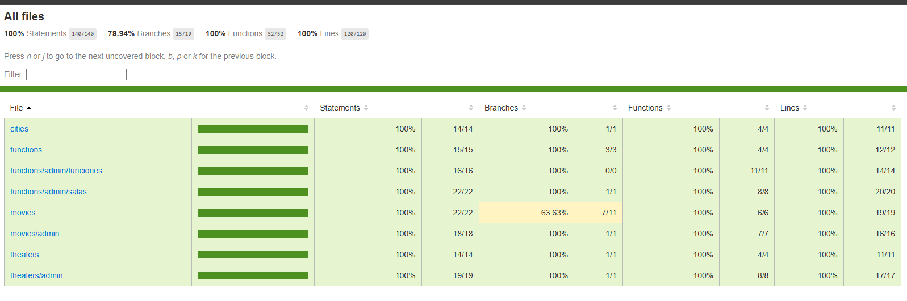
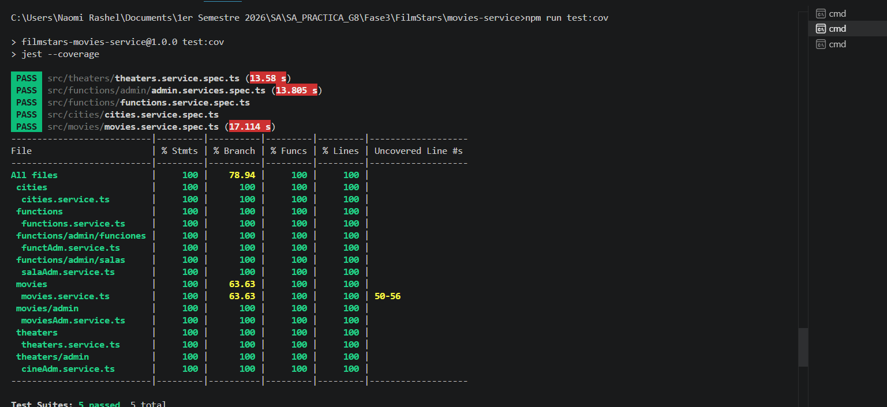
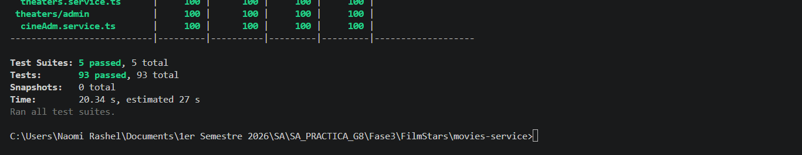

---

### Payment Service


**Resultados obtenidos**
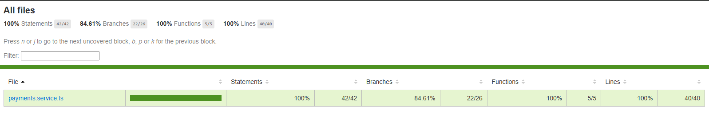
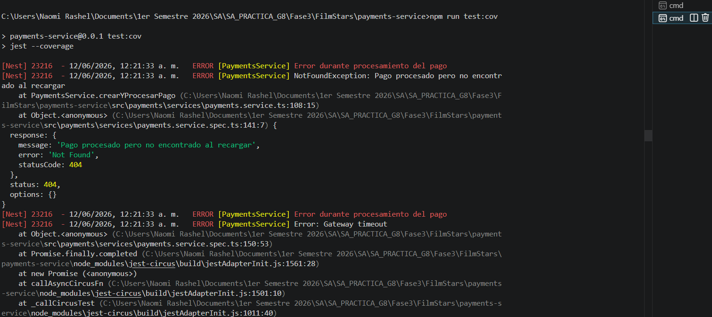
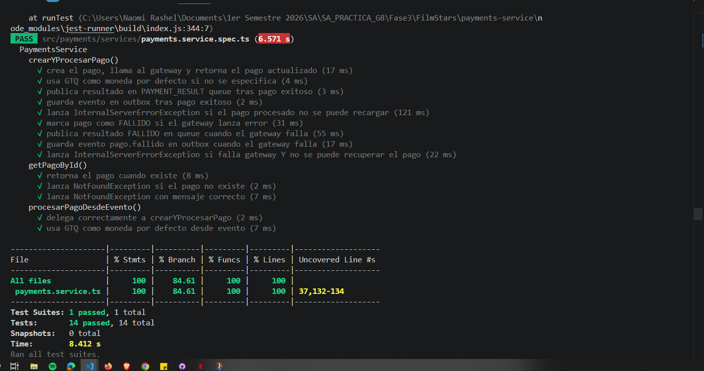


---

### Reservas Service


**Resultados obtenidos**


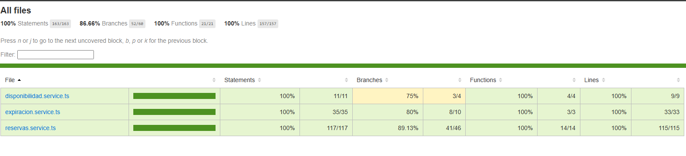
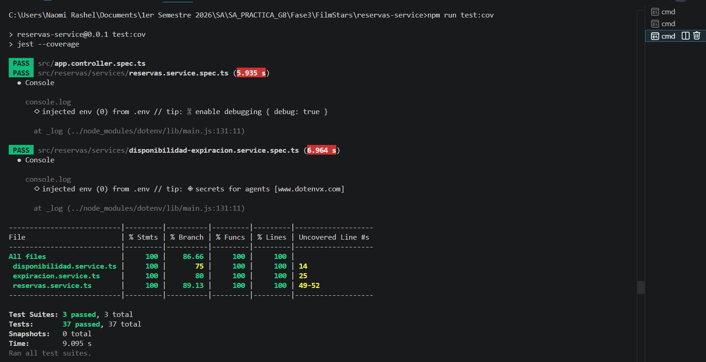
---

### User Service


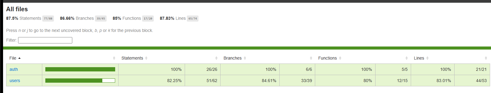
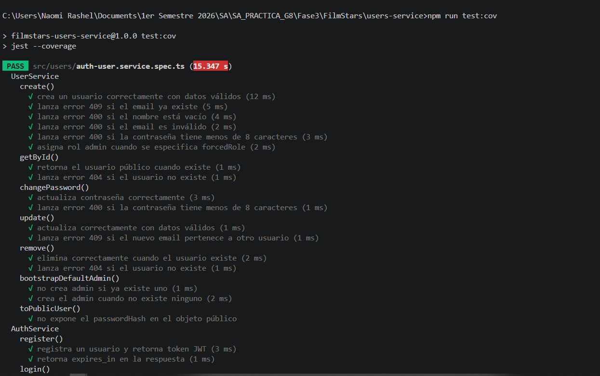
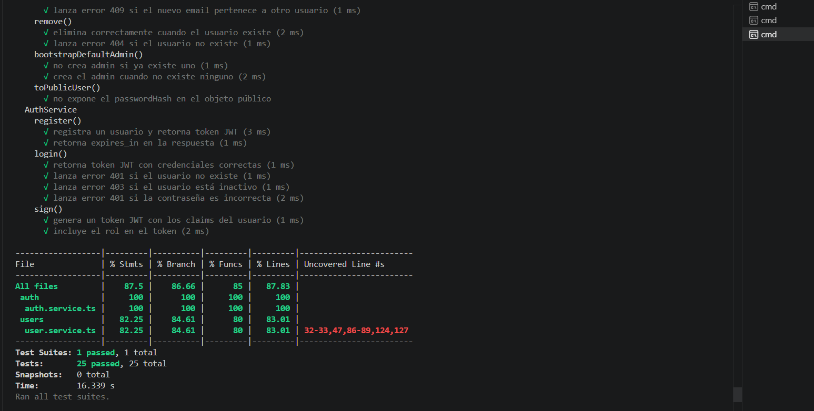
---

### Resumen General
Los casos de prueba fueron seleccionados con el objetivo de cubrir los flujos funcionales más importantes del sistema y alcanzar el porcentaje mínimo de cobertura establecido para el proyecto.

Todos los microservicios superan el umbral mínimo de cobertura del 75% establecido para los componentes principales de lógica de negocio del backend.

Gracias a esta estrategia se logró una cobertura superior al 75% exigido, obteniendo aproximadamente:

* Statements: 87.50%
* Branches: 86.66%
* Functions: 85.00%
* Lines: 87.83%

Estos resultados evidencian que la mayor parte de la lógica de negocio implementada en los servicios del backend fue validada mediante pruebas automatizadas, reduciendo el riesgo de errores durante la integración y despliegue del sistema.


## Rutas de los Archivos de Prueba

Las pruebas unitarias fueron implementadas en archivos con extensión `.service.spec.ts`, ubicados junto a los servicios correspondientes dentro de la estructura del proyecto.

