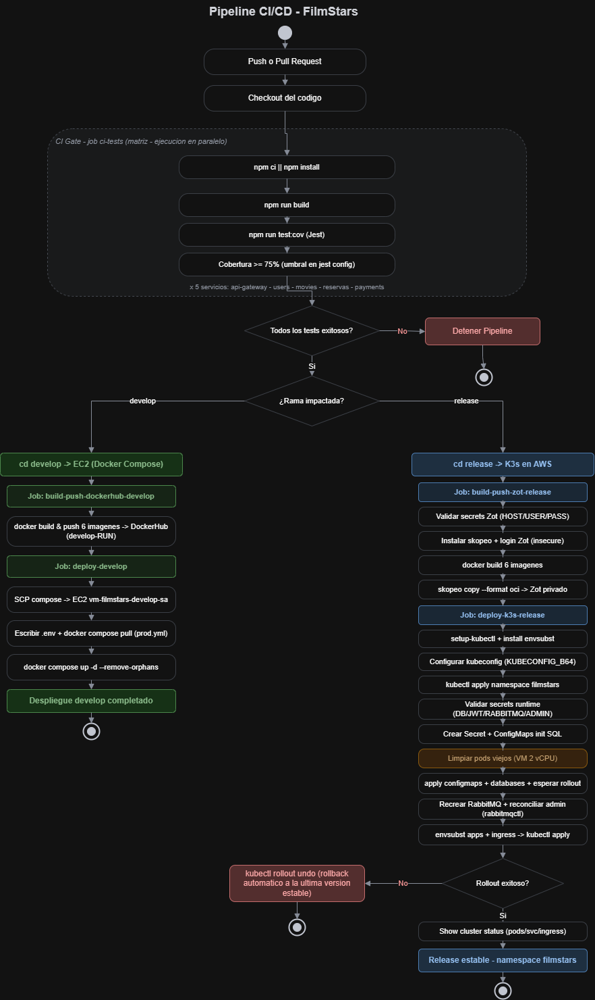
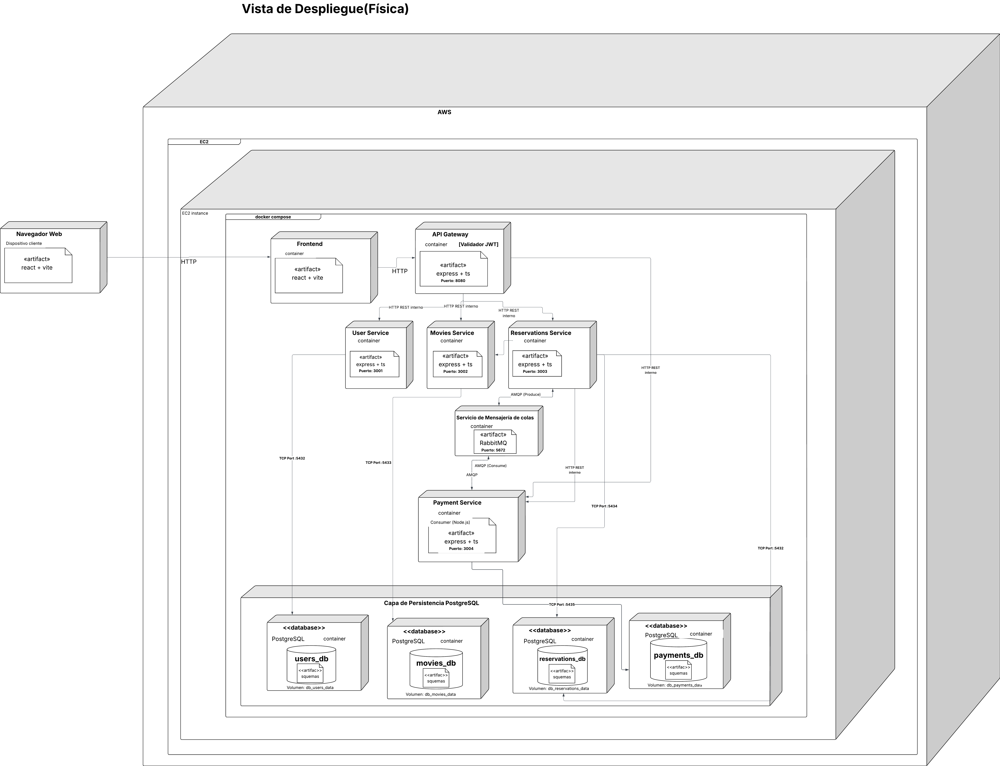

# Justificación del Diseño del Pipeline CI/CD — FilmStars

## 1. Visión General del Pipeline

El pipeline de CI/CD de **FilmStars** fue diseñado bajo una filosofía de **cortocircuito crítico**: ninguna etapa de despliegue puede avanzar si la fase de pruebas anterior presenta fallos. Esta decisión de diseño responde directamente al requisito de garantizar que únicamente código compilado y probado llegue a los entornos de despliegue. A diferencia de soluciones que fragmentan la lógica en múltiples archivos, FilmStars concentra todo en **un único workflow de GitHub Actions**: `.github/workflows/ci-cd.yml`, titulado *"CI/CD Pipeline - FilmStars"*.

Ese archivo define **cinco jobs** con responsabilidades claramente delimitadas:

| Job | Responsabilidad | Rama | Depende de |
|-----|-----------------|------|------------|
| `ci-tests` | Build + pruebas de los 5 microservicios (matriz) | develop y release | — |
| `build-push-dockerhub-develop` | Construye y publica 6 imágenes en Docker Hub | develop (push) | `ci-tests` |
| `deploy-develop` | Despliega el stack con Docker Compose en una VM EC2 | develop (push) | `build-push-dockerhub-develop` |
| `build-push-zot-release` | Construye y publica 6 imágenes en el registro privado Zot (Skopeo) | release (push) | `ci-tests` |
| `deploy-k3s-release` | Despliega en el clúster K3s sobre AWS con `kubectl` | release (push) | `build-push-zot-release` |

La arquitectura sigue el principio de separación de responsabilidades mediante el mecanismo `needs`: el job `ci-tests` actúa como **puerta de calidad reutilizada** por ambas ramas. Tanto los jobs de `develop` como los de `release` declaran `needs: [ci-tests]`, lo que elimina la duplicación de lógica de pruebas y garantiza que el mismo conjunto de verificaciones se aplique de manera uniforme con independencia de la rama que dispare el pipeline.



> **Disparadores (`on`):** el workflow se activa con `push` y `pull_request` sobre las ramas `develop` y `release`. En un Pull Request **solo corre la CI**; los jobs de despliegue exigen además que el evento sea `push` (`github.event_name == 'push'`), por lo que abrir un PR nunca despliega.

---

## 2. Fase de Integración Continua (CI)

### 2.1 Paralelismo mediante Estrategia de Matriz

El backend de FilmStars está compuesto por cinco microservicios homogéneos en **Node.js 20 + TypeScript (Express)**: `api-gateway`, `users-service`, `movies-service`, `reservas-service` y `payments-service`. Para validarlos sin que uno bloquee a los demás, el job `ci-tests` usa una **estrategia de matriz** (`strategy.matrix.service`) que **clona el job una vez por cada servicio**, ejecutándolos en **paralelo** sobre cinco runners `ubuntu-latest` independientes.

Cada clon entra a la carpeta de su servicio mediante `defaults.run.working-directory: Fase3/FilmStars/${{ matrix.service }}` y ejecuta la misma secuencia de pasos:

1. `actions/checkout@v4` — descarga el código.
2. `actions/setup-node@v4` con `node-version: "20"` — instala Node.
3. `npm ci || npm install` — instalación reproducible de dependencias (con respaldo a `npm install`).
4. `npm run build` — compila TypeScript a JavaScript; si no compila, el job falla aquí.
5. Pruebas con cobertura **cuando están disponibles**.
6. `actions/upload-artifact@v4` — sube el reporte de cobertura como artifact descargable.

### 2.2 Verificación de Cobertura

El paso de pruebas es defensivo: consulta el `package.json` del servicio y **solo ejecuta `npm run test:cov` si existe el script `test:cov`**; de lo contrario, registra un aviso y considera superada la puerta con el build (que ya validó la compilación). El umbral de cobertura no se codifica en el YAML, sino que vive en la **configuración de Jest** de cada microservicio (`coverageThreshold`), de modo que si la cobertura cae por debajo del mínimo configurado, `test:cov` retorna un código de error y provoca el cortocircuito del pipeline antes de cualquier build o despliegue de imágenes.

Esta decisión equilibra exigencia y pragmatismo: garantiza que la lógica de negocio crítica (autenticación, reservas, pagos) tenga pruebas, sin bloquear el desarrollo de servicios que aún no incorporan suite de tests.

### 2.3 Cancelación Rápida (`fail-fast`)

El bloque `strategy` define `fail-fast: true`. Si **uno** de los cinco servicios falla su build o sus pruebas, GitHub **cancela inmediatamente los runners restantes**. La razón es evitar el desperdicio de minutos de cómputo y dar retroalimentación temprana: no tiene sentido seguir probando los demás servicios si el commit ya está roto. Además, el paso de subida de cobertura usa `if: always()`, de modo que el reporte se conserva incluso cuando las pruebas fallan, para poder diagnosticarlas.

### 2.4 Variables de Entorno de Prueba

El job declara variables de entorno **ficticias** (`DB_PASS: ci-db-password`, `JWT_SECRET: ci-jwt-secret`, `RABBITMQ_PASS: ci-rabbitmq-password`, `DEFAULT_ADMIN_PASSWORD: ci-admin-password`) usadas únicamente durante el build y las pruebas. No son secretos reales: solo evitan que el arranque de los servicios falle por configuración ausente durante la CI. Los secretos productivos viven en GitHub Secrets y solo se consumen en los jobs de despliegue.

---

## 3. Versionamiento de Imágenes

FilmStars no genera tags semánticos `vX.Y.Z`; en su lugar utiliza el contador de corridas de GitHub Actions (`github.run_number`) para producir etiquetas **trazables e inmutables** por ejecución:

- **Rama `develop`:** cada imagen se publica con dos tags en Docker Hub: `:develop-N` (versión exacta de la corrida) y `:latest`.
- **Rama `release`:** cada imagen se publica con dos tags en Zot: `:release-N` y `:latest`.

El tag con número de corrida garantiza la trazabilidad de cada despliegue y permite distinguir sin ambigüedad las imágenes de integración (`develop-N`) de las candidatas a producción (`release-N`). El tag `:latest` facilita que el `docker-compose.prod.yml` y la operación cotidiana referencien siempre la última versión sin fijar un número.

> **Nota de nomenclatura:** el servicio de reservas se publica con nombres distintos según la ruta — en `develop` la imagen es `filmstars-reservas-service` (Docker Hub) y en `release` es `reservations-service` (Zot). El resto de servicios conserva su nombre en ambas rutas.

---

## 4. Despliegue Continuo en Rama Develop (EC2 + Docker Compose)



### 4.1 Topología: VM única con Docker Compose

El entorno `develop` se despliega sobre una **instancia EC2 de AWS** (`vm-filmstars-develop`) que ejecuta todo el stack con **Docker Compose** a partir del archivo `docker-compose.prod.yml`. Dentro de la VM conviven: cuatro bases PostgreSQL (una por microservicio), RabbitMQ, los cinco microservicios, el API Gateway y el frontend. Es un entorno de integración pensado para validar el sistema completo de forma sencilla y económica.

### 4.2 Build & Push a Docker Hub

El job `build-push-dockerhub-develop` valida primero el secret `DEVELOP_HOST`, activa **Buildx** (`docker/setup-buildx-action@v3`), inicia sesión en Docker Hub (`docker/login-action@v3`) y construye-y-publica **seis imágenes** con `docker/build-push-action@v5` (reservas, payments, users, movies, api-gateway y frontend). El **frontend** es un caso especial: recibe el argumento de construcción `VITE_API_URL=http://${{ secrets.DEVELOP_HOST }}:8080`, porque Vite **incrusta** la URL del backend en el momento de compilar; los demás servicios leen su configuración en tiempo de ejecución.

### 4.3 Despliegue por SSH con appleboy

El job `deploy-develop` (que declara `needs: [build-push-dockerhub-develop]`) copia los artefactos a la VM por **SCP** (`appleboy/scp-action@v0.1.7`): el `docker-compose.prod.yml`, los scripts SQL de inicialización y la configuración de RabbitMQ, usando `strip_components: 2` para aplanar la ruta `Fase3/FilmStars/`. Luego se conecta por **SSH** (`appleboy/ssh-action@v1.0.3`) con el usuario `ubuntu` y la llave privada `DEVELOP_SSH_KEY`, y ejecuta el ciclo de actualización:

```bash
cd ~/filmstars
# materializa los Docker secrets como archivos
echo "DOCKERHUB_USERNAME=$DOCKERHUB_USERNAME" > .env
mkdir -p secrets && chmod 700 secrets
printf '%s' "$DB_PASS"        > secrets/db_password.txt
printf '%s' "$JWT_SECRET"     > secrets/jwt_secret.txt
printf '%s' "$RABBITMQ_PASS"  > secrets/rabbitmq_password.txt
printf '%s' "$ADMIN_PASSWORD" > secrets/admin_password.txt
chmod 600 secrets/*.txt
docker compose -f docker-compose.prod.yml pull
docker compose -f docker-compose.prod.yml up -d --remove-orphans
docker image prune -f
```

El uso de `--remove-orphans` elimina contenedores de servicios retirados del compose, y `docker image prune -f` libera imágenes sin uso para no saturar el disco de la VM. Las contraseñas nunca viajan en texto plano dentro del YAML: se materializan como **Docker secrets basados en archivos** (`secrets/*.txt` con permisos `600`) que el compose monta en `/run/secrets/` dentro de cada contenedor.

### 4.4 Separación de Jobs con `needs`

La cadena `ci-tests → build-push-dockerhub-develop → deploy-develop` garantiza, mediante `needs`, que la aplicación nunca se despliegue sin imágenes publicadas y que las imágenes nunca se construyan sin pruebas aprobadas. Cada eslabón solo arranca si el anterior terminó con éxito.

---

## 5. Despliegue Continuo en Rama Release (K3s sobre AWS)

### 5.1 Registro Privado Zot con Skopeo

El job `build-push-zot-release` publica las imágenes en un **registro OCI privado Zot** alojado en el laboratorio. Dado que ese registro opera sin TLS válido, el job:

1. Valida `ZOT_HOST`, `ZOT_USER` y `ZOT_PASSWORD`.
2. Instala **Skopeo** y marca el registro como inseguro permitido escribiendo `/etc/docker/daemon.json` (`insecure-registries`) y reiniciando Docker.
3. Define `DOCKER_BUILDKIT: 0` para que la imagen quede en el daemon clásico y Skopeo pueda copiarla.
4. Construye cada imagen con `docker build` (dos tags: `release-N` y `latest`) y la copia al registro con `skopeo copy --format oci --dest-tls-verify=false`.

El uso de Skopeo con formato OCI estándar desacopla la construcción de la publicación y evita las incompatibilidades de BuildKit con registros inseguros.

### 5.2 Autenticación al Clúster mediante kubeconfig

El job `deploy-k3s-release` instala `kubectl` (`azure/setup-kubectl@v4`) y `envsubst` (`gettext-base`), y configura el acceso al clúster decodificando el secret `KUBECONFIG_B64` (un kubeconfig en base64) hacia `~/.kube/config` con permisos `600`. Este es el único mecanismo de acceso al clúster: no hay credenciales estáticas embebidas en los manifiestos.

### 5.3 Gestión Declarativa de Manifiestos

El despliegue es declarativo: el pipeline aplica los manifiestos YAML versionados en `Fase3/FilmStars/k3s/` con `kubectl apply`, usando **`envsubst`** para sustituir las variables `${ZOT_HOST}` y `${TAG}` en `apps.yaml` (apuntando a la imagen correcta del registro) y `${K3S_IP}` en `ingress.yaml` (armando el dominio del Ingress). El único vector de cambio del clúster es el pipeline; los despliegues manuales por CLI quedan fuera del flujo previsto.

### 5.4 Gestión de Secrets de Forma Idempotente

El Secret de Kubernetes `filmstars-secrets` se crea con el patrón **`--dry-run=client -o yaml | kubectl apply -f -`**, que hace la operación **idempotente**: si el Secret ya existe se actualiza, y si no existe se crea, evitando el fallo clásico de `kubectl create secret` cuando el recurso ya está presente. Contiene `DB_PASS`, `JWT_SECRET`, `RABBITMQ_PASS` y `DEFAULT_ADMIN_PASSWORD`, todos provenientes de GitHub Secrets. El mismo patrón idempotente se aplica a los ConfigMaps de inicialización SQL y de RabbitMQ.

### 5.5 Inicialización de Datos y RabbitMQ

El pipeline carga los scripts `init.sql`/`seed.sql` de cada base como **ConfigMaps** (`users-initsql`, `movies-initsql`, `reservations-initsql`, `payments-initsql`) para que las bases se inicialicen con su esquema y datos semilla al arrancar. RabbitMQ recibe sus definiciones y configuración (`rabbitmq-definitions`, `rabbitmq-config`). Tras desplegar RabbitMQ, un paso de **reconciliación de credenciales** ejecuta `rabbitmqctl` dentro del pod para alinear el usuario/clave `admin` con el valor del secret y asignarle permisos de administrador.

### 5.6 Liberación de Recursos antes de Actualizar

El nodo del laboratorio es limitado en CPU. Para evitar que los pods nuevos queden en estado `Pending` por falta de recursos, antes de aplicar los Deployments actualizados el pipeline **escala a 0** todos los Deployments existentes y fuerza el borrado de sus pods:

```bash
for d in $(kubectl -n $NS get deployment -o name); do
  kubectl -n $NS scale $d --replicas=0 2>/dev/null || true
done
kubectl -n $NS delete pod --all --grace-period=0 --force 2>/dev/null || true
```

Después aplica las bases de datos y espera su `rollout status`, recrea RabbitMQ, y finalmente aplica los servicios de aplicación y el Ingress.

### 5.7 RollingUpdate como Estrategia de Actualización

Todos los Deployments —microservicios, frontend, bases de datos y RabbitMQ— utilizan la estrategia `RollingUpdate` con `maxSurge: 0` y `maxUnavailable: 1`. Esta configuración, detallada en [ZeroDowntime.md](./ZeroDowntime.md), reemplaza el pod antiguo por el nuevo sin crear instancias adicionales, priorizando la **eficiencia de recursos** del nodo único del laboratorio sobre el Zero-Downtime estricto.

### 5.8 Rollback Automático Ante Fallos

Tras aplicar los Deployments, el pipeline itera sobre los seis servicios de aplicación (`users-service`, `movies-service`, `reservations-service`, `payments-service`, `api-gateway`, `frontend`) y ejecuta `kubectl rollout status --timeout=180s` para cada uno. Si algún Deployment no completa el rollout en el tiempo límite —indicio de `CrashLoopBackOff`, `OOMKilled` o fallo de probes—, el pipeline ejecuta de inmediato **`kubectl rollout undo`**, restaurando la versión anterior estable, y termina el job con `exit 1`. Un paso final con `if: always()` imprime el estado del clúster (pods, servicios, ingress, eventos y logs) para diagnóstico.

---

## 6. Gobierno de Código y Seguridad

El pipeline implementa el gobierno de código integrando todo cambio mediante Pull Request hacia `develop` o `release`, lo que activa la CI de forma automática gracias al trigger `pull_request: branches: [develop, release]`. Esto garantiza que ningún código sin verificar llega a las ramas de despliegue.

En cuanto a la seguridad de la información sensible, el pipeline cumple la prohibición de *hardcoding*: todas las contraseñas, el secreto JWT, las credenciales de RabbitMQ y de las bases de datos se gestionan como **GitHub Secrets** encriptados, validados con `test -n` antes de usarse e inyectados en tiempo de ejecución. En `develop` se materializan como Docker secrets basados en archivos (`/run/secrets/`); en `release` se almacenan en el Secret de Kubernetes `filmstars-secrets` (tipo `Opaque`, cifrado en `etcd`) y se inyectan en los pods mediante `secretKeyRef`, nunca como variables en texto plano en los manifiestos.

---

## 7. Recursos y Enlaces

- **Diagrama del pipeline (Draw.io, editable):** [`pipeline_cicd_filmstars.drawio`](./pipeline_cicd_filmstars.drawio)
- **Diagrama del pipeline (PNG):** [`image/pipeline_cicd_filmstars.png`](./image/pipeline_cicd_filmstars.png)
- **Vista de despliegue develop (PNG):** [`image/despliegue_develop.png`](./image/despliegue_develop.png)
- **Vista de despliegue release K3s (PNG):** [`image/despliegue_release_k3s.png`](./image/despliegue_release_k3s.png)
- **Diagrama en Lucidchart:** https://lucid.app/lucidchart/9c353bd3-d652-4647-89e1-eddc9209017b/edit?page=0_0
- **Workflow analizado:** [`.github/workflows/ci-cd.yml`](../../../.github/workflows/ci-cd.yml)
