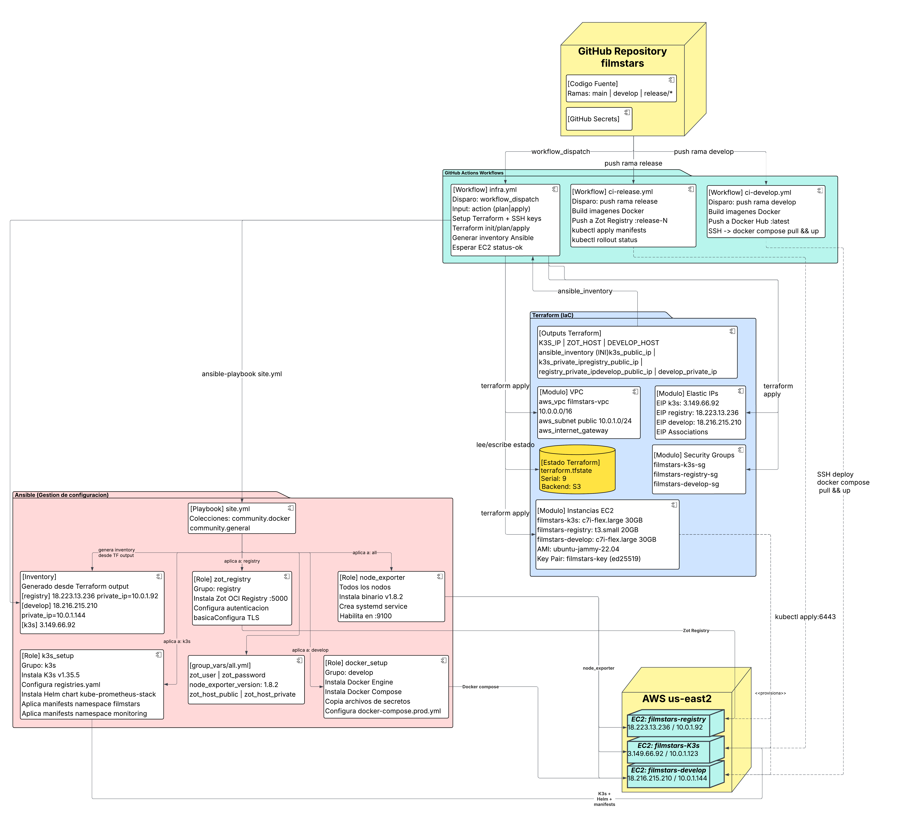

# Documentación de Infraestructura como Código — Terraform
## Proyecto FilmStars | Práctica 6 | Sistemas de Arquitectura

---

## Tabla de Contenidos

1. [¿Qué es Terraform?](#1-qué-es-terraform)
2. [¿Cómo funciona? Marco teórico](#2-cómo-funciona-marco-teórico)
   - 2.1 [Aprovisionamiento Declarativo](#21-aprovisionamiento-declarativo)
   - 2.2 [El Archivo de Estado (State)](#22-el-archivo-de-estado-state)
   - 2.3 [El Ciclo init → plan → apply](#23-el-ciclo-init--plan--apply)
   - 2.4 [Providers y Resources](#24-providers-y-resources)
3. [Estructura del Proyecto](#3-estructura-del-proyecto)
4. [Configuración Paso a Paso](#4-configuración-paso-a-paso)
   - 4.1 [Prerequisitos](#41-prerequisitos)
   - 4.2 [Backend remoto (S3)](#42-backend-remoto-s3)
   - 4.3 [Provider AWS](#43-provider-aws)
   - 4.4 [Variables de entrada](#44-variables-de-entrada)
   - 4.5 [Red: VPC, Subnet, IGW, Route Table](#45-red-vpc-subnet-igw-route-table)
   - 4.6 [Seguridad: Security Groups](#46-seguridad-security-groups)
   - 4.7 [Cómputo: EC2 Instances y Elastic IPs](#47-cómputo-ec2-instances-y-elastic-ips)
   - 4.8 [Outputs](#48-outputs)
   - 4.9 [Ejecución del workflow de IaC](#49-ejecución-del-workflow-de-iac)
5. [Recursos Aprovisionados y Evidencia](#5-recursos-aprovisionados-y-evidencia)
6. [Integración con GitHub Actions](#6-integración-con-github-actions)

---

## 1. ¿Qué es Terraform?

**Terraform** es una herramienta de código abierto desarrollada por HashiCorp que permite definir, aprovisionar y gestionar infraestructura de nube mediante archivos de configuración declarativos escritos en **HCL (HashiCorp Configuration Language)**. Pertenece a la categoría de herramientas de **Infraestructura como Código (IaC)**, lo que significa que toda la topología de red, instancias de cómputo, reglas de seguridad y demás recursos de nube se describen en archivos de texto versionables en Git, tratando la infraestructura con los mismos estándares de calidad que el código fuente de la aplicación.

En el proyecto FilmStars, Terraform gestiona completamente la capa de infraestructura de AWS: la red privada virtual, las tres instancias EC2, las IPs elásticas y los grupos de seguridad. El objetivo es que **ningún recurso se cree manualmente desde la consola de AWS**, eliminando la posibilidad de errores humanos y garantizando que el entorno sea reproducible en su totalidad.

---

## 2. ¿Cómo funciona? Marco teórico

### 2.1 Aprovisionamiento Declarativo

El paradigma declarativo es la característica central de Terraform. En lugar de escribir scripts imperativos que describen *cómo* crear un recurso paso a paso (como lo haría un script de Bash llamando a la AWS CLI), en Terraform el operador describe el *estado deseado* de la infraestructura. Terraform es responsable de calcular y ejecutar las acciones necesarias para alcanzar ese estado.

```
Estado actual (AWS)  ──┐
                       ├──► Terraform Plan ──► Conjunto de acciones ──► Terraform Apply
Estado deseado (HCL) ──┘
```

Por ejemplo, si se declara:

```hcl
resource "aws_instance" "k3s" {
  ami           = "ami-0063861063744e26c"
  instance_type = "c7i-flex.large"
}
```

Terraform determina si esa instancia ya existe, si necesita ser creada, modificada o destruida, y ejecuta solo las acciones mínimas necesarias. Esto lo hace **idempotente**: ejecutar `terraform apply` múltiples veces sobre la misma configuración no produce efectos secundarios si el estado ya es el deseado.

### 2.2 El Archivo de Estado (State)

El **archivo de estado** (`terraform.tfstate`) es el mecanismo central de Terraform para realizar el seguimiento de los recursos reales en el proveedor de nube. Es un archivo JSON que mapea cada recurso declarado en HCL con su contraparte real en AWS (ID del recurso, atributos, metadatos de dependencias).

Sin el estado, Terraform no puede saber qué recursos ya existen y cuáles necesitan cambios. Las funciones críticas del estado son:

- **Mapeo de identidad:** relaciona `aws_instance.k3s` con `i-00a1e4844a295ec3c` (ID real en AWS).
- **Detección de drift:** al comparar el estado almacenado con el estado real en AWS, Terraform detecta si alguien modificó un recurso fuera de Terraform (cambio manual en consola).
- **Cálculo de dependencias:** el grafo de dependencias entre recursos se construye a partir del estado y las referencias entre recursos (`resource.otro_resource.atributo`).
- **Performance:** evita tener que consultar la API de AWS por cada recurso en cada ejecución.

**Backend remoto en S3:** En FilmStars el estado se almacena en un bucket S3 en lugar del sistema de archivos local (`backend.tf`). Esto permite que múltiples miembros del equipo y el pipeline de GitHub Actions trabajen con el mismo estado de forma concurrente, sin riesgo de corrupción.

```hcl
# infra/terraform/backend.tf
terraform {
  backend "s3" {
    bucket = "filmstars-terraform-state"
    key    = "practica6/terraform.tfstate"
    region = "us-east-2"
  }
}
```

### 2.3 El Ciclo init → plan → apply

El flujo de trabajo estándar de Terraform consta de tres comandos principales:

| Comando | Función |
|---|---|
| `terraform init` | Inicializa el directorio de trabajo: descarga los providers necesarios (AWS), configura el backend remoto y valida la estructura de archivos. |
| `terraform plan` | Compara el estado actual (leído del backend) con la configuración HCL y genera un plan de ejecución detallado. No modifica ningún recurso. Puede usarse con `-out=tfplan` para guardar el plan y aplicarlo exactamente después. |
| `terraform apply` | Ejecuta el plan de cambios, creando, modificando o destruyendo recursos en AWS. Requiere confirmación explícita (o `-auto-approve` en pipelines). |
| `terraform destroy` | Destruye todos los recursos gestionados. Solo se usa para teardown completo del entorno. |

En el pipeline de FilmStars, el flag `-detailed-exitcode` en `terraform plan` permite detectar programáticamente si hay cambios (`exit code 2`) o no (`exit code 0`), evitando ejecutar `apply` innecesariamente.

### 2.4 Providers y Resources

**Provider:** Es el plugin que hace de intermediario entre Terraform y una API de servicio (en este caso, AWS). El provider `hashicorp/aws` traduce las declaraciones HCL en llamadas a la API de AWS.

```hcl
# infra/terraform/providers.tf
terraform {
  required_providers {
    aws = {
      source  = "hashicorp/aws"
      version = "~> 5.0"
    }
  }
  required_version = ">= 1.5.0"
}

provider "aws" {
  region = var.aws_region  # us-east-2
}
```

**Resource:** Es la unidad básica de infraestructura. Cada bloque `resource` describe un objeto gestionado por Terraform. Los recursos pueden referenciar atributos de otros recursos, lo que establece dependencias implícitas que Terraform usa para ordenar las operaciones.

---

## 3. Estructura del Proyecto

```
infra/terraform/
├── backend.tf          # Configuración del backend remoto S3
├── providers.tf        # Provider AWS y versiones requeridas
├── variables.tf        # Declaración de variables de entrada
├── terraform.tfvars.example  # Plantilla de valores (sin secretos)
├── network.tf          # VPC, Subnet, IGW, Route Table
├── security.tf         # Security Groups (k3s, registry, develop)
├── compute.tf          # Instancias EC2, Key Pair, Elastic IPs
├── outputs.tf          # Outputs exportados (IPs, inventory Ansible)
├── tfplan              # Plan binario generado por CI/CD
└── .terraform.lock.hcl # Lock file de versiones de providers
```

La separación en archivos por responsabilidad (`network.tf`, `security.tf`, `compute.tf`) sigue las convenciones de la comunidad y facilita la navegación. Terraform los trata todos como un único módulo raíz.



---

## 4. Configuración Paso a Paso

### 4.1 Prerequisitos

Antes de ejecutar Terraform para FilmStars se deben cumplir los siguientes requisitos:

1. **Terraform CLI instalado** (versión 1.5+). Verificar con `terraform version`.
2. **Credenciales AWS configuradas** con permisos para crear VPCs, EC2, Security Groups, EIPs y Key Pairs. Las credenciales se pasan como variables de entorno `AWS_ACCESS_KEY_ID` y `AWS_SECRET_ACCESS_KEY` en el pipeline.
3. **Par de llaves SSH generado** (`filmstars-key`, tipo ed25519). La llave pública se sube a AWS como `aws_key_pair` y la privada se usa por Ansible para conectarse a los nodos.
4. **Bucket S3 existente** para el backend de estado. Debe crearse manualmente (única operación fuera de Terraform).

```bash
# Generar el par de llaves SSH para el proyecto
ssh-keygen -t ed25519 -C "filmstars-deploy" -f ~/.ssh/filmstars_deploy

# Verificar la versión de Terraform
terraform version
# Terraform v1.15.7
```

### 4.2 Backend remoto (S3)

El archivo `backend.tf` configura el almacenamiento remoto del estado. Esto es crítico para el trabajo en equipo y para que el pipeline de GitHub Actions acceda al mismo estado.

```hcl
# infra/terraform/backend.tf
terraform {
  backend "s3" {
    bucket  = "filmstars-terraform-state"
    key     = "practica6/terraform.tfstate"
    region  = "us-east-2"
    encrypt = true
  }
}
```

### 4.3 Provider AWS

```hcl
# infra/terraform/providers.tf
terraform {
  required_providers {
    aws = {
      source  = "hashicorp/aws"
      version = "~> 5.0"
    }
  }
  required_version = ">= 1.5.0"
}

provider "aws" {
  region = var.aws_region
  default_tags {
    tags = {
      Project   = "FilmStars"
      ManagedBy = "Terraform"
      Practica  = "6"
    }
  }
}
```

El bloque `default_tags` aplica automáticamente los tags `Project=FilmStars`, `ManagedBy=Terraform` y `Practica=6` a todos los recursos, lo que se evidencia en el `terraform.tfstate` donde cada recurso muestra `"tags_all"` con estos valores.

### 4.4 Variables de entrada

```hcl
# infra/terraform/variables.tf
variable "aws_region" {
  description = "Region AWS donde se despliega la infraestructura"
  type        = string
  default     = "us-east-2"
}

variable "admin_cidr" {
  description = "CIDR permitido para acceso SSH administrativo"
  type        = string
  default     = "0.0.0.0/0"
}

variable "ssh_public_key_path" {
  description = "Ruta local a la llave publica SSH"
  type        = string
  default     = "~/.ssh/filmstars_deploy.pub"
}
```

El archivo `terraform.tfvars.example` contiene una plantilla de los valores sin secretos. El pipeline de GitHub Actions pasa los valores sensibles como variables de entorno.

### 4.5 Red: VPC, Subnet, IGW, Route Table

El archivo `network.tf` define toda la capa de red del proyecto. Se crea una VPC con CIDR `10.0.0.0/16`, una única subnet pública en la AZ `us-east-2a`, un Internet Gateway y una Route Table que enruta todo el tráfico de salida hacia el IGW.

```hcl
# infra/terraform/network.tf

# VPC principal del proyecto
resource "aws_vpc" "main" {
  cidr_block           = "10.0.0.0/16"
  enable_dns_hostnames = true
  enable_dns_support   = true

  tags = { Name = "filmstars-vpc" }
}

# Subnet publica en us-east-2a
resource "aws_subnet" "public" {
  vpc_id                  = aws_vpc.main.id
  cidr_block              = "10.0.1.0/24"
  availability_zone       = "us-east-2a"
  map_public_ip_on_launch = true

  tags = { Name = "filmstars-public-subnet" }
}

# Internet Gateway para salida a Internet
resource "aws_internet_gateway" "igw" {
  vpc_id = aws_vpc.main.id
  tags   = { Name = "filmstars-igw" }
}

# Route Table: todo el trafico publico sale por el IGW
resource "aws_route_table" "public" {
  vpc_id = aws_vpc.main.id
  route {
    cidr_block = "0.0.0.0/0"
    gateway_id = aws_internet_gateway.igw.id
  }
  tags = { Name = "filmstars-public-rt" }
}

# Asociacion de la Route Table con la subnet publica
resource "aws_route_table_association" "public" {
  subnet_id      = aws_subnet.public.id
  route_table_id = aws_route_table.public.id
}
```

**Recursos creados y sus IDs reales (del tfstate):**

| Recurso | Nombre | ID Real en AWS |
|---|---|---|
| aws_vpc | filmstars-vpc | `vpc-017be7cc4826638dc` |
| aws_subnet | filmstars-public-subnet | `subnet-06443d64e82b2ad67` |
| aws_internet_gateway | filmstars-igw | `igw-0f8c2bdd58af0a241` |
| aws_route_table | filmstars-public-rt | `rtb-0485f2239ac005b30` |


### 4.6 Seguridad: Security Groups

El archivo `security.tf` define tres Security Groups independientes, uno por cada rol de servidor. Esta separación sigue el principio de mínimo privilegio: cada servidor solo expone los puertos estrictamente necesarios para su función.

```hcl
# infra/terraform/security.tf

# ── Security Group: K3s Server ──────────────────────────────
resource "aws_security_group" "k3s" {
  name        = "filmstars-k3s-sg"
  description = "K3s server: API, Traefik, NodePorts, interno"
  vpc_id      = aws_vpc.main.id

  # SSH para CI/CD y administracion
  ingress {
    from_port   = 22
    to_port     = 22
    protocol    = "tcp"
    cidr_blocks = [var.admin_cidr]
    description = "SSH from CI/CD and admin"
  }
  # HTTP para Traefik Ingress (acceso publico a la aplicacion)
  ingress {
    from_port   = 80
    to_port     = 80
    protocol    = "tcp"
    cidr_blocks = ["0.0.0.0/0"]
    description = "HTTP Traefik Ingress (app publica)"
  }
  # HTTPS para Traefik
  ingress {
    from_port   = 443
    to_port     = 443
    protocol    = "tcp"
    cidr_blocks = ["0.0.0.0/0"]
    description = "HTTPS Traefik Ingress"
  }
  # Kube API Server para kubectl desde el pipeline de CI/CD
  ingress {
    from_port   = 6443
    to_port     = 6443
    protocol    = "tcp"
    cidr_blocks = ["0.0.0.0/0"]
    description = "Kube API (kubectl del CI/CD: runners con IP dinamica)"
  }
  # NodePorts para Grafana y Prometheus (acceso publico de monitoreo)
  ingress {
    from_port   = 30000
    to_port     = 32767
    protocol    = "tcp"
    cidr_blocks = ["0.0.0.0/0"]
    description = "Otros NodePorts administrativos"
  }
  # Trafico interno de la VPC sin restriccion (node_exporter, pods)
  ingress {
    from_port   = 0
    to_port     = 0
    protocol    = "-1"
    cidr_blocks = ["10.0.0.0/16"]
    description = "Trafico interno de la VPC (node_exporter, etc.)"
  }
  # Egress sin restriccion
  egress {
    from_port   = 0
    to_port     = 0
    protocol    = "-1"
    cidr_blocks = ["0.0.0.0/0"]
  }
  tags = { Name = "filmstars-k3s-sg" }
}

# ── Security Group: Zot Registry ────────────────────────────
resource "aws_security_group" "registry" {
  name        = "filmstars-registry-sg"
  description = "Zot registry privado"
  vpc_id      = aws_vpc.main.id

  ingress {
    from_port   = 22
    to_port     = 22
    protocol    = "tcp"
    cidr_blocks = [var.admin_cidr]
    description = "SSH from CI/CD and admin"
  }
  # Puerto del registro OCI: push desde CI/CD, pull desde K3s
  ingress {
    from_port   = 5000
    to_port     = 5000
    protocol    = "tcp"
    cidr_blocks = ["0.0.0.0/0"]
    description = "Zot :5000 (push del CI + pull de K3s)"
  }
  ingress {
    from_port   = 0
    to_port     = 0
    protocol    = "-1"
    cidr_blocks = ["10.0.0.0/16"]
    description = "Trafico interno de la VPC (node_exporter)"
  }
  egress {
    from_port   = 0
    to_port     = 0
    protocol    = "-1"
    cidr_blocks = ["0.0.0.0/0"]
  }
  tags = { Name = "filmstars-registry-sg" }
}

# ── Security Group: Develop (Docker Compose) ────────────────
resource "aws_security_group" "develop" {
  name        = "filmstars-develop-sg"
  description = "VM develop: Docker Compose"
  vpc_id      = aws_vpc.main.id

  ingress {
    from_port   = 22
    to_port     = 22
    protocol    = "tcp"
    cidr_blocks = [var.admin_cidr]
    description = "SSH (deploy del CI/CD via appleboy/ssh-action)"
  }
  ingress {
    from_port   = 5173
    to_port     = 5173
    protocol    = "tcp"
    cidr_blocks = ["0.0.0.0/0"]
    description = "Frontend"
  }
  ingress {
    from_port   = 8080
    to_port     = 8080
    protocol    = "tcp"
    cidr_blocks = ["0.0.0.0/0"]
    description = "API Gateway"
  }
  ingress {
    from_port   = 15672
    to_port     = 15672
    protocol    = "tcp"
    cidr_blocks = ["0.0.0.0/0"]
    description = "RabbitMQ management"
  }
  ingress {
    from_port   = 0
    to_port     = 0
    protocol    = "-1"
    cidr_blocks = ["10.0.0.0/16"]
    description = "Trafico interno de la VPC (node_exporter)"
  }
  egress {
    from_port   = 0
    to_port     = 0
    protocol    = "-1"
    cidr_blocks = ["0.0.0.0/0"]
  }
  tags = { Name = "filmstars-develop-sg" }
}
```

**Resumen de IDs reales (del tfstate):**

| Security Group | ID Real |
|---|---|
| filmstars-k3s-sg | `sg-0a90442528f7e6e3f` |
| filmstars-registry-sg | `sg-043dbe2e769b1b4ca` |
| filmstars-develop-sg | `sg-0921375803e0088c3` |


### 4.7 Cómputo: EC2 Instances y Elastic IPs

El archivo `compute.tf` define el Key Pair SSH, las tres instancias EC2, las tres Elastic IPs y sus asociaciones.

```hcl
# infra/terraform/compute.tf

# Key Pair SSH para acceso a los nodos (ed25519)
resource "aws_key_pair" "deploy" {
  key_name   = "filmstars-key"
  public_key = file(var.ssh_public_key_path)
}

# Data source para obtener la AMI mas reciente de Ubuntu 22.04 LTS
data "aws_ami" "ubuntu" {
  most_recent = true
  owners      = ["099720109477"] # Canonical
  filter {
    name   = "name"
    values = ["ubuntu/images/hvm-ssd/ubuntu-jammy-22.04-amd64-server-*"]
  }
  filter {
    name   = "virtualization-type"
    values = ["hvm"]
  }
}

# ── EC2: K3s Server ─────────────────────────────────────────
resource "aws_instance" "k3s" {
  ami                    = data.aws_ami.ubuntu.id
  instance_type          = "c7i-flex.large"
  key_name               = aws_key_pair.deploy.key_name
  subnet_id              = aws_subnet.public.id
  vpc_security_group_ids = [aws_security_group.k3s.id]

  root_block_device {
    volume_size = 30
    volume_type = "gp3"
  }

  tags = { Name = "filmstars-k3s" }
}

resource "aws_eip" "k3s" {
  domain = "vpc"
  tags   = { Name = "filmstars-k3s-eip" }
}

resource "aws_eip_association" "k3s" {
  instance_id   = aws_instance.k3s.id
  allocation_id = aws_eip.k3s.id
}

# ── EC2: Zot Registry ───────────────────────────────────────
resource "aws_instance" "registry" {
  ami                    = data.aws_ami.ubuntu.id
  instance_type          = "t3.small"   # Menor carga de trabajo
  key_name               = aws_key_pair.deploy.key_name
  subnet_id              = aws_subnet.public.id
  vpc_security_group_ids = [aws_security_group.registry.id]

  root_block_device {
    volume_size = 20
    volume_type = "gp3"
  }

  tags = { Name = "filmstars-registry" }
}

resource "aws_eip" "registry" {
  domain = "vpc"
  tags   = { Name = "filmstars-registry-eip" }
}

resource "aws_eip_association" "registry" {
  instance_id   = aws_instance.registry.id
  allocation_id = aws_eip.registry.id
}

# ── EC2: Develop (Docker Compose) ───────────────────────────
resource "aws_instance" "develop" {
  ami                    = data.aws_ami.ubuntu.id
  instance_type          = "c7i-flex.large"
  key_name               = aws_key_pair.deploy.key_name
  subnet_id              = aws_subnet.public.id
  vpc_security_group_ids = [aws_security_group.develop.id]

  root_block_device {
    volume_size = 30
    volume_type = "gp3"
  }

  tags = { Name = "filmstars-develop" }
}

resource "aws_eip" "develop" {
  domain = "vpc"
  tags   = { Name = "filmstars-develop-eip" }
}

resource "aws_eip_association" "develop" {
  instance_id   = aws_instance.develop.id
  allocation_id = aws_eip.develop.id
}
```

**Instancias EC2 aprovisionadas (IDs y datos reales del tfstate):**

| Nombre | Instance ID | Tipo | IP Privada | EIP Asignada |
|---|---|---|---|---|
| filmstars-k3s | `i-00a1e4844a295ec3c` | c7i-flex.large | 10.0.1.123 | **3.149.66.92** |
| filmstars-registry | `i-048258e288f110311` | t3.small | 10.0.1.92 | **18.223.13.236** |
| filmstars-develop | `i-0eb1dc82e01cff07f` | c7i-flex.large | 10.0.1.144 | **18.216.215.210** |


### 4.8 Outputs

Los outputs son valores que Terraform exporta tras un `apply` exitoso. En FilmStars son críticos porque el pipeline los usa para generar dinámicamente el inventory de Ansible.

```hcl
# infra/terraform/outputs.tf

output "K3S_IP" {
  value = aws_eip.k3s.public_ip
}

output "ZOT_HOST" {
  value = "${aws_eip.registry.public_ip}:5000"
}

output "DEVELOP_HOST" {
  value = aws_eip.develop.public_ip
}

output "k3s_private_ip" {
  value = aws_instance.k3s.private_ip
}

output "registry_private_ip" {
  value = aws_instance.registry.private_ip
}

output "develop_private_ip" {
  value = aws_instance.develop.private_ip
}

# Inventory de Ansible generado dinamicamente
output "ansible_inventory" {
  value = <<-EOT
    [registry]
    ${aws_eip.registry.public_ip} private_ip=${aws_instance.registry.private_ip}

    [develop]
    ${aws_eip.develop.public_ip} private_ip=${aws_instance.develop.private_ip}

    [k3s]
    ${aws_eip.k3s.public_ip} private_ip=${aws_instance.k3s.private_ip}

    [all:vars]
    ansible_user=ubuntu
    ansible_python_interpreter=/usr/bin/python3
  EOT
}
```

**Valores reales de los outputs (del tfstate serial 9):**

```
K3S_IP      = "3.149.66.92"
ZOT_HOST    = "18.223.13.236:5000"
DEVELOP_HOST = "18.216.215.210"

k3s_private_ip      = "10.0.1.123"
registry_private_ip = "10.0.1.92"
develop_private_ip  = "10.0.1.144"
```

### 4.9 Ejecución del workflow de IaC

El aprovisionamiento se ejecuta a través del workflow de GitHub Actions `.github/workflows/infra.yml`. Este workflow solo se dispara **manualmente** (`workflow_dispatch`) con el parámetro `action: plan | apply`, respetando las ventanas de mantenimiento definidas para el proyecto.

**Secuencia de ejecución:**

```
1. Checkout del repositorio
2. Restaurar llave publica SSH desde GitHub Secret SSH_PUBLIC_KEY
3. Restaurar llave privada SSH desde GitHub Secret DEVELOP_SSH_KEY
4. Setup de Terraform CLI via hashicorp/setup-terraform@v3
5. terraform -chdir=terraform init -input=false
6. terraform -chdir=terraform plan -input=false -detailed-exitcode -out=tfplan
   └── Exit code 0: sin cambios
   └── Exit code 2: hay cambios (se continua)
7. [Si action=apply] terraform -chdir=terraform apply -input=false tfplan
8. [Si action=apply] Generar ansible/inventory.ini desde el output
9. [Si action=apply] Esperar instance-status-ok en todas las EC2
10. [Si action=apply] Ejecutar ansible-playbook site.yml
```


---

## 5. Recursos Aprovisionados y Evidencia

El siguiente inventario consolida todos los recursos AWS gestionados por Terraform en el proyecto FilmStars, con sus identificadores reales extraídos del `terraform.tfstate` (serial 9):

### Red (network.tf)

| Tipo de Recurso | Nombre Terraform | ID AWS | Detalles |
|---|---|---|---|
| aws_vpc | main | `vpc-017be7cc4826638dc` | CIDR: 10.0.0.0/16, DNS habilitado |
| aws_subnet | public | `subnet-06443d64e82b2ad67` | CIDR: 10.0.1.0/24, AZ: us-east-2a |
| aws_internet_gateway | igw | `igw-0f8c2bdd58af0a241` | Adjunto a filmstars-vpc |
| aws_route_table | public | `rtb-0485f2239ac005b30` | Ruta 0.0.0.0/0 → IGW |
| aws_route_table_association | public | `rtbassoc-0af9294f1c9a22827` | Subnet → Route Table |

### Seguridad (security.tf)

| Tipo de Recurso | Nombre | ID AWS |
|---|---|---|
| aws_security_group | k3s | `sg-0a90442528f7e6e3f` |
| aws_security_group | registry | `sg-043dbe2e769b1b4ca` |
| aws_security_group | develop | `sg-0921375803e0088c3` |

### Cómputo (compute.tf)

| Tipo de Recurso | Nombre | ID AWS | Detalles |
|---|---|---|---|
| aws_key_pair | deploy | `key-0141eaf2501fb29a3` | filmstars-key, ed25519 |
| aws_instance | k3s | `i-00a1e4844a295ec3c` | c7i-flex.large, 30GB gp3 |
| aws_instance | registry | `i-048258e288f110311` | t3.small, 20GB gp3 |
| aws_instance | develop | `i-0eb1dc82e01cff07f` | c7i-flex.large, 30GB gp3 |
| aws_eip | k3s | `eipalloc-06814aad1d3c187fd` | 3.149.66.92 |
| aws_eip | registry | `eipalloc-061db494cb08d0b24` | 18.223.13.236 |
| aws_eip | develop | `eipalloc-019393b810b4347ad` | 18.216.215.210 |
| aws_eip_association | k3s | `eipassoc-0303de7c9091aa8ea` | k3s EIP ↔ k3s EC2 |
| aws_eip_association | registry | `eipassoc-0b893f2b158aa4560` | registry EIP ↔ registry EC2 |
| aws_eip_association | develop | `eipassoc-00d8cf02dac29d7cc` | develop EIP ↔ develop EC2 |

**Total de recursos gestionados:** 15 recursos AWS en un único módulo raíz de Terraform.

---

## 6. Integración con GitHub Actions

El workflow de IaC está diseñado siguiendo las mejores prácticas de GitOps:

- **Disparo manual exclusivamente:** No se acciona con push automático para evitar modificaciones de infraestructura accidentales durante el desarrollo. Un operador autorizado ejecuta el workflow desde la UI de GitHub Actions seleccionando `plan` (solo visualizar cambios) o `apply` (ejecutar cambios).

- **Separación plan/apply:** El pipeline siempre ejecuta `plan` primero. Solo procede a `apply` si el operador seleccionó `action=apply` **y** Terraform detectó cambios (`exit code 2`). Si no hay cambios, el apply se omite explícitamente con un mensaje informativo.

- **Credenciales como Secrets:** `AWS_ACCESS_KEY_ID`, `AWS_SECRET_ACCESS_KEY`, `SSH_PUBLIC_KEY` y `DEVELOP_SSH_KEY` se almacenan como GitHub Secrets cifrados, nunca en el repositorio.

- **Encadenamiento con Ansible:** Tras un `apply` exitoso, el pipeline genera el archivo `ansible/inventory.ini` a partir del output `ansible_inventory` de Terraform, espera a que todas las instancias EC2 pasen a estado `instance-status-ok` y luego ejecuta el playbook completo de Ansible. Esto garantiza que la configuración de software sigue inmediatamente al aprovisionamiento de hardware.

```yaml
# Fragmento relevante de .github/workflows/infra.yml
- name: Generar inventory de Ansible
  if: ${{ github.event.inputs.action == 'apply' }}
  run: terraform -chdir=terraform output -raw ansible_inventory > ansible/inventory.ini

- name: Esperar estado OK de EC2
  if: ${{ github.event.inputs.action == 'apply' }}
  run: |
    instance_ids=$(aws ec2 describe-instances \
      --filters "Name=tag:Name,Values=filmstars-k3s,filmstars-registry,filmstars-develop" \
                "Name=instance-state-name,Values=pending,running" \
      --query 'Reservations[].Instances[].InstanceId' \
      --output text)
    aws ec2 wait instance-status-ok --instance-ids $instance_ids
```
