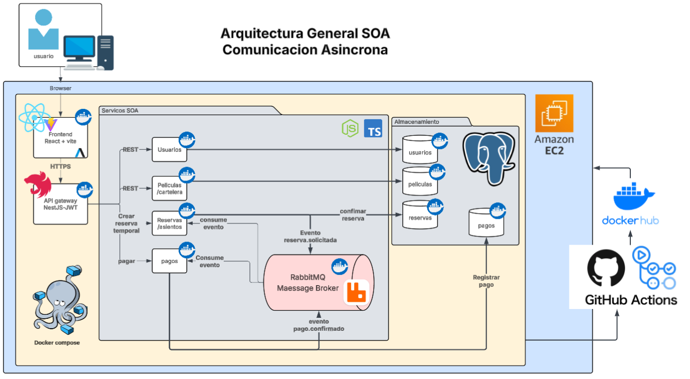

# SA_PRACTICA_G8

## Integrantes

| Grupo | Carné     | Nombre                           |
| ----- | --------- | -------------------------------- |
| 8     | 202100229 | Giovanni Saul Concohá Cax        |
| 8     | 202200214 | Pablo Alejandro Marroquin Cutz   |
| 8     | 201602619 | María de los Angeles Paz de León |
| 8     | 202180003 | Angel Isaias Mendoza Martinez    |
| 8     | 202001814 | Naomi Rashel Yos Cujcuj          |

---

# Índice

1. [Introducción](#introducción)
2. [Desarrollo](#desarrollo)
3. [Requerimientos del sistema](#requerimientos-del-sistema)
4. [Modelo de casos de uso](#modelo-de-casos-de-uso)
5. [Vista de arquitectura 4+1](#vista-de-arquitectura-41)
6. [Diagramas estructurales, comportamiento y persistencia](#diagramas-estructurales-comportamiento-y-persistencia)
7. [Justificaciones y decisiones arquitectónicas](#justificaciones-y-decisiones-arquitectónicas)
8. [Documentación SOLID](#documentación-solid)
9. [Manual de despliegue con Docker Compose](#manual-de-despliegue-con-docker-compose)
10. [Conclusiones](#conclusiones)

---

# Introducción

FilmStars es una plataforma web orientada a la venta de boletos de cine en línea. El sistema permite consultar cartelera por ubicación, visualizar funciones disponibles, seleccionar asientos en tiempo real, procesar pagos simulados y emitir boletos digitales.

La solución se implementa bajo un enfoque de Arquitectura Orientada a Servicios (SOA), separando los dominios principales del negocio en servicios independientes: usuarios, cartelera, reservas/asientos y pagos.

Durante esta segunda fase se desarrolló la implementación completa del sistema, incorporando autenticación basada en JWT, comunicación asíncrona mediante RabbitMQ, contenedorización con Docker, aplicación de principios SOLID y despliegue completo mediante Docker Compose.

La arquitectura fue diseñada para soportar alta concurrencia durante la selección de asientos, garantizar la integridad de las transacciones y facilitar la escalabilidad futura de la plataforma.

---

# Desarrollo

La documentación de la práctica se encuentra organizada dentro de la carpeta `Fase2`, agrupando los diferentes entregables requeridos por el enunciado.

---

# Requerimientos del sistema

* [Requerimientos funcionales y no funcionales](Fase1/Requerimientos/req.md)

---

# Modelo de casos de uso

* [Diagramas y casos de uso expandidos](Fase1/CasosDeUso/DCU.md)
* [Links de diagramas de casos de uso](Fase1/CasosDeUso/linksdiagramas.md)

---

# Vista de arquitectura 4+1

* [Vista de arquitectura 4+1](Fase1/4+1/vista.md)
* [Links de vistas arquitectónicas](Fase1/4+1/LinksVistas.md)

---

# Diagramas estructurales, comportamiento y persistencia

* [Diagrama de arquitectura general](Fase1/Diagramas/diagrama_general.md)
* [Diagrama de componentes](Fase1/Diagramas/diagrama_componentes.md)
* [Diagrama de actividades](Fase1/Diagramas/diagrama_actividad.md)
* [Diagrama de secuencia](Fase1/Diagramas/diagrama_secuencia.md)
* [Diagrama entidad-relación](Fase1/Diagramas/diagramas_entidadrelacion.md)
* [URL del diagrama entidad-relación](Fase1/Diagramas/URLEntidadRelacion.md)

---

# Justificaciones y decisiones arquitectónicas

Esta sección documenta las decisiones técnicas tomadas durante la implementación del sistema, incluyendo la arquitectura seleccionada, tecnologías utilizadas y justificación de los componentes principales.

## Documentación disponible

* [Justificación General de la Solución](Fase2/Documentacion/Justificaciones/Justificacion_general.md)

* [Justificación de Arquitectura SOA](Fase2/Documentacion/Justificaciones/Justificacion_soa.md)

---

# Documentación SOLID

Como parte de los requisitos de calidad establecidos para la segunda fase, se documenta la aplicación de los principios SOLID dentro de la implementación.

## Documentación disponible

* [Aplicación de Principios SOLID](Fase2/Documentacion/Justificaciones/Principios_solid.md)

---

# Manual de despliegue con Docker Compose

La solución fue completamente contenerizada utilizando Docker y Docker Compose para facilitar la ejecución, despliegue y pruebas de todos los componentes de la arquitectura.

La documentación incluye:

* Construcción de imágenes.
* Levantamiento completo de la plataforma.
* Administración de contenedores.
* Monitoreo de servicios.
* Gestión de bases de datos.
* Administración de RabbitMQ.
* Redes y volúmenes Docker.

## Documentación disponible

* [Manual de Docker Compose](Fase2/Documentacion/Justificaciones/manual_dockerCompose.md)

---

# Componentes implementados

La solución final se encuentra compuesta por:

## Frontend

* React
* Vite
* Axios
* JWT Authentication

## Backend

### API Gateway

Responsable de:

* Centralización de acceso
* Validación de JWT
* Enrutamiento hacia servicios internos

### Servicio de Usuarios

Responsable de:

* Registro de usuarios
* Inicio de sesión
* Gestión de perfiles
* Emisión de JWT

### Servicio de Películas y Cartelera

Responsable de:

* Gestión de películas
* Consulta de funciones
* Consulta de ciudades
* Consulta de cines

### Servicio de Reservas

Responsable de:

* Disponibilidad de asientos
* Bloqueo temporal
* Confirmación de reservas
* Publicación de eventos hacia RabbitMQ

### Servicio de Pagos

Responsable de:

* Procesamiento de pagos
* Confirmación de transacciones
* Consumo de eventos desde RabbitMQ

### Broker de Mensajería

* RabbitMQ

Responsable de:

* Comunicación asíncrona
* Gestión de colas
* Desacoplamiento entre servicios
* Reintentos y tolerancia a fallos

### Persistencia

* PostgreSQL

Bases de datos independientes para:

* Usuarios
* Películas
* Reservas
* Pagos

---

# Conclusiones

* La arquitectura SOA permitió separar las responsabilidades del negocio en servicios independientes, facilitando la mantenibilidad, escalabilidad y evolución del sistema.

* La incorporación de RabbitMQ permitió implementar comunicación asíncrona para los procesos críticos de reservas y pagos, reduciendo el acoplamiento y aumentando la tolerancia a fallos.

* La autenticación basada en JWT fortaleció la seguridad del sistema y permitió proteger las rutas sensibles de la aplicación.

* La aplicación de los principios SOLID contribuyó a mejorar la calidad del código, favoreciendo la reutilización, extensibilidad y facilidad de mantenimiento.

* Docker y Docker Compose simplificaron significativamente el despliegue de la solución completa, permitiendo levantar toda la arquitectura mediante un único comando.

* La plataforma desarrollada satisface los requisitos funcionales y no funcionales establecidos para la práctica, proporcionando una solución escalable, desacoplada y preparada para futuras ampliaciones.
